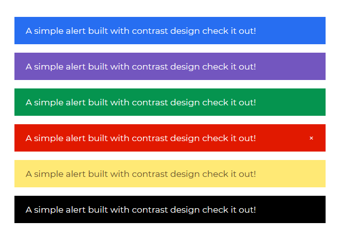

# Angular Bootstrap Alert

Contrast Angular Bootstrap Alert are used to send feedback messages to users after specific actions are carried out.

## Examples

Contrast Angular Bootstrap Alerts have an optional dismiss button. It is used with text of varying lengths to pass information to users. Contextual props (e.g., color="success") are used to give Bootstrap Alerts a suitable style. The dismiss prop is used for inline dismissal of the angular Alert component.

## Importing the Contrast Angular Bootstrap Alert

```ts
import { AlertModule } from 'cdbangular';
```



###### Typescript

```ts
import { Component, OnInit } from `@angular/core`;

@Component({
  selector: `app-alert`,
  templateUrl: `./alert.component.html`,
  styleUrls: [`./alert.component.scss`],
})
export class AlertComponent implements OnInit {
  constructor() {}

  ngOnInit(): void {}
}
```

###### HTML

```html
<CDBAlert color="primary">
  A simple alert built with contrast design check it out!
</CDBAlert>
<CDBAlert color="secondary">
  A simple alert built with contrast design check it out!
</CDBAlert>
<CDBAlert color="success">
  A simple alert built with contrast design check it out!
</CDBAlert>
<CDBAlert color="danger" [dismiss]="true">
  A simple alert built with contrast design check it out!
</CDBAlert>
<CDBAlert color="warning">
  A simple alert built with contrast design check it out!
</CDBAlert>
<CDBAlert color="dark">
  A simple alert built with contrast design check it out!
</CDBAlert>
```

## Contrast Angular Bootstrap Alert Props

This section will build on your information about the props you get to use with the Contrast Angular Bootstrap Alert component. You will find out what these props do, their default values, and how you would use them in your code.

The table below lists other prop options of the `CDBAlert` component.

| Name    |  Type   | Default |                                                          Description                                                          |           Example |
| :------ | :-----: | ------: | :---------------------------------------------------------------------------------------------------------------------------: | ----------------: |
| class   | String  |         |                                                      Adds custom classes                                                      | [class]="myClass" |
| color   | String  | primary | Sets color of the alert. Choose one of these: `primary`, `secondary`, `success`, `danger`, `warning`, `info`, `light`, `dark` | [color]="primary" |
| dismiss | Boolean |   false |                                                    Shows a dismiss button                                                     |    [dismiss]=true |
