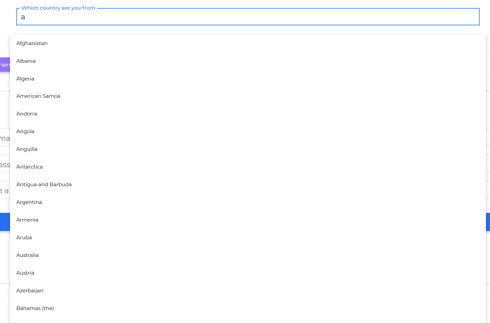

<ProAlertAngular />

# Contrast Angular Bootstrap Autocomplete

Contrast Angular Bootstrap Autocomplete component predicts words based on the first few letters typed by the users. It accepts a list of suggestions in the form of an `Array`.
You can use `↑` and `↓` arrow keys to navigate through options and use `↵` key to select required option.

## Importing the Contrast Angular Bootstrap Autocomplete Module

To use the Contrast Angular Bootstrap Autocomplete in your app, you start off by importing the AutocompleteModule.

```ts
import {AutocompleteModule } from 'cdbangular';
```

## Default Autocomplete.



###### Typescript
```ts
import { Component, OnInit } from '@angular/core';

@Component({
  selector: 'app-autocomplete',
  templateUrl: './autocomplete.component.html',
  styleUrls: ['./autocomplete.component.scss'],
})
export class AutocompleteComponent implements OnInit {
  countryList = [
    'Afghanistan',
    'Albania',
    'Algeria',
    'American Samoa',
    'Andorra',
    'Angola',
    'Anguilla',
    'Antarctica',
    'Antigua and Barbuda',
    'Argentina',
    'Armenia',
    'Aruba',
    'Australia',
    'Austria',
    'Azerbaijan',
    'Bahamas (the)',
    'Bahrain',
    'Bangladesh',
    'Barbados',
    'Belarus',
    'Belgium',
    'Belize',
    'Benin',
    'Bermuda',
    'Bhutan',
    'Bolivia (Plurinational State of)',
    'Bonaire, Sint Eustatius and Saba',
    'Bosnia and Herzegovina',
    'Botswana',
    'Bouvet Island',
    'Brazil',
    'British Indian Ocean Territory (the)',
    'Brunei Darussalam',
    'Bulgaria',
    'Burkina Faso',
    'Burundi',
    'Cabo Verde',
    'Cambodia',
    'Cameroon',
    'Canada',
    'Cayman Islands (the)',
    'Central African Republic (the)',
    'Chad',
    'Chile',
    'China',
    'Christmas Island',
    'Cocos (Keeling) Islands (the)',
    'Colombia',
    'Comoros (the)',
    'Congo (the Democratic Republic of the)',
    'Congo (the)',
    'Cook Islands (the)',
    'Costa Rica',
    'Croatia',
    'Cuba',
    'Curaçao',
    'Cyprus',
    'Czechia',
    "Côte d'Ivoire",
    'Denmark',
    'Djibouti',
    'Dominica',
    'Dominican Republic (the)',
    'Ecuador',
    'Egypt',
    'El Salvador',
    'Equatorial Guinea',
    'Eritrea',
    'Estonia',
    'Eswatini',
    'Ethiopia',
    'Falkland Islands (the) [Malvinas]',
    'Faroe Islands (the)',
    'Fiji',
    'Finland',
    'France',
    'French Guiana',
    'French Polynesia',
    'French Southern Territories (the)',
    'Gabon',
    'Gambia (the)',
    'Georgia',
    'Germany',
    'Ghana',
    'Gibraltar',
    'Greece',
    'Greenland',
    'Grenada',
    'Guadeloupe',
    'Guam',
    'Guatemala',
    'Guernsey',
    'Guinea',
    'Guinea-Bissau',
    'Guyana',
    'Haiti',
    'Heard Island and McDonald Islands',
    'Holy See (the)',
    'Honduras',
    'Hong Kong',
    'Hungary',
    'Iceland',
    'India',
    'Indonesia',
    'Iran (Islamic Republic of)',
    'Iraq',
    'Ireland',
    'Isle of Man',
    'Israel',
    'Italy',
    'Jamaica',
    'Japan',
    'Jersey',
    'Jordan',
    'Kazakhstan',
    'Kenya',
    'Kiribati',
    "Korea (the Democratic People's Republic of)",
    'Korea (the Republic of)',
    'Kuwait',
    'Kyrgyzstan',
    "Lao People's Democratic Republic (the)",
    'Latvia',
    'Lebanon',
    'Lesotho',
    'Liberia',
    'Libya',
    'Liechtenstein',
    'Lithuania',
    'Luxembourg',
    'Macao',
    'Madagascar',
    'Malawi',
    'Malaysia',
    'Maldives',
    'Mali',
    'Malta',
    'Marshall Islands (the)',
    'Martinique',
    'Mauritania',
    'Mauritius',
    'Mayotte',
    'Mexico',
    'Micronesia (Federated States of)',
    'Moldova (the Republic of)',
    'Monaco',
    'Mongolia',
    'Montenegro',
    'Montserrat',
    'Morocco',
    'Mozambique',
    'Myanmar',
    'Namibia',
    'Nauru',
    'Nepal',
    'Netherlands (the)',
    'New Caledonia',
    'New Zealand',
    'Nicaragua',
    'Niger (the)',
    'Nigeria',
    'Niue',
    'Norfolk Island',
    'Northern Mariana Islands (the)',
    'Norway',
    'Oman',
    'Pakistan',
    'Palau',
    'Palestine, State of',
    'Panama',
    'Papua New Guinea',
    'Paraguay',
    'Peru',
    'Philippines (the)',
    'Pitcairn',
    'Poland',
    'Portugal',
    'Puerto Rico',
    'Qatar',
    'Republic of North Macedonia',
    'Romania',
    'Russian Federation (the)',
    'Rwanda',
    'Réunion',
    'Saint Barthélemy',
    'Saint Helena, Ascension and Tristan da Cunha',
    'Saint Kitts and Nevis',
    'Saint Lucia',
    'Saint Martin (French part)',
    'Saint Pierre and Miquelon',
    'Saint Vincent and the Grenadines',
    'Samoa',
    'San Marino',
    'Sao Tome and Principe',
    'Saudi Arabia',
    'Senegal',
    'Serbia',
    'Seychelles',
    'Sierra Leone',
    'Singapore',
    'Sint Maarten (Dutch part)',
    'Slovakia',
    'Slovenia',
    'Solomon Islands',
    'Somalia',
    'South Africa',
    'South Georgia and the South Sandwich Islands',
    'South Sudan',
    'Spain',
    'Sri Lanka',
    'Sudan (the)',
    'Suriname',
    'Svalbard and Jan Mayen',
    'Sweden',
    'Switzerland',
    'Syrian Arab Republic',
    'Taiwan',
    'Tajikistan',
    'Tanzania, United Republic of',
    'Thailand',
    'Timor-Leste',
    'Togo',
    'Tokelau',
    'Tonga',
    'Trinidad and Tobago',
    'Tunisia',
    'Turkey',
    'Turkmenistan',
    'Turks and Caicos Islands (the)',
    'Tuvalu',
    'Uganda',
    'Ukraine',
    'United Arab Emirates (the)',
    'United Kingdom of Great Britain and Northern Ireland (the)',
    'United States Minor Outlying Islands (the)',
    'United States of America (the)',
    'Uruguay',
    'Uzbekistan',
    'Vanuatu',
    'Venezuela (Bolivarian Republic of)',
    'Viet Nam',
    'Virgin Islands (British)',
    'Virgin Islands (U.S.)',
    'Wallis and Futuna',
    'Western Sahara',
    'Yemen',
    'Zambia',
    'Zimbabwe',
    'Åland Islands',
  ];

  colors = ['White', 'Black', 'Green', 'Blue', 'Yellow', 'Red'];

  constructor() {}

  ngOnInit(): void {}
}
```

###### HTML
```html
<CDBAutocomplete label="Which country are you from" [suggestions]=countryList></CDBAutocomplete>
```

The `CDBAutocomplete` component takes in a label which serves a placeholder to inform users, what data is contained in the Autocomplete component, the `[suggestions]` takes in an object as a list of options the user can choose from.

## Usage within a Card

In this section of the tutorial we also use other Contrast Angular Bootstrap Components aside the `CDBAutocomplete`, these components are the [CDBIcon](https://www.devwares.com/docs/contrast/angular/components/icon) component for icons in our project, the [CDBCard](https://www.devwares.com/docs/contrast/angular/components/card) for creating our autocomplete card , the [CDBBtn](https://www.devwares.com/docs/contrast/angular/components/buttons) component for creating our buttons ( signin, signup etc.), the [CDBCardBody](https://www.devwares.com/docs/contrast/angular/components/card) component for creating the card body , and the [CDBInput](https://www.devwares.com/docs/contrast/angular/components/input) component for our autocomplete input field. 


###### Typescript
```ts
import { Component, OnInit } from '@angular/core';

@Component({
  selector: 'app-autocomplete',
  templateUrl: './autocomplete.component.html',
  styleUrls: ['./autocomplete.component.scss'],
})
export class AutocompleteComponent implements OnInit {

  colors = ['White', 'Black', 'Green', 'Blue', 'Yellow', 'Red'];

  constructor() {}

  ngOnInit(): void {}
}
```

```html
<CDBCard>
    <CDBCardBody class="mx-4">
        <div class="text-center">
            <h3 class="dark-grey-text mb-5">
                <strong>Sign in</strong>
            </h3>
        </div>
        <CDBInput label="Your email" [group]=true type="email" validate error="wrong" success="right"></CDBInput>
        <CDBInput label="Your password" [group]=true type="password" validate containerClass="mb-0"></CDBInput>
        <div style="position: relative">
            <CDBAutocomplete [suggestions]=colors label="Choose a Color">
            </CDBAutocomplete>
        </div>
        <div class="text-center pt-3 mb-3">
            <CDBBtn type="button" [block]=true gradient="blue" class="mx-0 z-depth-1a">
                Sign in
            </CDBBtn>
        </div>
        <p class="dark-grey-text text-right d-flex justify-content-center mb-3 pt-2"
            style="font-size: 0.8rem">
            or Sign up with:
        </p>
        <div class="row my-3 d-flex justify-content-center">
            <CDBBtn type="button" color="white" [circle]=true class="mr-md-3 z-depth-1a">
                <CDBIcon [fab]=true icon="facebook-f" class="blue-text text-center"></CDBIcon>
            </CDBBtn>
            <CDBBtn type="button" color="white" [circle]=true class="mr-md-3 z-depth-1a">
                <CDBIcon [fab]=true icon="twitter" class="blue-text"></CDBIcon>
            </CDBBtn>
            <CDBBtn type="button" color="white" [circle]=true class="z-depth-1a">
                <CDBIcon [fab]=true icon="google-plus-g" class="blue-text"></CDBIcon>
            </CDBBtn>
        </div>
    </CDBCardBody>
</CDBCard>
```

## Contrast Angular Bootstrap Autocomplete Props

This section will build on your information about the props you get to use with the Contrast Angular Bootstrap Autocomplete component. You will find out what these props do, their default values, and how you would use them in your code.

The table below lists other prop options of the `CDBAutocomplete` component.

| Name            | Type        | Default      |   Description| Example      |
| :------------- | :----------: | -----------: | :----------: | -----------: |
| suggestions    | Array        | empty array  | Suggestions to display  |     [suggestions]=[item1, item2]  |
| label          | String       |              | Sets label for Autocomplete input | [label]="Select your country" |
| class       | String     |              | Adds custom class| [class]="myClass" |
| getValue       | function     |              | Returns input value on onChange event |  [getValue]={logValue} |
