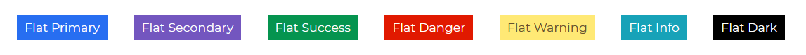

<ProAlertAngular />

# Contrast Angular Bootstrap Badges

Contrast Angular Bootstrap Badge component is a small count and labeling component. It is used to display notifications such unread messages, missed phone call and suchlike.

Badges scale to match the size of the immediate parent element by using relative font sizing and `em` units.

## Importing the Contrast Angular Bootstrap Badge Module

```ts
import {BadgeModule } from 'cdbangular';
```

## Default Badges 

Use the `color` prop to give your badges a background color. The `color` prop takes in a value which is a contrast color code.


###### HTML
```html
<CDBBadge color="primary">
    Primary
  </CDBBadge>
  <CDBBadge color="secondary">
    Secondary Badge
  </CDBBadge>
  <CDBBadge color="success">
    Success Badge
  </CDBBadge>
  <CDBBadge color="danger">
    Danger Badge
  </CDBBadge>
  <CDBBadge color="warning">
    Warning Badge
  </CDBBadge>
  <CDBBadge color="info">
    Info Badge
  </CDBBadge>
  <CDBBadge color="dark">
    Dark Badge
</CDBBadge>
```
## Pill Badges

Set the `borderType` property to `pill` to make badges more rounded.


###### HTML
```html
  <CDBBadge color="primary" borderType="pill">
    Primary
  </CDBBadge>
  <CDBBadge color="secondary" borderType="pill">
    Secondary Badge
  </CDBBadge>
  <CDBBadge color="success" borderType="pill">
    Success Badge
  </CDBBadge>
  <CDBBadge color="danger" borderType="pill">
    Danger Badge
  </CDBBadge>
  <CDBBadge color="warning" borderType="pill">
    Warning Badge
  </CDBBadge>
  <CDBBadge color="info" borderType="pill">
    Info Badge
  </CDBBadge>
  <CDBBadge color="dark" borderType="pill">
    Dark Badge
  </CDBBadge>
```

## Contextual Variations

Use the `size` prop to define how little or large you want your badges to be. The `medium` value is the defualt value.


###### HTML
```html
  <CDBBadge color="secondary" size="large">
    Large
  </CDBBadge>
  <CDBBadge color="primary">Medium</CDBBadge>
  <CDBBadge color="success" size="small">
    Small
  </CDBBadge>
```

## Flat Badges

Use the `flat` property to remove the button shadow.



###### HTML
```html
  <CDBBadge color="primary" flat>
    Flat Primary
  </CDBBadge>
  <CDBBadge color="secondary" flat>
    Flat Secondary
  </CDBBadge>
  <CDBBadge color="success" flat>
    Flat Success
  </CDBBadge>
  <CDBBadge color="danger" flat>
    Flat Danger
  </CDBBadge>
  <CDBBadge color="warning" flat>
    Flat Warning
  </CDBBadge>
  <CDBBadge color="info" flat>
    Flat Info
  </CDBBadge>
  <CDBBadge color="dark" flat>
    Flat Dark
  </CDBBadge>
```

## Badges with Icons

Use the [CDBIcon](https://www.devwares.com/docs/contrast/angular/components/icon) component to add icons to a badge. Chcek out our docs for more information on the `CDBIcon` component.


###### HTML
```html
  <CDBBadge color="secondary">
    <CDBIcon fab icon="facebook-f" />
  </CDBBadge>
  <CDBBadge color="primary">
    <CDBIcon fab icon="instagram" />
  </CDBBadge>
  <CDBBadge color="success">
    <CDBIcon fab icon="snapchat-ghost" />
  </CDBBadge>
  <CDBBadge color="info">
    <CDBIcon icon="anchor" />
  </CDBBadge>
  <CDBBadge color="warning">
    <CDBIcon far icon="sun" />
  </CDBBadge>
  <CDBBadge color="danger">
    <CDBIcon icon="battery-three-quarters" />
  </CDBBadge>
  <CDBBadge color="success">
    <CDBIcon fab icon="btc" size="large" />
  </CDBBadge>
  <CDBBadge borderType="pill" color="secondary" size="large">
    <CDBIcon icon="heart" />
  </CDBBadge>
  <CDBBadge borderType="pill" color="danger">
    <CDBIcon fab icon="apple" />
  </CDBBadge>
  <CDBBadge borderType="pill" color="primary" size="large">
    <CDBIcon icon="users" />
  </CDBBadge>
```

## Rounded Badges with Icons

Set the `borderType` property to `pill` to make badges more rounded.
Use `CDBIcon` to add icons to a badge.


###### HTML
```html
  <CDBBadge color="secondary">
    <CDBIcon fab icon="facebook-f" />
  </CDBBadge>
  <CDBBadge color="primary">
    <CDBIcon fab icon="instagram" />
  </CDBBadge>
  <CDBBadge color="success">
    <CDBIcon fab icon="snapchat-ghost" />
  </CDBBadge>
  <CDBBadge color="info">
    <CDBIcon icon="anchor" />
  </CDBBadge>
  <CDBBadge color="warning">
    <CDBIcon far icon="sun" />
  </CDBBadge>
  <CDBBadge color="danger">
    <CDBIcon icon="battery-three-quarters" />
  </CDBBadge>
  <CDBBadge color="success">
    <CDBIcon fab icon="btc" size="large" />
  </CDBBadge>
  <CDBBadge borderType="pill" color="secondary" size="large">
    <CDBIcon icon="heart" />
  </CDBBadge>
  <CDBBadge borderType="pill" color="danger">
    <CDBIcon fab icon="apple" />
  </CDBBadge>
  <CDBBadge borderType="pill" color="primary" size="large">
    <CDBIcon icon="users" />
  </CDBBadge>
```

# Contrast Angular Bootstrap Badge Props

This section will build on your information about the props you get to use with the Contrast Angular Bootstrap Badge component. You will find out what these props do, their default values, and how you would use them in your code.

The table below lists other prop options of the `CDBBadge` component.

| Name            | Type        | Default      |   Description| Example      |
| :------------- | :----------: | -----------: | :----------: | -----------: |
| className     | String       |              |Adds custom classes	      |     class="myClass" |
| color          | String       | primary      | Determines badge color, accepts CDB predefined color classes: `primary` `secondary` `success` `danger` `warning` `info` `light` `dark` | [color]="primary" |
| flat           | Boolean      | false        | Adds flat effect to badge | color="primary" flat="true"  |
| size           | String       | medium       | Determines badge size, available values: `small` `medium` `large`, `medium` by default  | color="secondary" size="large"  |
| borderType     | String       | box          | Determines the corners effect of the badge| color="secondary" borderType="pill"  |
| tag            | String       | span         | Changes default tag | color="secondary" tag="span" |

