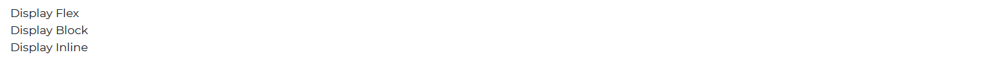

# Contrast Angular Bootstrap Box

Contrast Angular Bootstrap boxes are layout components which help to create build components for of the CSS utility needs.

Contrast Angular Bootstrap Box component can become any element from `ElementType` like `div`, `span`, `img`, `video` etc. depending on the value of the `tag` prop. The default is a `div` element.


## Importing the Contrast Angular Bootstrap Box Module

To use the Contrast Angular Bootstrap Box component in your project you need to import `BoxModule`.

```ts
import {BoxModule } from 'cdbangular';
```


Use the `tag` prop to indicate the HTML element you are trying to imitate with the `CDBBox` component.

###### HTML
```html
<CDBBox tag="span">
  Span
</CDBBox>
<CDBBox tag="div">
  Div
</CDBBox>
<CDBBox tag="p">
  Paragraph
</CDBBox>
<CDBBox tag="section">
  Section
</CDBBox>
```
## Display

With Contrast Angular Bootstrap Box component, you can set any CSS display style from Bootstrap 5 like `d-none`, `d-flex` etc.



###### HTML
```html
<CDBBox display="flex">
  Display Flex
</CDBBox>
<CDBBox display="block">
  Display Block
</CDBBox>
<CDBBox display="none">
  Dislpay None
</CDBBox>
<CDBBox display="inline">
  Display Inline
</CDBBox>
```

## Flex

We can use CSS flexbox styles with the Contrast Angular Bootstrap Box. To do that, we set the `display` prop on the `CDBBox` component to flex.

We can use props like `justifyContent`, `flex`, `alignItems`, `alignContent`, `alignSelf` just like you would in regular CSS Flex. 


###### HTML
```html
<CDBBox display="flex" justifyContent="center">
  Justify Content Center
</CDBBox>
<CDBBox display="flex" justifyContent="end">
  Justify Content End
</CDBBox>
<CDBBox display="flex" flex="column">
  <CDBBox tag="p">Column</CDBBox>
  <CDBBox tag="p">Column</CDBBox>
  <CDBBox tag="p">Column</CDBBox>
</CDBBox>
<CDBBox display="flex" flex="row">
  <CDBBox tag="p">Row</CDBBox>
  <CDBBox tag="p">Row</CDBBox>
  <CDBBox tag="p">Row</CDBBox>
</CDBBox>
<CDBBox display="none">
  <CDBBox display="flex" flex="fill">
    <CDBBox tag="p">Fill</CDBBox>
  </CDBBox>
  <CDBBox display="flex" flex="row" alignItems="start">
    Align Items Start
  </CDBBox>
  <CDBBox display="flex" flex="row" alignItems="center">
    Align Items Center
  </CDBBox>
  <CDBBox display="flex" alignContent="start">
    Align Content Start
  </CDBBox>
  <CDBBox display="flex" alignContent="center">
    Align Content Center
  </CDBBox>
  <CDBBox display="flex" alignSelf="start">
    Align Self Start
  </CDBBox>
  <CDBBox display="flex" alignSelf="center">
    Align Self Center
  </CDBBox>
</CDBBox>
```

## Colors

With CDBox component you can set element's text color.


###### HTML
```html
<CDBBox color="red">
  Red Color
</CDBBox>
<CDBBox color="green">
  Green Color
</CDBBox>
<CDBBox color="blue">
  Blue Color
</CDBBox>
<CDBBox color="pink">
  Pink Color
</CDBBox>
```
## Background Colors

Use the `bg` prop to set the background color of your box.


###### HTML
```html
<CDBBox bg="success">
  Success Background
</CDBBox>
<CDBBox bg="secondary">
  Secondary Background
</CDBBox>
<CDBBox bg="danger">
  Danger Background
</CDBBox>
<CDBBox bg="warning">
  Warning Background
</CDBBox>
```

## Contrast Angular Bootstrap Box Props

This section will build on your information about the props you get to use with the Contrast Angular Bootstrap Box component. You will find out what these props do, their default values, and how you would use them in your code.

The table below lists other prop options of the `CDBBox` component.

| Name            | Type        | Default      |   Description| Example      |
| :------------- | :----------: | -----------: | :----------: | -----------: |
| class      | String       |              |Adds custom classes	      |     class="myClass"  |
| color          | String       |              | Change color of text in the CDBox component. Choose one of these from CDB: `red`, `pink`, `purple`, `deep-purple`, `indigo`, `blue`, `light-blue`, `cyan`, `teal`, `green`, `light-green`, `yellow`, `amber`, `orange`, `deep-orange`, `brown`, `grey`, `blue-grey`, `cdb-color white`. You can also chose default colors from Bootstrap like: `primary`, `secondary`, `success`, `info`, `default,` `warning`, `danger`, `dark`, `muted`, `light`.  | color="pink"  |
| alignContent   | String       |              | Set align-content class to children of CDBox. Choose one of these: `start`, `end`, `center`, `between`, `stretch`, `around`.  | alignContent="start"  |
| alignItems     | String       |              | Set align-items class to children of CDBox. Choose one of these: `start`, `end`, `center`, `between`, `stretch`.    | alignItems="start" |
| alignSelf      | String       |              | Set align-self class to children of CDBox. Choose one of these: `start`, `end`, `center`, `between`, `stretch`.    | alignSelf="start" |
| bg        | String       |              | Sets background color of the box component. Choose one of these: `primary`, `secondary`, `success`, `danger`, `warning`, `info`, `light`, `dark`  | bg="light" |
| display        | String       |              | Set display to element. Choose one of these: `none`, `inline`, `inline-block`, `block`, `table`, `table-row`, `table-cell`, `flex`, `inline-flex`.    | display="inline" |
| flex           | String       |              | Set flex class to children of CDBox. Choose one of these: `row`, `column`, `row-reverse`, `column-reverse`, `wrap`, `nowrap`, `wrap-reverse`, `fill`, `grow-0`, `grow-0`, `shrink-0`, `shrink-1`, `center`.      | flex="column" |
| justifyContent | String       |              | Set justify-content to children od CDBox. Choose one of these: `start`, `end`, `center`, `between`, `around`.     | justifyContent="start" |
| m              | Number|              | With margin you can set margin top/bottom/right/left/x/y from 0 to 5.      | m=5 , mt=1 ,  mb=4 , my=2 , mx=4 |
| p              | Number|              | With padding you can set padding top/bottom/right/left/x/y from 0 to 5.       | p=5 , pt=1 , pb=4 , py=2 , px=4 |
