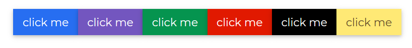
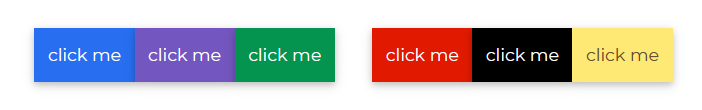
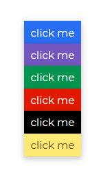
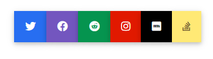

# Contrast Angular Bootstrap ButtonGroup

Contrast Angular Bootstrap ButtonGroup is a set of buttons vertically arranged in a straight line or stack. They are easy to customize in terms of their size, shape and color.

Examples of Angular Bootstrap button group use:

* Group of pricing options
* Group of licenses you can purchase on our CDB Pro page

## Importing the Contrast Angular Bootstrap ButtonGroup Module

To use the Contrast Angular Bootstrap ButtonGroup component in your project you need to import `ButtonGroupModule`.

```ts
import {ButtongroupModule } from 'cdbangular';
```

## Multicolored Button Groups

Use `color` prop to give your buttons in your button group a background color.



###### HTML
```html
  <CDBBtnGrp size="lg">
    <CDBBtn color="primary">click me</CDBBtn>
    <CDBBtn color="secondary">click me</CDBBtn>
    <CDBBtn color="success">click me</CDBBtn>
    <CDBBtn color="danger">click me</CDBBtn>
    <CDBBtn color="dark">click me</CDBBtn>
    <CDBBtn color="warning">click me</CDBBtn>
  </CDBBtnGrp>
```
## Rect Secondary Medium with Space Between



###### HTML
```html
  <CDBBtnGrp>
    <CDBBtn color="primary">click me</CDBBtn>
    <CDBBtn color="secondary">click me</CDBBtn>
    <CDBBtn color="success">click me</CDBBtn>
  </CDBBtnGrp>
  <CDBBtnGrp>
    <CDBBtn color="danger">click me</CDBBtn>
    <CDBBtn color="dark">click me</CDBBtn>
    <CDBBtn color="warning">click me</CDBBtn>
  </CDBBtnGrp>
```

## Rect Secondary Small

Use the `size` prop to define how little or large you want the buttons in your button group to be.


###### HTML
```html
  <CDBBtnGrp size="sm">
    <CDBBtn color="primary">click me</CDBBtn>
    <CDBBtn color="secondary">click me</CDBBtn>
    <CDBBtn color="success">click me</CDBBtn>
    <CDBBtn color="danger">click me</CDBBtn>
    <CDBBtn color="dark">click me</CDBBtn>
    <CDBBtn color="warning">click me</CDBBtn>
  </CDBBtnGrp>
```

## Vertical Rect Secondary Large

Make a set of buttons appear vertically stacked rather than horizontally.


###### HTML
```html
  <CDBBtnGrp [vertical]=true size="lg">
    <CDBBtn color="primary">click me</CDBBtn>
    <CDBBtn color="secondary">click me</CDBBtn>
    <CDBBtn color="success">click me</CDBBtn>
    <CDBBtn color="danger">click me</CDBBtn>
    <CDBBtn color="dark">click me</CDBBtn>
    <CDBBtn color="warning">click me</CDBBtn>
  </CDBBtnGrp>
```

## Vertical Rect Secondary Medium

Make a set of buttons appear vertically stacked rather than horizontally.


###### HTML
```html
  <CDBBtnGrp [vertical]=true>
    <CDBBtn color="primary">click me</CDBBtn>
    <CDBBtn color="secondary">click me</CDBBtn>
    <CDBBtn color="success">click me</CDBBtn>
    <CDBBtn color="danger">click me</CDBBtn>
    <CDBBtn color="dark">click me</CDBBtn>
    <CDBBtn color="warning">click me</CDBBtn>
  </CDBBtnGrp>
```
## Vertical Rect Secondary Small




###### HTML
```html
  <CDBBtnGrp [vertical]=true size="sm">
    <CDBBtn color="primary">click me</CDBBtn>
    <CDBBtn color="secondary">click me</CDBBtn>
    <CDBBtn color="success">click me</CDBBtn>
    <CDBBtn color="danger">click me</CDBBtn>
    <CDBBtn color="dark">click me</CDBBtn>
    <CDBBtn color="warning">click me</CDBBtn>
  </CDBBtnGrp>
```

<i/>

## Button Group with Icon

Use the [CDBIcon](https://www.devwares.com/docs/contrast/angular/components/icon) component to have icons in your buttons.




###### HTML
```html
<CDBBtnGrp>
    <CDBBtn color="primary"><CDBIcon [fab]=true icon="twitter"></CDBIcon></CDBBtn>
    <CDBBtn color="secondary"><CDBIcon [fab]=true icon="facebook"></CDBIcon></CDBBtn>
    <CDBBtn color="success"><CDBIcon [fab]=true icon="reddit"></CDBIcon></CDBBtn>
    <CDBBtn color="danger"><CDBIcon [fab]=true icon="instagram"></CDBIcon></CDBBtn>
    <CDBBtn color="dark"><CDBIcon [fab]=true icon="imdb"></CDBIcon></CDBBtn>
    <CDBBtn color="warning"><CDBIcon [fab]=true icon="stack-overflow"></CDBIcon></CDBBtn>
</CDBBtnGrp>
```
## Button Group with Dropdown

Use the [CDBDropDown](https://www.devwares.com/docs/contrast/angular/components/dropdown) component to add dropdowns to Button Groups.


###### HTML
```html
<CDBBtnGrp>
    <CDBBtn color="primary">click me</CDBBtn>
    <CDBBtn color="secondary">click me</CDBBtn>
    <CDBBtn color="success">click me</CDBBtn>
</CDBBtnGrp>
<CDBBtnGrp class="ml-2">
    <CDBDropDown>
        <CDBDropDownToggle color="warning" [caretDropRight]=true (click)="menu.toggleDropdown($event)">Dropdown
            <!-- <CDBIcon [fas]=true icon="caret-down"></CDBIcon> -->
        </CDBDropDownToggle>
        <CDBDropDownMenu #menu="cdbDropdownMenu" placement="right">
            <CDBDropDownItem>Action 1</CDBDropDownItem>
            <CDBDropDownItem>Action 2</CDBDropDownItem>
        </CDBDropDownMenu>
    </CDBDropDown>
</CDBBtnGrp>
```

## API Reference: Contrast Angular Bootstrap Button Group Props

This section will build on your information about the props you get to use with the Contrast Angular Bootstrap Breadcrumb component. You will find out what these props do, their default values, and how you would use them in your code.

The table below lists other prop options of the `CDBBtnGrp` component.

| Name            | Type        | Default      |   Description| Example      |
| :------------- | :----------: | -----------: | :----------: | -----------: |
| class      | String       |              | Adds custom classes	      |     class="myClass"  |
| role           | String       | group        | Change default component's role | role="group"  |
| size           | String       | medium       |  	Determines buttons size, available values: `[sm, lg]`. | size="lg"   |
| vertical       | Boolean      | false        | Changes group orientation to vertical | [vertical]=true  |
