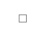

# Contrast Angular Bootstrap Checkbox

Contrast Angular Bootstrap Checkbox is a component that allows users to make multiple selection from a list of options. It is broadly used in the forms and surveys.

Checkboxes are for selecting one or several options in a list, while `radios` are for selecting one option from many.

## Importing the Contrast Angular Bootstrap Checkbox Module

To use the Contrast Angular Bootstrap Card component in your project you need to import `CheckboxModule`.

```ts
import {CheckboxModule } from 'cdbangular';
```

## Default Checkbox

For the default Contrast Angular Bootstrap Checkbox, use the [CDBInput](https://www.devwares.com/docs/contrast/angular/components/input) component and pass in a `type` prop with its value set to `checkbox`



###### HTML
```html
<CDBInput type="checkbox"></CDBInput>
```

<i/>

## CDBCheckbox


###### HTML
```html
<CDBCheckbox class="mt-5"></CDBCheckbox>
```

## Disabled state

Simply add the `disabled` Boolean attribute to `CDBCheckbox`


###### HTML
```html
<CDBCheckbox disabled="true"></CDBCheckbox>
```


## API Reference: Contrast Checkbox Bootstrap Inputs

This section will build on your information about the props you get to use with the Contrast Angular Bootstrap Checkbox component. You will find out what these props do, their default values, and how you would use them in your code.

The table below lists other prop options of the `CDBCheckbox` component.

| Name            | Type        | Default      |   Description| Example      |
| :------------- | :----------: | -----------: | :----------: | -----------: |
| class      | String       |              |Adds custom classes	      |     class="myClass"  |
| disable        | Boolean      | false        | Disables Checkbox component | disabled=true |
