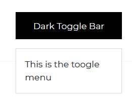
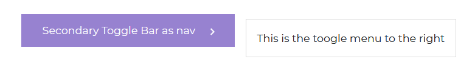
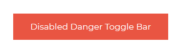

# Angular Bootstrap Dropdown

Angular Bootstrap Dropdown is a toggleable menu embedding additional links or content. It allows you to construct advanced navigation and link categorization.

In case of more complicated navigation systems, dropdowns are the essential elements providing you with possibility of placing all the most relevant links in our navigation bar (or other navigational components)

Aside from being not only highly functional, CDB dropdowns are also extraordinary visually attractive. It gives them this characteristic Material Design effects, like shadows, living colors or charming waves effect after a dropdown item is clicked.

They’re toggled by clicking, not by hovering; this is an intentional design decision. Why?

CDB is a "mobile first" framework so, we avoid mixing functional elements and interaction by hovering because it decreases User Experience of users of mobile devices.

## Importing the Contrast Angular Bootstrap Dropdown Module

To use the Contrast Angular Bootstrap Collapse component in your project you need to import `DropdownModule`.

```ts
import {DropdownModule } from 'cdbangular';
```

## Dark Toggle Bar



###### HTML
```html
<CDBDropDown>
    <CDBDropDownToggle color="dark" (click)="menu1.toggleDropdown($event)"
        (mouseenter)="menu1.toggleDropdown($event)">
        Dark Toggle Bar
    </CDBDropDownToggle>
    <CDBDropDownMenu #menu1="cdbDropdownMenu">
        This is the toggle menu
    </CDBDropDownMenu>
</CDBDropDown>
```
## Primary Toggle with Caret


###### HTML
```html
<CDBDropDown>
    <CDBDropDownToggle color="primary" [caretDropDown]=true (click)="menu2.toggleDropdown($event)">
        Primary Toggle Bar
    </CDBDropDownToggle>
    <CDBDropDownMenu #menu2="cdbDropdownMenu" placement="bottom">
        This is the toogle menu with caret
    </CDBDropDownMenu>
</CDBDropDown>
```

## Secondary Toggle Bar



###### HTML
```html
<CDBDropDown>
    <CDBDropDownToggle [nav]=true color="secondary" [caretDropRight]=true
        (click)="menu3.toggleDropdown($event)">
        Secondary Toggle Bar as nav
    </CDBDropDownToggle>
    <CDBDropDownMenu #menu3="cdbDropdownMenu" placement="right">
        This is the toogle menu to the right
    </CDBDropDownMenu>
</CDBDropDown>
```

## Danger Toggle Bar


###### HTML
```html
<CDBDropDown>
    <CDBDropDownToggle color="danger" [caretDropUp]=true (click)="menu4.toggleDropdown($event)">
        Danger Toggle Bar
    </CDBDropDownToggle>
    <CDBDropDownMenu #menu4="cdbDropdownMenu" placement="top">
        This is the toogle menu to the top
    </CDBDropDownMenu>
</CDBDropDown>
```
## Success Toggle Bar


###### HTML
```html
<CDBDropDown>
    <CDBDropDownToggle color="success" [caretDropLeft]=true (click)="menu5.toggleDropdown($event)">
        Success Toggle Bar
    </CDBDropDownToggle>
    <CDBDropDownMenu #menu5="cdbDropdownMenu" placement="left">
        This is the toogle menu to the bottom
    </CDBDropDownMenu>
</CDBDropDown>
```

## Large Dropdown


###### HTML
```html
<CDBDropDown>
    <CDBDropDownToggle color="dark" size="lg" (click)="menu6.toggleDropdown($event)">
        Large Dark Toggle Bar
    </CDBDropDownToggle>
    <CDBDropDownMenu #menu6="cdbDropdownMenu" placement="right">
        This is the toogle menu to the right
    </CDBDropDownMenu>
</CDBDropDown>
```
## Small Dropdown


###### HTML
```html
<CDBDropDown>
    <CDBDropDownToggle color="secondary" size="sm" (click)="menu7.toggleDropdown($event)">
        Small Secondary Toggle Bar
    </CDBDropDownToggle>
    <CDBDropDownMenu #menu7="cdbDropdownMenu" placement="right">
        <CDBDropDownItem [header]=true>cold place</CDBDropDownItem>
        <CDBDropDownItem [divider]=true></CDBDropDownItem>
        <CDBDropDownItem [disabled]=true>
            First Item in cold place
        </CDBDropDownItem>
        <CDBDropDownItem [disabled]=true>second</CDBDropDownItem>
        <CDBDropDownItem [toggle]=true>second</CDBDropDownItem>
        <CDBDropDownItem>second</CDBDropDownItem>
        <CDBDropDownItem>
            <CDBLink to="/alert"> Alert</CDBLink>
        </CDBDropDownItem>
    </CDBDropDownMenu>
</CDBDropDown>
```

## Disabled Danger Toggle Bar

Set the `disabled` prop of your dropdown to true to disable your dropdown.



###### HTML
```html
<CDBDropDown>
    <CDBDropDownToggle color="danger" [disabled]=true (click)="menu8.toggleDropdown($event)">
        Disabled Danger Toggle Bar
    </CDBDropDownToggle>
    <CDBDropDownMenu #menu8="cdbDropdownMenu" placement="right">
        This is the toogle menu to the right
    </CDBDropDownMenu>
</CDBDropDown>
```

## Menu with Header


###### HTML
```html
<CDBDropDown>
    <CDBDropDownToggle color="secondary" (click)="menu9.toggleDropdown($event)">
        DropDown
    </CDBDropDownToggle>
    <CDBDropDownMenu #menu9="cdbDropdownMenu" placement="right">
        <CDBDropDownItem [header]=true>Cold place</CDBDropDownItem>
        <CDBDropDownItem>
            First Item in cold place
        </CDBDropDownItem>
        <CDBDropDownItem [toggle]=true>second</CDBDropDownItem>
        <CDBDropDownItem>second</CDBDropDownItem>
    </CDBDropDownMenu>
</CDBDropDown>
```

## Menu with Divider


###### HTML
```html
<CDBDropDown>
    <CDBDropDownToggle color="warning" (click)="menu10.toggleDropdown($event)">
        DropDown
    </CDBDropDownToggle>
    <CDBDropDownMenu #menu10="cdbDropdownMenu" placement="left">
        <CDBDropDownItem>
            <CDBLink to="/alert">Alert</CDBLink>
        </CDBDropDownItem>
        <CDBDropDownItem [divider]=true></CDBDropDownItem>
        <CDBDropDownItem>
            First Item in cold place
        </CDBDropDownItem>
        <CDBDropDownItem [toggle]=true>second</CDBDropDownItem>
        <CDBDropDownItem>second</CDBDropDownItem>
    </CDBDropDownMenu>
</CDBDropDown>
```
## Disable Menu Items


###### HTML
```html
<CDBDropDown>
    <CDBDropDownToggle color="success" (click)="menu11.toggleDropdown($event)">
        DropDown
    </CDBDropDownToggle>
    <CDBDropDownMenu #menu11="cdbDropdownMenu" placement="top">
        <CDBDropDownItem>Cold place</CDBDropDownItem>
        <CDBDropDownItem [disabled]=true>
            Disabled
        </CDBDropDownItem>
        <CDBDropDownItem [disabled]=true>Second</CDBDropDownItem>
        <CDBDropDownItem>Last</CDBDropDownItem>
    </CDBDropDownMenu>
</CDBDropDown>
```

## Active Menu Items


###### HTML
```html
<CDBDropDown>
    <CDBDropDownToggle color="dark" (click)="menu12.toggleDropdown($event)">
        DropDown
    </CDBDropDownToggle>
    <CDBDropDownMenu #menu12="cdbDropdownMenu" placement="top">
        <CDBDropDownItem>Cold place</CDBDropDownItem>
        <CDBDropDownItem [active]=true>
            Active
        </CDBDropDownItem>
        <CDBDropDownItem [toggle]=true>Second</CDBDropDownItem>
        <CDBDropDownItem>Last</CDBDropDownItem>
    </CDBDropDownMenu>
</CDBDropDown>
```


## API Reference: Contrast Angular Bootstrap DropDown Props

This section will build on your information about the props you get to use with the Contrast Angular Bootstrap DropDown component. You will find out what these props do, their default values, and how you would use them in your code.

The table below lists other prop options of the `CDBDropDown` component.

| Name            | Type        | Default      |   Description| Example      |
| :------------- | :----------: | -----------: | :----------: | -----------: |
| class      | String       |              |Adds custom classes	      |     class="myClass" |
| dropup        | Boolean      | false        | Trigger dropdown menu above dropdown button | dropUp |
| dropleft        | Boolean      | false        | Trigger dropdown menu on the left side of dropdown button | dropleft |
| dropright        | Boolean      | false        | Trigger dropdown menu on the right side of dropdown button | dropright |
| toggle        | function      |         | Control dropdown on click | toggle={handleToggle} |


## API Reference: Contrast Angular Bootstrap DropDownItem Properties

The table below lists other prop options of the `CDBDropDownItem` component.


| Name            | Type        | Default      |   Description| Example      |
| :------------- | :----------: | -----------: | :----------: | -----------: |
| class      | String       |              |Adds custom classes	      |     class="myClass" |
| active        | Boolean      | false        | Sets active state for of the menu item | active=true |
| disable        | Boolean      | false        | Disables item and sets its color to light grey | disable |
| divider        | Boolean      | false        | Places dividing line instead of content | divider |
| header        | Boolean      | false        |  	Formats the item as a menu header (grey text, more padding) | header |
| toggle        | Boolean      | false        |  Set to `false` to prevent from closing Dropdown on click	| toggle=false |
| onClick        | function      |         | Toggle dropdown on click | onClick={handleToggle} |

## API Reference: Contrast Angular Bootstrap DropownMenu Properties

The table below lists other prop options of the `CDBDropDownMenu` component.


| Name            | Type        | Default      |   Description| Example      |
| :------------- | :----------: | -----------: | :----------: | -----------: |
| class      | String       |              |Adds custom classes	      |     class="myClass" |
| color        | String      | primary        | Changes DropdownMenuItem hover background color, accepts `["primary", "secondary", "success", "dark", "danger", "info", "warning"]` | color="secondary" |
| disable        | Boolean      | false        | Disables item and sets its color to light grey | disable=true |
| divider        | Boolean      | false        | Places dividing line instead of content | divider=true |
| header        | Boolean      | false        |  	Formats the item as a menu header (grey text, more padding) | header=true |
| toggle        | Boolean      | false        |  Set to `false` to prevent from closing Dropdown on click	| toggle=false |
| onClick        | function      |         | Toggle dropdown on click | onClick={handleToggle} |
| dropup        | Boolean      | false        | Trigger dropdown menu above dropdown button | dropup=true |
| dropdown        | Boolean      | false        | Trigger dropdown menu below dropdown button | dropdown=true |
| dropleft        | Boolean      | false        | Trigger dropdown menu on the left side of dropdown button | dropleft=true |
| dropright        | Boolean      | false        | Trigger dropdown menu on the right side of dropdown button | dropright=true |

## API Reference: Contrast Angular Bootstrap DropDownToggle Properties

The table below lists other prop options of the `CDBDropDownToggle` component.

| Name            | Type        | Default      |   Description| Example      |
| :------------- | :----------: | -----------: | :----------: | -----------: |
| class      | String       |              |Adds custom classes	      |     class="myClass" |
| color        | String      | primary        | Changes DropdownMenuItem hover background color, accepts `["primary", "secondary", "success", "dark", "danger", "info", "warning"]` |color="secondary" |
| size        | String      | |  	Determines size of the Dropdown button, available parameters: `["lg", "sm"]` (medium by default) | size="sm" |
| caret        | Boolean      | false        |  Inserts caret icon inside Dropdown button | caret=true |
| nav        | Boolean      | false        |   	Props required while using Dropdown within Navbar	| nav=true |
| dropup        | Boolean      | false        | Trigger dropdown menu above dropdown button | dropup=true |
| dropdown        | Boolean      | false        | Trigger dropdown menu below dropdown button | dropdown=true |
| dropleft        | Boolean      | false        | Trigger dropdown menu on the left side of dropdown button | dropleft=true |
| dropright        | Boolean      | false        | Trigger dropdown menu on the right side of dropdown button | dropright=true |
