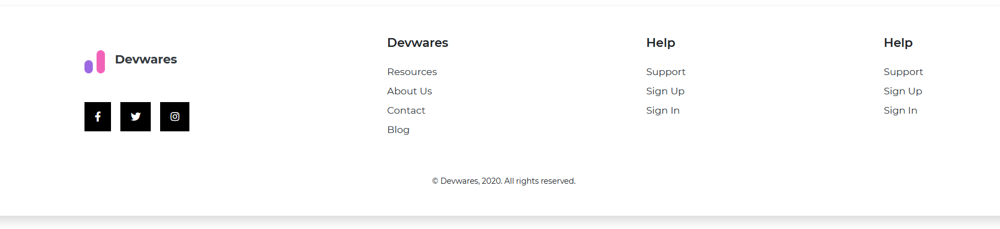
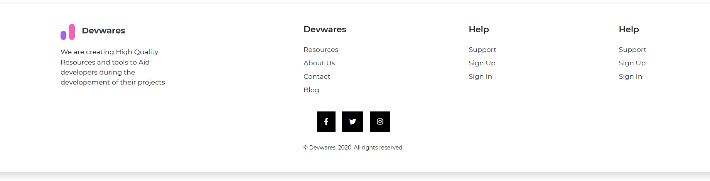
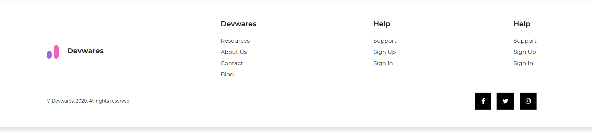

# Contrast Angular Bootstrap Footer

Contrast Angular Bootstrap Footer is a component that provides additional navigation for a website. It can hold `links`, `company info`, `copyrights`, `buttons`, `forms`. and many other elements.

You can set the color of the footer by adding one of classes from our `color palette`.

Just like any other components of CDBootstrap, Footers are responsive by default.

## Importing the Contrast Angular Bootstrap Footer Module

To use the Contrast Angular Bootstrap Footer component in your project you need to import `FooterModule`.

```ts
import {FooterModule } from 'cdbangular';
```


## Default Footer

Alongside the `CDBFooter` component we also use the [CDBBtn](https://www.devwares.com/docs/contrast/angular/components/buttons) for buttons in our footer, we nest the [CDBIcon](https://www.devwares.com/docs/contrast/angular/components/icon) component in the button component to have icons in our button.


###### HTML
```html
    <CDBFooter class="shadow">
        <div class="d-flex flex-column mx-auto py-5" style="width: 80%;">
            <div class="d-flex justify-content-between">
                <div>
                    <CDBLink class="d-flex align-items-center p-0 text-dark">
                        
                        <span class="ml-3 h5 font-weight-bold">Devwares</span>
                    </CDBLink>
                    <p class="my-3" style="width: 250px;" >We are creating High Quality Resources and tools to Aid
                        developers during the developement of their projects</p>
                    <div class="mt-4">
                        <CDBBtn [flat]=true color="dark">
                            <CDBIcon [fab]=true icon="facebook-f" ></CDBIcon>
                        </CDBBtn>
                        <CDBBtn [flat]=true color="dark" class="mx-3">
                            <CDBIcon [fab]=true icon="twitter" ></CDBIcon>
                        </CDBBtn>
                        <CDBBtn [flat]=true color="dark">
                            <CDBIcon [fab]=true icon="instagram" ></CDBIcon>
                        </CDBBtn>
                    </div>
                </div>
                <div>
                    <p class="h5 mb-4" style="font-weight:600">Devwares</p>
                    <ul style="list-style:none; cursor:pointer">
                        <li class="my-2"><a class="text-dark" href="/">Resources</a></li>
                        <li class="my-2"><a class="text-dark" href="/">About Us</a></li>
                        <li class="my-2"><a class="text-dark" href="/">Contact</a></li>
                        <li class="my-2"><a class="text-dark" href="/">Blog</a></li>
                    </ul>
                </div>
                <div>
                    <p class="h5 mb-4" style="font-weight:600">Help</p>
                    <ul style="list-style:none; cursor:pointer">
                        <li class="my-2"><a class="text-dark" href="/">Support</a></li>
                        <li class="my-2"><a class="text-dark" href="/">Sign Up</a></li>
                        <li class="my-2"><a class="text-dark" href="/">Sign In</a></li>
                    </ul>
                </div>
                <div>
                    <p class="h5 mb-4" style="font-weight:600">Help</p>
                    <ul style="list-style:none; cursor:pointer">
                        <li class="my-2"><a class="text-dark" href="/">Support</a></li>
                        <li class="my-2"><a class="text-dark" href="/">Sign Up</a></li>
                        <li class="my-2"><a class="text-dark" href="/">Sign In</a></li>
                    </ul>
                </div>
            </div>
            <small class="text-center mt-5">&copy; Devwares, 2020. All rights reserved.</small>
        </div>
    </CDBFooter>
```
## Example 2



###### HTML
```html
    <CDBFooter class="shadow">
        <div class="d-flex flex-column mx-auto py-5" style="width:80%">
            <div class="d-flex justify-content-between">
                <div class="align-self-center">
                    <CDBLink class="d-flex align-items-center p-0 text-dark">
                        
                        <span class="ml-3 h5 font-weight-bold">Devwares</span>
                    </CDBLink>
                    <div class="mt-5">
                        <CDBBtn [flat]=true color="dark">
                            <CDBIcon [fab]=true icon="facebook-f"></CDBIcon>
                        </CDBBtn>
                        <CDBBtn [flat]=true color="dark" class="mx-3">
                            <CDBIcon [fab]=true icon="twitter"></CDBIcon>
                        </CDBBtn>
                        <CDBBtn [flat]=true color="dark">
                            <CDBIcon [fab]=true icon="instagram"></CDBIcon>
                        </CDBBtn>
                    </div>
                </div>
                <div>
                    <p class="h5 mb-4" style="font-weight:600">Devwares</p>
                    <ul style="list-style:none; cursor:pointer">
                        <li class="my-2"><a class="text-dark" href="/">Resources</a></li>
                        <li class="my-2"><a class="text-dark" href="/">About Us</a></li>
                        <li class="my-2"><a class="text-dark" href="/">Contact</a></li>
                        <li class="my-2"><a class="text-dark" href="/">Blog</a></li>
                    </ul>
                </div>
                <div>
                    <p class="h5 mb-4" style="font-weight:600">Help</p>
                    <ul style="list-style:none; cursor:pointer">
                        <li class="my-2"><a class="text-dark" href="/">Support</a></li>
                        <li class="my-2"><a class="text-dark" href="/">Sign Up</a></li>
                        <li class="my-2"><a class="text-dark" href="/">Sign In</a></li>
                    </ul>
                </div>
                <div>
                    <p class="h5 mb-4" style="font-weight:600">Help</p>
                    <ul style="list-style:none; cursor:pointer">
                        <li class="my-2"><a class="text-dark" href="/">Support</a></li>
                        <li class="my-2"><a class="text-dark" href="/">Sign Up</a></li>
                        <li class="my-2"><a class="text-dark" href="/">Sign In</a></li>
                    </ul>
                </div>
            </div>
            <small class="text-center mt-5">&copy; Devwares, 2020. All rights reserved.</small>
        </div>
    </CDBFooter>
```

## Example 3




###### HTML
```html
    <CDBFooter class="shadow">
        <div class="d-flex flex-column mx-auto py-5" style="width:80%">
            <div class="d-flex justify-content-between">
                <div>
                    <CDBLink class="d-flex align-items-center p-0 text-dark">
                        
                        <span class="ml-3 h5 font-weight-bold">Devwares</span>
                    </CDBLink>
                    <p class="my-3" style="width:250px">We are creating High Quality Resources and tools to Aid
                        developers during the developement of their projects</p>
                </div>
                <div>
                    <p class="h5 mb-4" style="font-weight:600">Devwares</p>
                    <ul style="list-style:none; cursor:pointer">
                        <li class="my-2"><a class="text-dark" href="/">Resources</a></li>
                        <li class="my-2"><a class="text-dark" href="/">About Us</a></li>
                        <li class="my-2"><a class="text-dark" href="/">Contact</a></li>
                        <li class="my-2"><a class="text-dark" href="/">Blog</a></li>
                    </ul>
                </div>
                <div>
                    <p class="h5 mb-4" style="font-weight:600">Help</p>
                    <ul style="list-style:none; cursor:pointer">
                        <li class="my-2"><a class="text-dark" href="/">Support</a></li>
                        <li class="my-2"><a class="text-dark" href="/">Sign Up</a></li>
                        <li class="my-2"><a class="text-dark" href="/">Sign In</a></li>
                    </ul>
                </div>
                <div>
                    <p class="h5 mb-4" style="font-weight:600">Help</p>
                    <ul style="list-style:none; cursor:pointer">
                        <li class="my-2"><a class="text-dark" href="/">Support</a></li>
                        <li class="my-2"><a class="text-dark" href="/">Sign Up</a></li>
                        <li class="my-2"><a class="text-dark" href="/">Sign In</a></li>
                    </ul>
                </div>
            </div>
            <div class="text-center mt-4">
                <div class="mb-4">
                    <CDBBtn [flat]=true color="dark">
                        <CDBIcon [fab]=true icon="facebook-f" ></CDBIcon>
                    </CDBBtn>
                    <CDBBtn [flat]=true color="dark" class="mx-3">
                        <CDBIcon [fab]=true icon="twitter" ></CDBIcon>
                    </CDBBtn>
                    <CDBBtn [flat]=true color="dark">
                        <CDBIcon [fab]=true icon="instagram" ></CDBIcon>
                    </CDBBtn>
                </div>
                <small>&copy; Devwares, 2020. All rights reserved.</small>
            </div>
        </div>
    </CDBFooter>
```

## Example 4



###### HTML
```html
    <CDBFooter class="shadow">
        <div class="d-flex flex-column mx-auto py-5" style="width:80%">
            <div class="d-flex justify-content-between">
                <div class="align-self-center">
                    <CDBLink class="d-flex align-items-center p-0 text-dark">
                        
                        <span class="ml-4 h5 font-weight-bold">Devwares</span>
                    </CDBLink>
                </div>
                <div>
                    <p class="h5 mb-4" style="font-weight:600">Devwares</p>
                    <ul style="list-style:none; cursor:pointer">
                        <li class="my-2"><a class="text-dark" href="/">Resources</a></li>
                        <li class="my-2"><a class="text-dark" href="/">About Us</a></li>
                        <li class="my-2"><a class="text-dark" href="/">Contact</a></li>
                        <li class="my-2"><a class="text-dark" href="/">Blog</a></li>
                    </ul>
                </div>
                <div>
                    <p class="h5 mb-4" style="font-weight:600">Help</p>
                    <ul style="list-style:none; cursor:pointer">
                        <li class="my-2"><a class="text-dark" href="/">Support</a></li>
                        <li class="my-2"><a class="text-dark" href="/">Sign Up</a></li>
                        <li class="my-2"><a class="text-dark" href="/">Sign In</a></li>
                    </ul>
                </div>
                <div>
                    <p class="h5 mb-4" style="font-weight:600">Help</p>
                    <ul style="list-style:none; cursor:pointer">
                        <li class="my-2"><a class="text-dark" href="/">Support</a></li>
                        <li class="my-2"><a class="text-dark" href="/">Sign Up</a></li>
                        <li class="my-2"><a class="text-dark" href="/">Sign In</a></li>
                    </ul>
                </div>
            </div>
            <div class="d-flex justify-content-between align-items-center mt-4">
                <small>&copy; Devwares, 2020. All rights reserved.</small>
                <div>
                    <CDBBtn [flat]=true color="dark">
                        <CDBIcon [fab]=true icon="facebook-f" ></CDBIcon>
                    </CDBBtn>
                    <CDBBtn [flat]=true color="dark" class="mx-3">
                        <CDBIcon [fab]=true icon="twitter" ></CDBIcon>
                    </CDBBtn>
                    <CDBBtn [flat]=true color="dark">
                        <CDBIcon [fab]=true icon="instagram" ></CDBIcon>
                    </CDBBtn>
                </div>
            </div>
        </div>
    </CDBFooter>
```

## Example 5


###### HTML
```html
    <CDBFooter class="shadow">
        <div class="d-flex justify-content-between align-items-center mx-auto py-4" style="width:80%">
            <CDBLink class="d-flex align-items-center p-0 text-dark">
                
                <span class="ml-4 h5 font-weight-bold">Devwares</span>
                <small class="ml-2">&copy; Devwares, 2020. All rights reserved.</small>
            </CDBLink>
            <div>
                <CDBBtn [flat]=true color="dark">
                    <CDBIcon [fab]=true icon="facebook-f" ></CDBIcon>
                </CDBBtn>
                <CDBBtn [flat]=true color="dark" class="mx-3">
                    <CDBIcon [fab]=true icon="twitter" ></CDBIcon>
                </CDBBtn>
                <CDBBtn [flat]=true color="dark">
                    <CDBIcon [fab]=true icon="instagram" ></CDBIcon>
                </CDBBtn>
            </div>
        </div>
    </CDBFooter>
```

## Example 6


###### HTML
```html
    <CDBFooter class="shadow">
        <div class="d-flex flex-column mx-auto py-5" style="width:80%">
            <div class="d-flex justify-content-between">
                <div class="align-self-center">
                    <CDBLink class="d-flex align-items-center p-0 text-dark">
                        
                        <span class="ml-4 h5 font-weight-bold">Devwares</span>
                    </CDBLink>
                </div>
                <div class="d-flex justify-content-between" style="width:40%">
                    <div>
                        <p class="h5 mb-4" style="font-weight:600">Devwares</p>
                        <ul style="list-style:none; cursor:pointer">
                            <li class="my-2"><a class="text-dark" href="/">Resources</a></li>
                            <li class="my-2"><a class="text-dark" href="/">About Us</a></li>
                            <li class="my-2"><a class="text-dark" href="/">Contact</a></li>
                            <li class="my-2"><a class="text-dark" href="/">Blog</a></li>
                        </ul>
                    </div>
                    <div>
                        <p class="h5 mb-4" style="font-weight:600">Help</p>
                        <ul style="list-style:none; cursor:pointer">
                            <li class="my-2"><a class="text-dark" href="/">Support</a></li>
                            <li class="my-2"><a class="text-dark" href="/">Sign Up</a></li>
                            <li class="my-2"><a class="text-dark" href="/">Sign In</a></li>
                        </ul>
                    </div>
                </div>
            </div>
            <div class="d-flex justify-content-between align-items-center mt-4">
                <small>&copy; Devwares, 2020. All rights reserved.</small>
                <div>
                    <CDBBtn [flat]=true color="dark">
                        <CDBIcon [fab]=true icon="facebook-f" ></CDBIcon>
                    </CDBBtn>
                    <CDBBtn [flat]=true color="dark" class="mx-3">
                        <CDBIcon [fab]=true icon="twitter" ></CDBIcon>
                    </CDBBtn>
                    <CDBBtn [flat]=true color="dark">
                        <CDBIcon [fab]=true icon="instagram" ></CDBIcon>
                    </CDBBtn>
                </div>
            </div>
        </div>
    </CDBFooter>
```

## Example 7


###### HTML
```html
    <CDBFooter class="shadow">
        <div class="d-flex justify-content-between align-items-center mx-auto py-4" style="width:80%">
            <CDBLink class="d-flex align-items-center p-0 text-dark">
                
                <span class="ml-4 h5 font-weight-bold">Devwares</span>
            </CDBLink>
            <small>&copy; Devwares, 2020. All rights reserved.</small>
            <div>
                <CDBBtn [flat]=true color="dark">
                    <CDBIcon [fab]=true icon="facebook-f" ></CDBIcon>
                </CDBBtn>
                <CDBBtn [flat]=true color="dark" class="mx-3">
                    <CDBIcon [fab]=true icon="twitter" ></CDBIcon>
                </CDBBtn>
                <CDBBtn [flat]=true color="dark">
                    <CDBIcon [fab]=true icon="instagram" ></CDBIcon>
                </CDBBtn>
            </div>
        </div>
    </CDBFooter>
```

## API Reference: Contrast Angular Bootstrap Footer Props

This section will build on your information about the props you get to use with the Contrast Angular Bootstrap Footer component. You will find out what these props do, their default values, and how you would use them in your code.

The table below lists other prop options of the `CDBFooter` component.

| Name            | Type        | Default      |   Description| Example      |
| :------------- | :----------: | -----------: | :----------: | -----------: |
| class      | String       | |Adds custom classes	      |     class="myClass" |
| color          | String       |              | Defines component's color | color="blue" |
