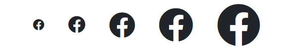

# Contrast Angular Bootstrap Icon

Contrast Angular Bootstrap Icons are representative symbols or elements that can serve as a link, provide information, or simply be aesthetic.

<i/>

## Importing the Contrast Angular Bootstrap Icon Module

To use the Contrast Angular Bootstrap Icon component in your project you need to import `IconModule`.

```ts
import {IconModule } from 'cdbangular';
```

## Default Icons

Use the [fab] prop to indicate that we want to use brand icons in our project. The `icon` prop indicates the icon we want to use.


###### HTML
```html
<CDBBtn color="primary">
    <CDBIcon [fab]=true icon="stack-overflow"></CDBIcon>
    click me
</CDBBtn>
<CDBBtn color="secondary">
    <CDBIcon [fab]=true icon="facebook"></CDBIcon>
    click me
</CDBBtn>
<CDBBtn color="success">
    <CDBIcon [fab]=true icon="reddit"></CDBIcon>
    click me
</CDBBtn>
<CDBBtn color="danger">
    <CDBIcon [fab]=true icon="twitter"></CDBIcon>
    click me
</CDBBtn>
<CDBBtn color="dark">
    <CDBIcon [fab]=true icon="instagram"></CDBIcon>
    click me
</CDBBtn>
<CDBBtn color="warning">
    <CDBIcon [fab]=true icon="google"></CDBIcon>
    click me
</CDBBtn>
```


## Border Icons

Set the [border] prop to `true` to allow your icons have borders.


###### HTML
```html
<CDBIcon [fab]=true [border]=true icon="stack-overflow"></CDBIcon>
<CDBIcon [fab]=true [border]=true icon="facebook"></CDBIcon>
<CDBIcon [fab]=true [border]=true icon="reddit"></CDBIcon>
<CDBIcon [fab]=true [border]=true icon="twitter"></CDBIcon>
<CDBIcon [fab]=true [border]=true icon="instagram"></CDBIcon>
<CDBIcon [fab]=true [border]=true icon="google"></CDBIcon>
```


## Spin Icons

Set your [spin] prop to `true` to spin your icons.


###### HTML
```html
<CDBIcon [fab]=true [spin]=true icon="stack-overflow"></CDBIcon>
<CDBIcon [fab]=true [spin]=true icon="facebook"></CDBIcon>
<CDBIcon [fab]=true [spin]=true icon="reddit"></CDBIcon>
<CDBIcon [fab]=true [spin]=true icon="twitter"></CDBIcon>
<CDBIcon [fab]=true [spin]=true icon="instagram"></CDBIcon>
<CDBIcon [fab]=true [spin]=true icon="google"></CDBIcon>
```


## Pull Icons

Use the `pull` prop to indicate the direction you want your icon to face.


###### HTML
```html
<CDBIcon [fab]=true pull="left" icon="stack-overflow"></CDBIcon>
```

## Pulse Icons

Use the [pulse] prop to spin your icons a little faster


###### HTML
```html
<CDBIcon [fab]=true [pulse]=true icon="stack-overflow"></CDBIcon>
<CDBIcon [fab]=true [pulse]=true icon="facebook"></CDBIcon>
<CDBIcon [fab]=true [pulse]=true icon="reddit"></CDBIcon>
<CDBIcon [fab]=true [pulse]=true icon="twitter"></CDBIcon>
<CDBIcon [fab]=true [pulse]=true icon="instagram"></CDBIcon>
<CDBIcon [fab]=true [pulse]=true icon="google"></CDBIcon>
```


## Flip Icons


###### HTML
```html
<CDBIcon [fab]=true flip="horizontal" icon="stack-overflow"></CDBIcon>
<CDBIcon [fab]=true flip="vertical" icon="facebook"></CDBIcon>
```


## Rotate Icons

Use the `rotate` prop to specify the angle to rotate your icons by.


###### HTML
```html
<CDBIcon [fab]=true rotate="90" icon="stack-overflow"></CDBIcon>
<CDBIcon [fab]=true rotate="180" icon="facebook"></CDBIcon>
```


## Sizes

Use the `size` prop to define how little or how large you want your icons to be.



###### HTML
```html
<CDBIcon icon="facebook" [fab]=true size="lg"></CDBIcon>
<CDBIcon [fab]=true icon="facebook" size="2x"></CDBIcon>
<CDBIcon [fab]=true icon="facebook" size="3x"></CDBIcon>
<CDBIcon [fab]=true icon="facebook" size="4x"></CDBIcon>
<CDBIcon [fab]=true icon="facebook" size="5x"></CDBIcon>
```


## API Reference: Contrast Angular Bootstrap Icon Props

This section will build on your information about the props you get to use with the Contrast Angular Bootstrap Icon component. You will find out what these props do, their default values, and how you would use them in your code.

The table below lists other prop options of the `CDBIcon` component.

| Name            | Type        | Default      |   Description| Example      |
| :------------- | :----------: | -----------: | :----------: | -----------: |
| class          | String       |              |Adds custom classes	      |     class="myClass" |
| icon           | String       |              | `Required!` The Font Awesome icon name, which you want to use | icon="facebook" |
| border         | Boolean      | false        |  	Adds border around icon | border=true |
| brand          | Boolean      | false        |  Sets brand icon category; `alias: brand`	| [brand]=true icon="chevron" |
| fab            | Boolean      | false        |  Sets brand icon category; `alias: fab`	| [fab]=true icon="twitter" |
| fal            | Boolean      | false        |  Sets light icon category; `alias: fal`	| [fal]=true icon="user" |
| far            | Boolean      | false        |  Sets light icon category; `alias: far`	| [far]=true icon="user" |
| fixed          | Boolean      | false        | Sets fixed with of icons (i.e. inside list) | fixed=true icon="user" |
| flip           | String       |              | Flips icon; acceptable props: `horizontal` or `vertical` | flip="vertical" icon="user" |
| inverse        | Boolean      | false        | Sets alternative icon color | inverse=true icon="user" |
| light          | Boolean      | false        | Sets light icon category; `alias: light` | light=true icon="facebook" |
| list           | Boolean      | false        | Adds `fa-li` to the className | list=true icon="facebook" |
| pull           | String       |              | Pulls icon to the `right` or `left` | pull="left" icon="user" |
| pulse          | Boolean      | false        | Rotates icon in 8 steps | pulse=true icon="facebook" |
| rotate         | String       |              | Rotates icon by `90`, `180` or `270` degrees | rotate="90" icon="facebook" |
| size           | String       |              |  	Increase icon size; accepts parameters: [`lg`, `2x`, `3x`, `4x`, `5x`] | size="5x" icon="facebook" |
| spin           | Boolean      | false        | Spins the icon, you can combine this prop with `pulse` | [spin]=true  |
| stack          | String       |              | Use class `fa-stack` on wrapper to stack multiple icons; use `1x` for regular sized icon and `2x` for larger one | class="fa-stack"... [far]=true icon="square" stack="2x" ... [fab]=true icon="twitter" stack="1x" |
