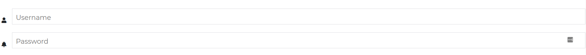
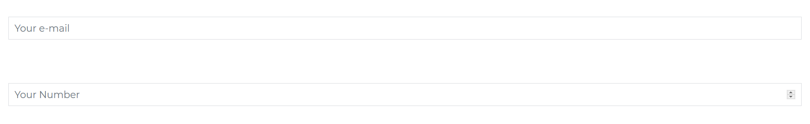

# Contrast Angular Bootstrap Input

Contrast Angular Bootstrap Input is a special field which is used to receive data from the user. It is used mostly in a variety of web-based forms. You can use material design version or default bootstrap style.

## Importing the Contrast Angular Bootstrap Input Module

To use the Contrast Angular Bootstrap Input component in your project you need to import `InputModule`.

```ts
import {InputModule } from 'cdbangular';
```

## Default Input 

The `CDBInput` allows for a variety of props to be passed into it to personalize the input field.

The `label` property is used to tell you user what kind of data to input in that field.

The `type` property describes what type of data we want to collect in the input field, ranging from text, emails, to passwords and checkboxes etc. 

The [background] property takes in a Boolean that if set to true gives our input a background.


###### HTML
```html
<CDBInput id="username" label="Username"></CDBInput>
<CDBInput hint="Your e-mail" type="email"></CDBInput>
<CDBInput type="number"></CDBInput>
<CDBInput [material]=true type="text"></CDBInput>
<CDBInput [background]=true type="text"></CDBInput>
<CDBInput type="checkbox"></CDBInput>
<CDBInput class="mt-5" type="textarea"></CDBInput>
```

## Input Sizing

Use the `size` prop to define how little or large you want your input field to be.


###### HTML
```html
<CDBInput label="Your e-mail" type="email" size="sm"></CDBInput>
<CDBInput type="number" label="Your Number" size="lg"></CDBInput>
```

## Input with icons

Use the `icon` property to nest icons in your input.



###### HTML
```html
<CDBInput label="Username" type="text" icon="user"></CDBInput>
<CDBInput label="Password" type="password" icon="bell"></CDBInput>
```

## Input with MD


###### HTML
```html
<CDBInput [material]=true label="Your e-mail" type="email"></CDBInput>
<CDBInput [material]=true type="number" label="Your Number"></CDBInput>
```

## Placeholder

Use the `hint` property to give your input fields a placeholder.


###### HTML
```html
<CDBInput hint="Your e-mail" type="email"></CDBInput>
<CDBInput type="number" hint="Your Number"></CDBInput>
```
## Disabled Inputs

Set your [disabled] property to `true` to disable your input fields.



###### HTML
```html
<CDBInput hint="Your e-mail" type="email" [disabled]=true></CDBInput>
<CDBInput type="number" hint="Your Number" [disabled]=true></CDBInput>
```
## Textarea

Give the `type` property a value of `textarea` to give your input field a large area to work with usually for essays.


###### HTML
```html
<CDBInput label="Your name" type="textarea"></CDBInput>
<CDBInput label="Your story" type="textarea" [material]=true [rows]=20 [cols]=30></CDBInput>
```
## Background


###### HTML
```html
<CDBInput hint="Your e-mail" type="email" [background]=true></CDBInput>
<CDBInput type="number" hint="Your Number" [background]=true></CDBInput>
```

## API Reference: Contrast Angular Bootstrap Input Props

This section will build on your information about the props you get to use with the Contrast Angular Bootstrap  Input component. You will find out what these props do, their default values, and how you would use them in your code.

The table below lists other prop options of the `CDBInput` component.

| Name            | Type        | Default      |   Description| Example      |
| :------------- | :----------: | -----------: | :----------: | -----------: |
| class      | String       |              |Adds custom classes	      |     class="myClass" |
| containerClass     | String       |           | Adds custom class to wrapping div | containerClass="wrapper" |
| error     | String       |           |  	Sets the error message for the labels data-error attribute | error="Ouch!" |
| hint     | String       |           |  	Sets the placeholder for the Input | hint="Placeholder" |
| value     | Number, Boolean or String       |           |  The value of the input element (use with the controlled input)	| value="I am controlled" onChange={this.handleChange} |
| material        | Boolean      | false        | Changes component styles for material theme | material=true |
| valueDefault     | Number or String       |           |  The default value of the input (use with the uncontrolled input)	| valueDefault="I am uncontrolled" |
| id     | String       |           | Required! Set the id of the input element 	| id="myId" |
| label     | String       |           | Add label to the component; you can attach jsx elements (f.e. links) 	| label="My custom input" |
| labelClass     | String       |           | Add custom class to label | labelClass="My custom label class" |
| labelId     | String       |           | Sets custom id to label | labelId="myId" |
| size     | String       |      lg     | Changes size of the component; available `lg` and `sm` | size="lg" |
| success     | String       |           | Sets the success message for the labels data-success attribute | success="Great!" |
| type     | String       |  text         | The type of the input element | type="checkbox" |
| inputRef     | Object or function       |           |  	Allows to attach Angular Ref to the input component; accepts only Callback Ref | inputRef={ref => this.myRef = ref } |
| icon     | String       |           |  Adds font awesome icon	| icon="caret-right" |
| iconBrand     | String       |           |  Use this property to set brand icon (`fab`)	| icon="twitter" iconBrand=true |
| iconLight     | String       |           |  Use this property to set light icon (`fal`)	| icon="twitter" iconLight=true   |
| iconRegular     | String       |           |  Use this property to set regular icon (`far`)	| icon="twitter" iconRegular=true |
| iconClass     | String       |           | Adds custom classes to icon element | icon="caret-right" iconClass="my-class" |
| disable        | Boolean      | false        | Disables Input component | disabled=true |
| group        | Boolean      | false        | Add .form-group class to the wrapping div | error=true |
| filled        | Boolean      | false        | Add filled-in style to checkbox/radio button | type="checkbox" filled=true |
| validate        | Boolean      | false        |  	Adds `.validate` class to the Input component | validate=true |
| gap        | Boolean      | false        | Creates gap inside checkbox/radio button | type="checkbox" gap=true |
