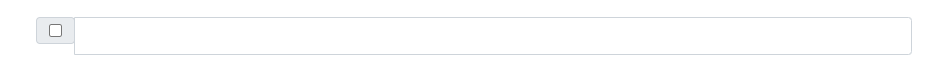

---
title: 'InputGroup'
metaTitle: 'Angular Bootstrap InputGroup'
metaDescription: 'Angular Bootstrap Input group component is used for collecting data entered by users'
githubUrl: "https://github.com/Devwares-Team/DOCS-Contrast/blob/master/content/contrast/angular/components/inputgroup.md"
---# Contrast Angular Bootstrap InputGroup

Contrast Angular Bootstrap Input group component is used for collecting data entered by users. It usually contains buttons, text areas and other inputs. With this component, your forms are attractive and easy to customize.

## Importing the Contrast Angular Bootstrap InputGroup Module

To use the Contrast Angular Bootstrap Footer component in your project you need to import `InputGroupModule`.

```ts
import { InputgroupModule } from 'cdbangular';
```
## Prepends and Appends
Contrast Angular Bootstrap Input group component provides two ways for adding prepends and appends to the component. The `prepend` and `append` properties of the component may be used to insert text add-ons to the component, while for adding other HTML elements such as radios, checkboxes and suchlike, the HTML elements can be added as children within the InputGroup component. The elements must be given a `slot` property which can only be assigned to the values `cdbInputPrepend` and `cdbInputAppend`, and a class of `input-group-text` & `md-addon` as demonstrated in the InputGroup with checkbox section.


## Basic input with appended text after

This is the default InputGroup.


###### HTML

```html
<CDBInputGroup hint="Recipient's username" inputGroupClass="mb-3 mt-0" append="@example.com">
</CDBInputGroup>
```

## Basic input with appended text before


###### HTML

```html
<CDBInputGroup inputGroupClass="flex-nowrap mb-3" prepend="@" hint="Username"></CDBInputGroup>
```

## Run function on icon click


###### HTML

```html
<CDBInputGroup icon="bell" onIconClick="" append="Bells"></CDBInputGroup>
```

## Small input group


###### HTML

```html
<CDBInputGroup inputGroupClass="mb-2 mt-0" prepend="Small" size="sm"></CDBInputGroup>
```

## Large input group


###### HTML

```html
<CDBInputGroup inputGroupClass="mb-2 mt-0" prepend="Large" size="lg"></CDBInputGroup>
```

## Input group with checkbox



###### HTML
```html
<CDBInputGroup>
  <div slot="cdbInputPrepend" class="input-group-text md-addon">
    <input type="checkbox" />
  </div>
</CDBInputGroup>
```

## API Reference: Contrast Angular Bootstrap InputGroup Props

This section will build on your information about the props you get to use with the Contrast Angular Bootstrap InputGroup component. You will find out what these props do, their default values, and how you would use them in your code.

The table below lists other prop options of the `CDBInputGroup` component.

| Name           |           Type            | Default |                           Description                            |                                                                                                                                                              Example |
| :------------- | :-----------------------: | ------: | :--------------------------------------------------------------: | -------------------------------------------------------------------------------------------------------------------------------------------------------------------: |
| class          |          String           |         |                       Adds custom classes                        |                                                                                                                                                      class="myClass" |
| containerClass |          String           |         |                 Adds custom class to wrapper div                 |                                                                                                                                             containerClass="wrapper" |
| containerId    |          String           |         |                  Adds custom Id to wrapper div                   |                                                                                                                                                     containerId="id" |
| hint           |          String           |         |                Sets the placeholder for the Input                |                                                                                                                                                   hint="placeholder" |
| id             |          String           |         |            Required! Set the id of the input element             |                                                                                                                                                            id="myId" |
| input          |           node            |         |         Replaces default input for your custom elements          | inputs={ <select className="browser-default custom-select"...> <option value="0" ...>Choose< .../option> <option value="1" ...>One< .../option> <... /select>} .../> |
| label          |     String or Boolean     |     div |                    Adds label for your input                     |                                                                                                                                                           group=true |
| labelClass     |          String           |     div |                  Adds custom class to the label                  |                                                                                                                                        labelClass="labelCustomClass" |
| append         |      Node or String       |    null |                    Adds suffix for your input                    |                                                                                                                   append={<CDBBtn>Send</CDBBtn>} append="@gmail.com" |
| appendClass    |          String           |         |         Adds custom class to Input Group append element          |                                                                                                                                            appendClass="font-italic" |
| prependClass   |          String           |         |         Adds custom class to Input Group prepend element         |                                                                                                                                           prependClass="font-italic" |
| size           |          String           |      lg |      Changes size of the component; available `lg` and `sm`      |                                                                                                                                                            size="lg" |
| type           |          String           |    text |                  The type of the input element                   |                                                                                                                                                      type="textarea" |
| validate       |          Boolean          |   false |          Adds `.validate` class to the Input component           |                                                                                                                                                        validate=true |
| value          | Number, Boolean or String |         |  The value of the input element (use with the controlled input)  |                                                                                                                   value="I am controlled" onChange=this.handleChange |
| valueDefault   |     Number or String      |         | The default value of the input (use with the uncontrolled input) |                                                                                                                                     valueDefault="I am uncontrolled" |
| arialLabel     |          String           |         |          Adds custom aria-label text for input element           |                                                                                                                                                   arialLabel="close" |
| material       |          Boolean          |   false |           Changes component styles for material theme            |                                                                                                                                                        material=true |
