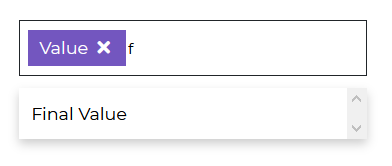

# Contrast Angular Bootstrap Multiselect

Contrast Angular Bootstrap Multiselect is a form control component. It displays a collapsible list of multiple options which can be used in forms, menus or surveys.

Multiselect enables you to use `↑` and `↓` arrow keys to navigate through options and use `↵` key to select required option.

<i/>

## Importing the Contrast Angular Bootstrap Multiselect Module

To use the Contrast Angular Bootstrap Multiselect component in your project you need to import `MultiselectModule`.

```ts
import {MultiselectModule } from 'cdbangular';
```

## Basic Multiselect

The Contrast Angular Bootstrap Multiselect Component takes in an `options` parameter whose value is an object of a user's different options.


###### HTML
```html
<CDBMultiselect [options]='option' selected="Value"></CDBMultiselect>
```
###### TypeScript
```ts
import { Component, OnInit } from '@angular/core';

@Component({
  selector: 'app-multiselect',
  templateUrl: './multiselect.component.html',
  styleUrls: ['./multiselect.component.scss'],
})
export class MultiselectComponent implements OnInit {
  option = [
    {
      text: 'Value 1',
      showing: true,
    },
    {
      text: 'Second Value',
      showing: true,
    },
    {
      text: 'Third Value',
      showing: true,
    },
    {
      text: 'Final Value',
      showing: true,
    },
  ];

  selectOptions = [
    {
      text: 'Value 1',
      showing: true,
    },
    {
      text: 'Second Value',
      showing: true,
    },
    {
      text: 'Third Value',
      showing: true,
    },
    {
      text: 'Final Value',
      showing: true,
    },
  ];

  constructor() {}

  ngOnInit(): void {}
}
```

## Multiselect with Search

Set the [search] property to `true` to enale users search for these options. 



###### HTML
```html
<CDBMultiselect color="secondary" [search]=true [options]='option' selected="Value"></CDBMultiselect>
```
###### TypeScript
```ts
import { Component, OnInit } from '@angular/core';

@Component({
  selector: 'app-multiselect',
  templateUrl: './multiselect.component.html',
  styleUrls: ['./multiselect.component.scss'],
})
export class MultiselectComponent implements OnInit {
  option = [
    {
      text: 'Value 1',
      showing: true,
    },
    {
      text: 'Second Value',
      showing: true,
    },
    {
      text: 'Third Value',
      showing: true,
    },
    {
      text: 'Final Value',
      showing: true,
    },
  ];

  selectOptions = [
    {
      text: 'Value 1',
      showing: true,
    },
    {
      text: 'Second Value',
      showing: true,
    },
    {
      text: 'Third Value',
      showing: true,
    },
    {
      text: 'Final Value',
      showing: true,
    },
  ];

  constructor() {}

  ngOnInit(): void {}
}
```


## Multiselect with Submit Option


###### HTML
```html
<CDBMultiselect color="dark" [submit]=true [options]='option' selected="Value" ></CDBMultiselect>
```
###### TypeScript
```ts
import { Component, OnInit } from '@angular/core';

@Component({
  selector: 'app-multiselect',
  templateUrl: './multiselect.component.html',
  styleUrls: ['./multiselect.component.scss'],
})
export class MultiselectComponent implements OnInit {
  option = [
    {
      text: 'Value 1',
      showing: true,
    },
    {
      text: 'Second Value',
      showing: true,
    },
    {
      text: 'Third Value',
      showing: true,
    },
    {
      text: 'Final Value',
      showing: true,
    },
  ];

  selectOptions = [
    {
      text: 'Value 1',
      showing: true,
    },
    {
      text: 'Second Value',
      showing: true,
    },
    {
      text: 'Third Value',
      showing: true,
    },
    {
      text: 'Final Value',
      showing: true,
    },
  ];

  constructor() {}

  ngOnInit(): void {}
}
```


## Multiselect with Limited Options


###### HTML
```html
<CDBMultiselect color="danger" [limitedOptions]=true [options]='option' selected="Value" ></CDBMultiselect>
```
###### TypeScript
```ts
import { Component, OnInit } from '@angular/core';

@Component({
  selector: 'app-multiselect',
  templateUrl: './multiselect.component.html',
  styleUrls: ['./multiselect.component.scss'],
})
export class MultiselectComponent implements OnInit {
  option = [
    {
      text: 'Value 1',
      showing: true,
    },
    {
      text: 'Second Value',
      showing: true,
    },
    {
      text: 'Third Value',
      showing: true,
    },
    {
      text: 'Final Value',
      showing: true,
    },
  ];

  selectOptions = [
    {
      text: 'Value 1',
      showing: true,
    },
    {
      text: 'Second Value',
      showing: true,
    },
    {
      text: 'Third Value',
      showing: true,
    },
    {
      text: 'Final Value',
      showing: true,
    },
  ];

  constructor() {}

  ngOnInit(): void {}
}
```

## Contrast Angular Bootstrap Multiselect Props

This section will build on your information about the props you get to use with the Contrast Angular Bootstrap Multiselect component. You will find out what these props do, their default values, and how you would use them in your code.

The table below lists other prop options of the `CDBMultiselect` component.

| Name            | Type        | Default      |   Description| Example      |
| :------------- | :----------: | -----------: | :----------: | -----------: |
| class      | String       |              |Adds custom classes	      |     class="myClass" |
| search         | Boolean      | false        |  	Search element will appear as the first child of select. | search=true |
| color          | String       | primary      |  	Sets colorful hover effect on select options. | color="secondary" |
| options        | array of objects |          | Sets options array as source of data. This property is used in alternative Select version. | [options]='option' |
| selected       | String       |              |  	Set default select text content. | selected="choose_option" |

