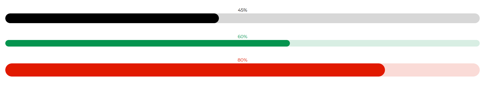

# Progress

Angular Bootstrap Progress bar is a component which displays  progress of a process in which user is involved. Their color, shape, and animation can be customized.

If it takes too long for your website to load up, your user will be less stressed about it when he sees a simple progress bar. It means as much as “Everything is fine. The content you want to see will load in a few seconds”.


## Importing the Contrast Angular Bootstrap Progress Module

To use the Contrast Angular Bootstrap Progress component in your project you need to import `ProgressModule`.

```typescript
import {ProgressModule } from 'cdbangular';
```

## Circular Progress Color Variationsv

The `CDBCircularProgress` component takes in a `value` prop, indicating the progression of the particular metric we are trying to measure.

The `max` prop indicates the maximum value of the progress bar, and the `min` prop shows the minimum value of the progress bar. The `text` prop allows you to write texts on your progress bar. The `color` prop to change the background color of your progress bar.


###### html
```html
<CDBCircularProgress value=25 max=100 min=0 text="25%"></CDBCircularProgress>
<CDBCircularProgress value=50 max=100 min=0 text="50%" color="primary"></CDBCircularProgress>
<CDBCircularProgress value=95 max=100 min=0 color="secondary" text="95%"></CDBCircularProgress>
<CDBCircularProgress value=35 max=100 min=0 color="danger" text="35%"></CDBCircularProgress>
<CDBCircularProgress value=47 max=100 min=0 color="info" text="47%"></CDBCircularProgress>
<CDBCircularProgress value=100 max=100 min=0 color="success" text="100%"></CDBCircularProgress>
```

## Circular Progress Size Variations

Use the `size` prop to specify how large or little you want your progress bar to be.


###### html
```html
<CDBCircularProgress value=25 max=100 min=0 text="25%" size="lg"></CDBCircularProgress>
<CDBCircularProgress value=50 max=100 min=0 text="50%" size="sm"></CDBCircularProgress>
<CDBCircularProgress value=95 max=100 min=0 text="95%" size="md"></CDBCircularProgress>
```

## Rect Progress Default


###### html
```html
<CDBProgress wrapperStyle="" value=69 text="69%"></CDBProgress>
```

## Rect Progress Color Variants

Use the `color` prop to specify the color of your progress bar.


###### html
```html
<div>
    <CDBProgress value=10 text="10%" color="primary"></CDBProgress>
</div>
<div>
    <CDBProgress value=20 text="20%" color="secondary"></CDBProgress>
</div>
<div>
    <CDBProgress value=70 text="70%" color="success"></CDBProgress>
</div>
<div>
    <CDBProgress value=40 text="40%" color="danger"></CDBProgress>
</div>
<div>
    <CDBProgress value=90 text="90%" color="info"></CDBProgress>
</div>
<div>
    <CDBProgress value=60 text="60%" color="warning"></CDBProgress>
</div>
```

## Fixed Height

Use the `height` prop to specify the height of your progress bar in `px`.



###### html
```html
<div>
    <CDBProgress value=45 color="dark" height=30 text="45%"></CDBProgress>
</div>
<div>
    <CDBProgress value=60 color="success" height=20 text="60%"></CDBProgress>
</div>
<div>
    <CDBProgress value=80 color="danger" height=40 text="80%"></CDBProgress>
</div>
```

# API

Here in this section you will find information about required modules and available inputs, outputs, methods and events of this component.


## API Reference: Contrast Progress Inputs

The table below shows the possible input of the Progress component.

| Name            | Type        | Default      |   Description| Example      |
| :------------- | :----------: | -----------: | :----------: | -----------: |
| class      | String       |              |Adds custom classes to bar wrapper	      |     class="myClass" |
| barClass   | String       |              | Adds custom classes to colorful bar	      |     barClass="myClass" |
| colors         | String       | dark         | Changes bar color; accepts CDB predefined color classes |     colors="primary" |
| height         | String       | 10px         |  	Sets custom height of the bar |     height="50px" |
| max            | Number       | 100          |  Sets maximum value of progress bar |     max=200 |
| min            | Number       | 0            |  Sets minimum value of progress bar |     min=0 |
| value          | Number       | 0            |  	Sets current value of progress bar |     value=40 |
| wrapperStyle   | String       |            |  Sets additional inline styles for bar's wrapper |     wrapperStyle="width: 50%" |
