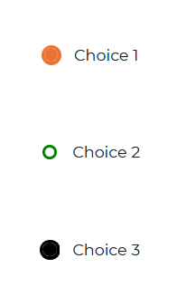

# Angular Bootstrap Radio

Angular Bootstrap Radio button is a component used for allowing a user to make a single choice among many options, while
`Checkboxes` are for selecting multiple options.

<i/>

## Importing the Contrast Angular Bootstrap Radio Module

To use the Contrast Angular Bootstrap Radio component in your project you need to import `RadioModule`.

```typescript
import {RadioModule } from 'cdbangular';
```

## Single Radio

Use the Contrast Angular Bootstrap `CDBRadio` component to create radio buttons.



###### html
```html
<CDBRadio value="Choice 1" fill="#eb7434" colorfill="#eb7434"></CDBRadio>
<CDBRadio value="Choice 2" fill="green" colorfill="red"></CDBRadio>
<CDBRadio value="Choice 3" fill="#000000" colorfill="#000000"></CDBRadio>
```
<i/>

## Radio Group

Creating multiple radio buttons may be hectic, and with the Contrast Angular Bootstrap RadioGroup component, frankly unnecessary.

With `CDBRadioGroup` component, you have an [answers] prop. This [answers] prop takes in an array of choices and creates multiple radio buttons.


###### html
```html
<CDBRadioGroup fill="#eb7434" colorfill="#eb7434" [answers]="['Choice 1', 'Choice 2' , 'Choice 3' , 'Choice 4' ]"></CDBRadioGroup>
```


# API

This section will build on your information about the props you get to use with the Contrast React Bootstrap Radio component. You will find out what these props do, their default values, and how you would use them in your code.


## API Reference: Contrast Radio Props

The table below lists other prop options of the `CDBRadio`.

| Name            | Type        | Default      |   Description| Example      |
| :------------- | :----------: | -----------: | :----------: | -----------: |
| class      | String       |              |Adds custom classes	      |     class="myClass" |
| fill           | String       | #455ff5      | Sets the color of the unselected radio button | fill="#000000" |
| colorfill      | String       |              | Sets the color of the selected radio button | colorFill="#000000" |
| value          | String       |              | The value of the input element | value="Choice1" |

## API Reference: Contrast Radio Group Props

The table below lists other prop options of the `CDBRadioGroup`.

| Name            | Type        | Default      |   Description| Example      |
| :------------- | :----------: | -----------: | :----------: | -----------: |
| className      | String       |              |Adds custom classes	      |     class="myClass" |
| fill           | String       | #455ff5      | Sets the color of the unselected radio button | fill="#000000" |
| colorfill      | String       |              | Sets the color of the selected radio button | colorFill="#000000" |
| answers        | Array        | []           | The list of values of the input element | answers=[choice1, choice2, choice3] |
