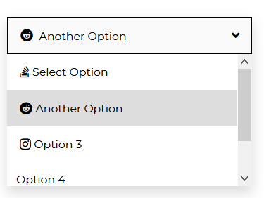
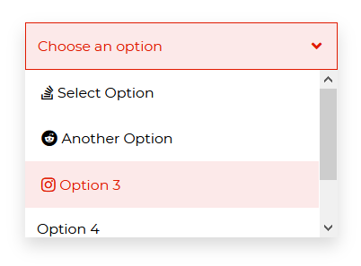

#  Angular Bootstrap Select2

The  Angular Bootstrap `Select2` is the pro version of the Contrast Angular Bootstrap Select component, [CDBSelect](https://www.devwares.com/docs/contrast/react/components/select). With more predefined styles for your select button. Get the CDB pro version to use in your project.  

<i/>

## Importing the Contrast Angular Bootstrap Select2 Module

To use the Contrast Angular Bootstrap Select2 component in your project you need to import `Select2Module`.

```typescript
import {Select2Module } from 'cdbangular';
```

## Select Button



###### html
```html
<CDBSelect2 [options]='select2Options' [iconBrand]=true selected="Choose an option" color="white"></CDBSelect2>
```

###### typescript
```typescript
import { Component, OnInit } from '@angular/core';

@Component({
  selector: 'app-select2',
  templateUrl: './select2.component.html',
  styleUrls: ['./select2.component.scss'],
})
export class Select2Component implements OnInit {
  select2Options = [
    {
      text: 'Select Option',
      icon: 'stack-overflow',
    },
    {
      text: 'Another Option',
      icon: 'reddit',
    },
    {
      text: 'Option 3',
      icon: 'instagram',
    },
    {
      text: 'Option 4',
    },
    {
      text: 'Last Option',
    },
  ];

  constructor() {}

  ngOnInit(): void {}
}
```
<i/>

## Disable Select Button

Use the `disabled` prop to disable the select button.


###### html
```html
<CDBSelect2 [options]='select2Options' [iconBrand]=true selected="Choose an option" [disabled]=true color="none"></CDBSelect2>
```
###### typescript
```typescript
import { Component, OnInit } from '@angular/core';

@Component({
  selector: 'app-select2',
  templateUrl: './select2.component.html',
  styleUrls: ['./select2.component.scss'],
})
export class Select2Component implements OnInit {
  select2Options = [
    {
      text: 'Select Option',
      icon: 'stack-overflow',
    },
    {
      text: 'Another Option',
      icon: 'reddit',
    },
    {
      text: 'Option 3',
      icon: 'instagram',
    },
    {
      text: 'Option 4',
    },
    {
      text: 'Last Option',
    },
  ];

  constructor() {}

  ngOnInit(): void {}
}
```
<i/>

## Colored Select Button

Use the `color` prop to give the select button a background color of your choice.


###### html
```html
<CDBSelect2 [options]='select2Options' [iconBrand]=true selected="Choose an option" color="primary"></CDBSelect2>
<CDBSelect2 [options]='select2Options' [iconBrand]=true selected="Choose an option" color="secondary"></CDBSelect2>
<CDBSelect2 [options]='select2Options' [iconBrand]=true selected="Choose an option" color="success"></CDBSelect2>
<CDBSelect2 [options]='select2Options' [iconBrand]=true selected="Choose an option" color="warning"></CDBSelect2>
<CDBSelect2 [options]='select2Options' [iconBrand]=true selected="Choose an option" color="dark"></CDBSelect2>
```
###### typescript
```typescript
import { Component, OnInit } from '@angular/core';

@Component({
  selector: 'app-select2',
  templateUrl: './select2.component.html',
  styleUrls: ['./select2.component.scss'],
})
export class Select2Component implements OnInit {
  select2Options = [
    {
      text: 'Select Option',
      icon: 'stack-overflow',
    },
    {
      text: 'Another Option',
      icon: 'reddit',
    },
    {
      text: 'Option 3',
      icon: 'instagram',
    },
    {
      text: 'Option 4',
    },
    {
      text: 'Last Option',
    },
  ];

  constructor() {}

  ngOnInit(): void {}
}
```
<i/>

## Colored Options with Hover

The `hoverColor` prop gives your select options an hover effect.



###### html
```html
<CDBSelect2 [options]='select2Options' [iconBrand]=true selected="Choose an option" [hoverColor]=true color="danger"></CDBSelect2>
```
###### typescript
```typescript
import { Component, OnInit } from '@angular/core';

@Component({
  selector: 'app-select2',
  templateUrl: './select2.component.html',
  styleUrls: ['./select2.component.scss'],
})
export class Select2Component implements OnInit {
  select2Options = [
    {
      text: 'Select Option',
      icon: 'stack-overflow',
    },
    {
      text: 'Another Option',
      icon: 'reddit',
    },
    {
      text: 'Option 3',
      icon: 'instagram',
    },
    {
      text: 'Option 4',
    },
    {
      text: 'Last Option',
    },
  ];

  constructor() {}

  ngOnInit(): void {}
}
```
<i/>


## API Reference: Contrast Angular Bootstrap Select2 Props

This section will build on your information about the props you get to use with the Contrast Angular Bootstrap Select2 component. You will find out what these props do, their default values, and how you would use them in your code.

The table below lists other prop options of the `CDBSelect2`.

| Name            | Type        | Default      |   Description| Example      |
| :------------- | :----------: | -----------: | :----------: | -----------: |
| class      | String       |              |Adds custom classes	      |     class="myClass" |
| disable        | Boolean      | false        | If `true` - the option wont be clickable. | disabled=true |
| color          | String       |              |  	Sets colorful hover effect on select options. | color="primary" |
| iconSize       | String       |              | Sets size of icon brand in select option | iconSize="20px" |
| iconBrand      | Boolean      | false        | adds icon to the select option | iconBrand=true |
| iconLight      | Boolean      | false        | Sets the icon light | iconLight=true |
| iconRegular    | Boolean      | false        | Sets the icon regular | iconRegular=true |
| iconClass      | String       |              | Adds custom class to icon | iconClass="myClass" |
| options        | Array of Objects |              | Sets options array as source of data. This property is used in alternative `Select` version. | options=[options] |
| hoverColor     | Boolean      | false        | Sets hover effect on select options.| hoverColor=true |
| selected       | String       |              | Set default select text content. | selected="Choose one" |
| optionClassName  | String       |              | Adds custom classes to options | optionClassName="my-class" |
