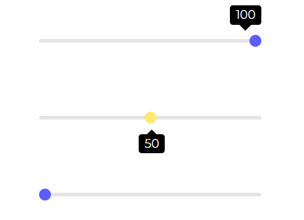

# Angular Bootstrap Slider

Angular Bootstrap Slider is an interactive component that lets the user swiftly slide through possible values spread on the desired range.

Applications of a React Bootstrap slider:

* Brightness
* Volume increase/decrease
* Video Progression.

## Importing the Contrast Angular Bootstrap Slider Module

To use the Contrast Angular Bootstrap Slider component in your project you need to import `SliderModule`.

```typescript
import {SliderModule } from 'cdbangular';
```

## Slider 


###### html

```html
        <CDBSlider style="max-width: 300px;margin: auto;"></CDBSlider>
        <CDBSlider variant='slider-warning' tooltipPlacement="bottom"
            style="max-width: 300px;margin: auto; margin-top: 50px;">
        </CDBSlider>
        <CDBSlider tooltip="auto" style="max-width: 300px;margin: auto; margin-top: 50px;"></CDBSlider>
```

## API Reference: Contrast Angular Bootstrap Slider Props

This section will build on your information about the props you get to use with the Contrast Angular Bootstrap Slider component. You will find out what these props do, their default values, and how you would use them in your code.

The table below lists other prop options of the `CDBSlider`.

| Name            | Type        | Default      |   Description| Example      |
| :------------- | :----------: | -----------: | :----------: | -----------: |
| class      | String       |              |Adds custom classes	      |     class="myClass" |
| value      | Number or String       |              | Slider's value - useful for additional data binding and edge use-cases	|     value=49 |
| disable        | Boolean      | false        | Disables Slider component | [disabled] = false |
| min            | Number       |  0         | Sets the lowest Slider's value  | min=10 |
| max            | Number       |  100         | Sets the highest Slider's value  | max=70 |
| step           | Number       |  1         | Specifies the interval between valid values in a number-based input.  | step=0.1 |
| size            | String       |           | Changes size of slider component. Choose from `lg` and `sm` | size="sm" |
| variant            | String       | dark          |  	Changes default slider color; available values: `[blue, red, teal, dark-grey, dark, blue-grey, amber, purple]` | variant="red" |
| onChange            | function       |           | Returns slider value, on onChange event | onChange=handleChange |
| onAfterChange            | function       |           | executes a function after Change event | onAfterChange=handleAfterChange |
| tooltip            | String       |          | Displays the current value of the slider. Can choose from `auto`, `on` or `off` | tooltip="on" |
| tooltipPlacement          | String       |          | Selects where to place tooltip. Can choose from `top` or `bottom` | tooltipPlacement="top" |
| tooltipLabel          | function       |          | Sets the label of the tooltip | tooltipLabel=yourFunction |
| tooltipStyle          | Object       |          | Customize the style of the tooltip | tooltipStyle= color: "red" |
