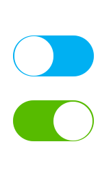

# Contrast Angular Bootstrap Switch

Contrast Angular Bootstrap switch is a simple component that a user uses to toggle between two predefined options.

## Importing the Contrast Angular Bootstrap Switch Module

To use the Contrast Angular Bootstrap Switch component in your project you need to import `SwitchModule`.

```ts
import {SwitchModule } from 'cdbangular';
```

## Default Switch



###### HTML
```html
    <CDBSwitch></CDBSwitch>
    <CDBSwitch [checked]=true></CDBSwitch>
```

## API Reference: Contrast Angular Bootstrap Switch Props

This section will build on your information about the props you get to use with the Contrast Angular Bootstrap Switch component. You will find out what these props do, their default values, and how you would use them in your code.

The table below lists other prop options of the `CDBSwitch`.

| Name            | Type        | Default      |   Description| Example      |
| :------------- | :----------: | -----------: | :----------: | -----------: |
| checked        | Boolean      | false        | Sets the initial state of switch to ON | [checked]=true |
