# Angular Bootstrap Forms

Angular Bootstrap forms are input-based components which are designed to collect users data. Used as login, subscribe or contact form, all can be easily customized.

The Contrast Angular Bootstrap forms have predefined form logins, form registers, form subscriptions or form contacts and other layout forms varying in their design are all at your disposal. Each of them offers a different type of functionality.

## Importing the Contrast Angular Bootstrap Forms Module

To use the Contrast Angular Bootstrap Forms component in your project you need to import `FormsModule`.

```typescript
import {FormsModule} from '@angular/forms';
```

## Default Form Login

To create a Contrast Angular Bootstrap Form we use nested [CDBInput](https://www.devwares.com/docs/contrast/angular/components/input) components on a [CDBCard](https://www.devwares.com/docs/contrast/angular/components/card), this card makes up the for body. The [CDBBtn](https://www.devwares.com/docs/contrast/angular/components/buttons) for creating the form button.

We also use the [CDBIcon](https://www.devwares.com/docs/contrast/angular/components/icon) component to put icons in your form and the `CDBLink` for creating links in your form.


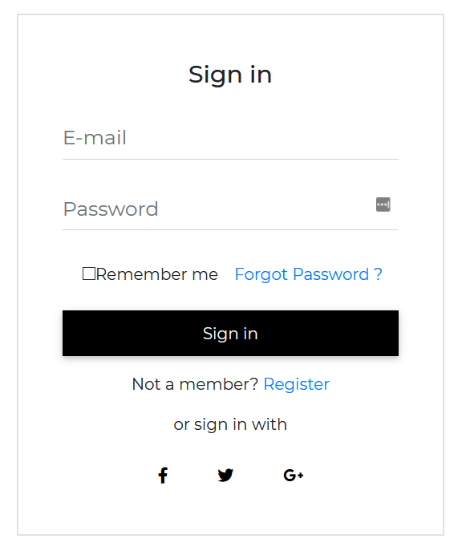

###### html
```html
<CDBCard>
    <CDBCardBody class="mx-4">
        <div class="text-center mt-4 mb-2">
            <p class="h4"> Sign in </p>
        </div>
        <CDBInput [material]=true hint="E-mail" type="email"></CDBInput>
        <CDBInput [material]=true hint="Password" type="password"></CDBInput>
        <div class="d-flex flex-wrap justify-content-center align-items-center">
            <CDBInput type="checkbox"></CDBInput>
            <p class="m-0">Remember me</p>
            <CDBLink to="/">Forgot Password ?</CDBLink>
        </div>
        <CDBBtn color="dark" class="btn-block my-3 mx-0">
            Sign in
        </CDBBtn>
        <p class="text-center">Not a member? <CDBLink class="d-inline p-0" to="/">Register</CDBLink>
        </p>
        <p class="text-center"> or sign in with</p>
        <div class="row my-3 d-flex justify-content-center">
            <CDBBtn color="white" style="box-shadow: none">
                <CDBIcon [fab]=true icon="facebook-f"></CDBIcon>
            </CDBBtn>
            <CDBBtn color="white" class="m-0" style="box-shadow: none">
                <CDBIcon [fab]=true icon="twitter"></CDBIcon>
            </CDBBtn>
            <CDBBtn color="white" style="box-shadow: none">
                <CDBIcon [fab]=true icon="google-plus-g"></CDBIcon>
            </CDBBtn>
        </div>
    </CDBCardBody>
</CDBCard>
```
###### typescript
```typescript
import { Component, OnInit } from '@angular/core';

@Component({
  selector: 'app-forms',
  templateUrl: './forms.component.html',
  styleUrls: ['./forms.component.scss'],
})
export class FormsComponent implements OnInit {
  option = [
    {
      text: 'Select Option',
      icon: 'stack-overflow',
    },
    {
      text: 'Another Option',
      icon: 'reddit',
    },
    {
      text: 'Option 3',
      icon: 'instagram',
    },
    {
      text: 'Option 4',
    },
    {
      text: 'Last Option',
    },
  ];

  constructor() {}

  ngOnInit(): void {}
}
```


## Contrast Form Login

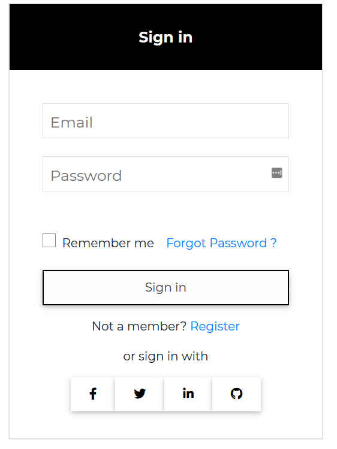

###### html
```html
<CDBCard>
    <div style="background: black" class="text-center text-white">
        <p class="h5 mt-2 py-4 font-weight-bold">Sign in</p>
    </div>
    <CDBCardBody class="mx-4">
        <CDBInput label="Email" type="email"></CDBInput>
        <CDBInput label="Password" type="password"></CDBInput>
        <div class="mt-5 d-flex flex-wrap justify-content-center align-items-center">
            <CDBCheckbox class="mr-2"></CDBCheckbox>
            <p class="m-0">Remember me</p>
            <CDBLink to="/">Forgot Password ?</CDBLink>
        </div>
        <CDBBtn color="dark" [outline]=true class="btn-block my-3 mx-0">
            Sign in
        </CDBBtn>
        <p class="text-center">Not a member? <CDBLink class="d-inline p-0" to="/">Register</CDBLink>
        </p>
        <p class="text-center"> or sign in with</p>
        <div class="row my-3 d-flex justify-content-center">
            <CDBBtn color="white" class="m-0" [outline]=true>
                <CDBIcon [fab]=true icon="facebook-f"></CDBIcon>
            </CDBBtn>
            <CDBBtn color="white" class="m-0" [outline]=true>
                <CDBIcon [fab]=true icon="twitter"></CDBIcon>
            </CDBBtn>
            <CDBBtn color="white" class="m-0" [outline]=true>
                <CDBIcon [fab]=true icon="linkedin-in"></CDBIcon>
            </CDBBtn>
            <CDBBtn color="white" class="m-0" [outline]=true>
                <CDBIcon [fab]=true icon="github"></CDBIcon>
            </CDBBtn>
        </div>
    </CDBCardBody>
</CDBCard>
```
###### typescript
```typescript
import { Component, OnInit } from '@angular/core';

@Component({
  selector: 'app-forms',
  templateUrl: './forms.component.html',
  styleUrls: ['./forms.component.scss'],
})
export class FormsComponent implements OnInit {
  option = [
    {
      text: 'Select Option',
      icon: 'stack-overflow',
    },
    {
      text: 'Another Option',
      icon: 'reddit',
    },
    {
      text: 'Option 3',
      icon: 'instagram',
    },
    {
      text: 'Option 4',
    },
    {
      text: 'Last Option',
    },
  ];

  constructor() {}

  ngOnInit(): void {}
}
```

## Default Form Register


###### html

```html
<CDBCard>
    <CDBCardBody class="mx-4">
        <div class="text-center mt-4 mb-2">
            <p class="h4"> Sign up </p>
        </div>
        <div class="form-row mb-n4">
            <div class="col">
                <CDBInput [material]=true hint="First name" type="text"></CDBInput>
            </div>
            <div class="col">
                <CDBInput [material]=true hint="Last name" type="text"></CDBInput>
            </div>
        </div>
        <CDBInput [material]=true hint="E-mail" type="email"></CDBInput>
        <p class="text-muted text-center small mt-n4">At least 8 characters and 1 digit</p>
        <CDBInput [material]=true hint="Password" type="password"></CDBInput>
        <CDBInput [material]=true hint="Phone number" type="text"></CDBInput>
        <p class="text-muted text-center small mt-n4">Optional - for two step authentication</p>
        <div class="d-flex justify-content-center align-items-center mt-4">
            <CDBInput type="checkbox"></CDBInput>
            <p class="m-0">Subscribe to our newsletter</p>
        </div>
        <CDBBtn color="dark" class="btn-block my-3 mx-0">
            Sign up
        </CDBBtn>
        <p class="text-center"> or sign up with</p>
        <div class="row mb-3 d-flex justify-content-center">
            <CDBBtn color="white" class="m-0" style="box-shadow: none">
                <CDBIcon [fab]=true icon="facebook-f"></CDBIcon>
            </CDBBtn>
            <CDBBtn color="white" class="m-0" style="box-shadow: none">
                <CDBIcon [fab]=true icon="twitter"></CDBIcon>
            </CDBBtn>
            <CDBBtn color="white" class="m-0" style="box-shadow: none">
                <CDBIcon [fab]=true icon="google-plus-g"></CDBIcon>
            </CDBBtn>
        </div>
        <p class="text-center m-0">Already have an account? <CDBLink class="d-inline p-0" to="/">Sign In
            </CDBLink>
        </p>
        <hr />
        <p class="text-center">By clicking <em>Sign up</em> you agree to our <CDBLink class="d-inline p-0"
                to="/">terms of service</CDBLink>
        </p>
    </CDBCardBody>
</CDBCard>
```
###### typescript
```typescript
import { Component, OnInit } from '@angular/core';

@Component({
  selector: 'app-forms',
  templateUrl: './forms.component.html',
  styleUrls: ['./forms.component.scss'],
})
export class FormsComponent implements OnInit {
  option = [
    {
      text: 'Select Option',
      icon: 'stack-overflow',
    },
    {
      text: 'Another Option',
      icon: 'reddit',
    },
    {
      text: 'Option 3',
      icon: 'instagram',
    },
    {
      text: 'Option 4',
    },
    {
      text: 'Last Option',
    },
  ];

  constructor() {}

  ngOnInit(): void {}
}
```
## Contrast Form Register

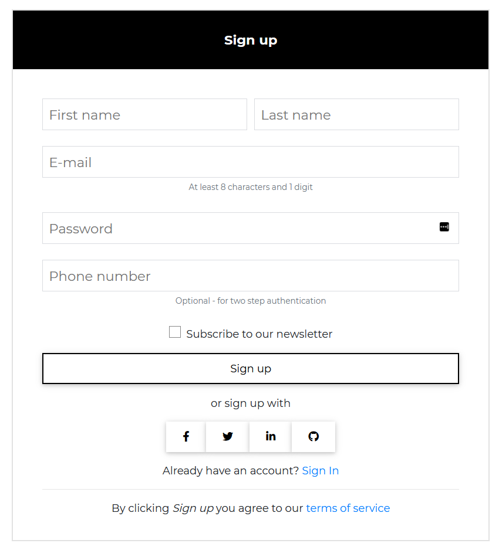

###### html
```html
<CDBCard>
    <div class="text-center text-white" style="background: black">
        <p class="h5 mt-2 py-4 font-weight-bold"> Sign up </p>
    </div>
    <CDBCardBody class="mx-4">
        <div class="form-row mb-n4">
            <div class="col">
                <CDBInput label="First name" type="text"></CDBInput>
            </div>
            <div class="col">
                <CDBInput label="Last name" type="text"></CDBInput>
            </div>
        </div>
        <CDBInput label="E-mail" type="email"></CDBInput>
        <p class="text-muted text-center small mt-n4">At least 8 characters and 1 digit</p>
        <CDBInput label="Password" type="password"></CDBInput>
        <CDBInput label="Phone number" type="text"></CDBInput>
        <p class="text-muted text-center small mt-n4">Optional - for two step authentication</p>
        <div class="d-flex justify-content-center align-items-center mt-4">
            <CDBCheckbox class="mr-2"></CDBCheckbox>
            <p class="m-0">Subscribe to our newsletter</p>
        </div>
        <CDBBtn color="dark" [outline]=true class="btn-block my-3 mx-0">
            Sign up
        </CDBBtn>
        <p class="text-center"> or sign up with</p>
        <div class="row mb-3 d-flex justify-content-center">
            <CDBBtn color="white" class="m-0" [outline]=true>
                <CDBIcon [fab]=true icon="facebook-f"></CDBIcon>
            </CDBBtn>
            <CDBBtn color="white" class="m-0" [outline]=true>
                <CDBIcon [fab]=true icon="twitter"></CDBIcon>
            </CDBBtn>
            <CDBBtn color="white" class="m-0" [outline]=true>
                <CDBIcon [fab]=true icon="linkedin-in"></CDBIcon>
            </CDBBtn>
            <CDBBtn color="white" class="m-0" [outline]=true>
                <CDBIcon [fab]=true icon="github"></CDBIcon>
            </CDBBtn>
        </div>
        <p class="text-center m-0">Already have an account? <CDBLink class="d-inline p-0" to="/">Sign In
            </CDBLink>
        </p>
        <hr />
        <p class="text-center">By clicking <em>Sign up</em> you agree to our <CDBLink class="d-inline p-0"
                to="/">terms of service</CDBLink>
        </p>
    </CDBCardBody>
</CDBCard>
```
###### typescript
```typescript
import { Component, OnInit } from '@angular/core';

@Component({
  selector: 'app-forms',
  templateUrl: './forms.component.html',
  styleUrls: ['./forms.component.scss'],
})
export class FormsComponent implements OnInit {
  option = [
    {
      text: 'Select Option',
      icon: 'stack-overflow',
    },
    {
      text: 'Another Option',
      icon: 'reddit',
    },
    {
      text: 'Option 3',
      icon: 'instagram',
    },
    {
      text: 'Option 4',
    },
    {
      text: 'Last Option',
    },
  ];

  constructor() {}

  ngOnInit(): void {}
}
```
## Default Form Subscription


###### html
```html
<CDBCard>
    <CDBCardBody class="mx-4">
        <div class="text-center mt-4 mb-2">
            <p class="h4">Subscribe</p>
        </div>
        <p class="text-center mt-4 font-weight-light">Join our mailing list. We write rarely, but only the
            best content.</p>
        <CDBLink class="text-center p-0 font-weight-light" to="/">See the last newsletter</CDBLink>
        <CDBInput [material]=true hint="Name" type="text"></CDBInput>
        <CDBInput [material]=true hint="E-mail" type="email"></CDBInput>
        <CDBBtn color="dark" class="btn-block my-3 mx-0">
            Subscribe
        </CDBBtn>
    </CDBCardBody>
</CDBCard>
```
###### typescript
```typescript
import { Component, OnInit } from '@angular/core';

@Component({
  selector: 'app-forms',
  templateUrl: './forms.component.html',
  styleUrls: ['./forms.component.scss'],
})
export class FormsComponent implements OnInit {
  option = [
    {
      text: 'Select Option',
      icon: 'stack-overflow',
    },
    {
      text: 'Another Option',
      icon: 'reddit',
    },
    {
      text: 'Option 3',
      icon: 'instagram',
    },
    {
      text: 'Option 4',
    },
    {
      text: 'Last Option',
    },
  ];

  constructor() {}

  ngOnInit(): void {}
}
```
## Contrast Form Submission

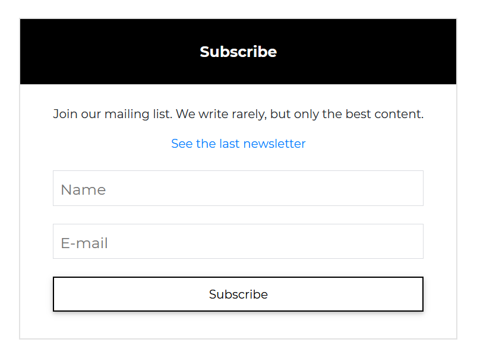

###### html
```html
<CDBCard>
    <div class="text-center text-white" style="background: black">
        <p class="h5 mt-2 py-4 font-weight-bold">Subscribe</p>
    </div>
    <CDBCardBody class="mx-4">
        <p class="text-center mt-2">Join our mailing list. We write rarely, but only the best content.</p>
        <CDBLink class="text-center p-0" to="/">See the last newsletter</CDBLink>
        <CDBInput label="Name" type="text"></CDBInput>
        <CDBInput label="E-mail" type="email"></CDBInput>
        <CDBBtn color="dark" [outline]=true class="btn-block my-3 mx-0">
            Subscribe
        </CDBBtn>
    </CDBCardBody>
</CDBCard>
```
###### typescript
```typescript
import { Component, OnInit } from '@angular/core';

@Component({
  selector: 'app-forms',
  templateUrl: './forms.component.html',
  styleUrls: ['./forms.component.scss'],
})
export class FormsComponent implements OnInit {
  option = [
    {
      text: 'Select Option',
      icon: 'stack-overflow',
    },
    {
      text: 'Another Option',
      icon: 'reddit',
    },
    {
      text: 'Option 3',
      icon: 'instagram',
    },
    {
      text: 'Option 4',
    },
    {
      text: 'Last Option',
    },
  ];

  constructor() {}

  ngOnInit(): void {}
}
```
## Default Form Contact

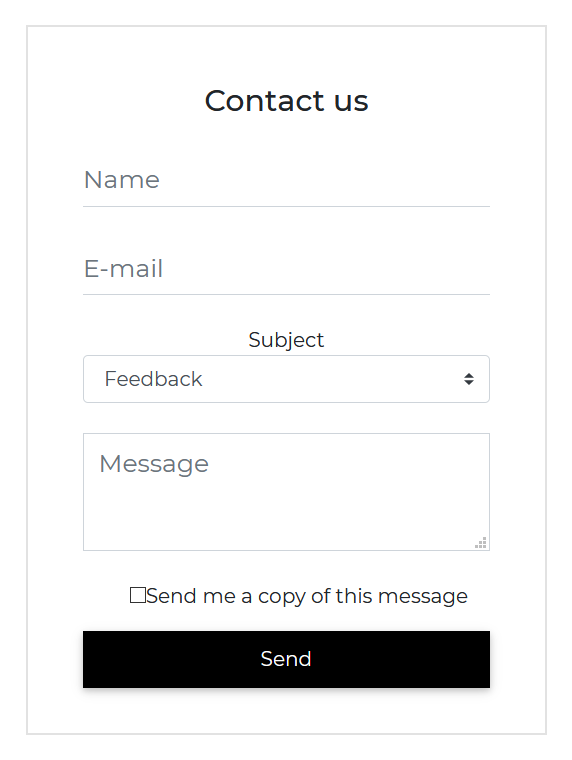

###### html
```html
<CDBCard>
    <CDBCardBody class="mx-4">
        <div class="text-center mt-4 mb-2">
            <p class="h4"> Contact us </p>
        </div>
        <CDBInput [material]=true hint="Name" type="text"></CDBInput>
        <CDBInput [material]=true hint="E-mail" type="email"></CDBInput>
        <p class="text-center m-0">Subject</p>
        <CDBSelect [options]="option" selected="Feedback"></CDBSelect>
        <CDBInput hint="Message" type="textarea"></CDBInput>
        <div class="d-flex justify-content-center align-items-center mt-4">
            <CDBInput [material]=true type="checkbox"></CDBInput>
            <p class="m-0">Send me a copy of this message</p>
        </div>
        <CDBBtn color="dark" class="btn-block my-3 mx-0">
            Send
        </CDBBtn>
    </CDBCardBody>
</CDBCard>
```
###### typescript
```typescript
import { Component, OnInit } from '@angular/core';

@Component({
  selector: 'app-forms',
  templateUrl: './forms.component.html',
  styleUrls: ['./forms.component.scss'],
})
export class FormsComponent implements OnInit {
  option = [
    {
      text: 'Select Option',
      icon: 'stack-overflow',
    },
    {
      text: 'Another Option',
      icon: 'reddit',
    },
    {
      text: 'Option 3',
      icon: 'instagram',
    },
    {
      text: 'Option 4',
    },
    {
      text: 'Last Option',
    },
  ];

  constructor() {}

  ngOnInit(): void {}
}
```
## Contrast Form Contact


###### html
```html
<CDBCard>
    <div style="background: black" class="text-center text-white">
        <p class="h5 mt-2 py-4 font-weight-bold">Contact Us</p>
    </div>
    <CDBCardBody class="mx-4">
        <CDBInput label="Name" type="text"></CDBInput>
        <CDBInput label="E-mail" type="email"></CDBInput>
        <p class="text-center m-0 text-muted">Subject</p>
        <CDBSelect2 color="white" [options]="option" selected="Feedback"></CDBSelect2>
        <CDBInput label="Message" type="textarea"></CDBInput>
        <div class="d-flex justify-content-center align-items-center mt-4">
            <CDBInput type="checkbox"></CDBInput>
            <p class="m-0">Send me a copy of this message</p>
        </div>
        <CDBBtn color="dark" [outline]=true class="btn-block my-3 mx-0">
            Send
        </CDBBtn>
    </CDBCardBody>
</CDBCard>
```
###### typescript
```typescript
import { Component, OnInit } from '@angular/core';

@Component({
  selector: 'app-forms',
  templateUrl: './forms.component.html',
  styleUrls: ['./forms.component.scss'],
})
export class FormsComponent implements OnInit {
  option = [
    {
      text: 'Select Option',
      icon: 'stack-overflow',
    },
    {
      text: 'Another Option',
      icon: 'reddit',
    },
    {
      text: 'Option 3',
      icon: 'instagram',
    },
    {
      text: 'Option 4',
    },
    {
      text: 'Last Option',
    },
  ];

  constructor() {}

  ngOnInit(): void {}
}
```

## Login Form with Icons


###### html
```html
<CDBCard>
    <CDBCardBody class="mx-4">
        <div class="text-center mt-4 mb-2">
            <p class="h4 font-weight-bold"> Sign in </p>
        </div>
        <CDBInput label="E-mail" type="email" icon="envelope"></CDBInput>
        <CDBInput label="Password" type="password" icon="lock"></CDBInput>
        <CDBBtn color="success" class="btn-block mt-5 mx-auto">
            Login
        </CDBBtn>
    </CDBCardBody>
</CDBCard>
```
###### typescript
```typescript
import { Component, OnInit } from '@angular/core';

@Component({
  selector: 'app-forms',
  templateUrl: './forms.component.html',
  styleUrls: ['./forms.component.scss'],
})
export class FormsComponent implements OnInit {
  option = [
    {
      text: 'Select Option',
      icon: 'stack-overflow',
    },
    {
      text: 'Another Option',
      icon: 'reddit',
    },
    {
      text: 'Option 3',
      icon: 'instagram',
    },
    {
      text: 'Option 4',
    },
    {
      text: 'Last Option',
    },
  ];

  constructor() {}

  ngOnInit(): void {}
}
```
## Login Form with Outside Label


###### html
```html
<CDBCard>
    <CDBCardBody class="mx-4">
        <div class="text-center mt-4 mb-4">
            <p class="h4"> Sign in </p>
        </div>
        <label htmlFor="defaultLoginEmail" class="text-muted m-0">
            Your email
        </label>
        <CDBInput id="defaultLoginEmail" class="mt-n3" type="email"></CDBInput>
        <label htmlFor="defaultLoginPassword" class="text-muted m-0">
            Your password
        </label>
        <CDBInput id="defaultLoginPassword" class="mt-n3" type="password"></CDBInput>
        <CDBBtn color="primary" class="btn-block mt-5 mx-auto">
            Login
        </CDBBtn>
    </CDBCardBody>
</CDBCard>
```
###### typescript
```typescript
import { Component, OnInit } from '@angular/core';

@Component({
  selector: 'app-forms',
  templateUrl: './forms.component.html',
  styleUrls: ['./forms.component.scss'],
})
export class FormsComponent implements OnInit {
  option = [
    {
      text: 'Select Option',
      icon: 'stack-overflow',
    },
    {
      text: 'Another Option',
      icon: 'reddit',
    },
    {
      text: 'Option 3',
      icon: 'instagram',
    },
    {
      text: 'Option 4',
    },
    {
      text: 'Last Option',
    },
  ];

  constructor() {}

  ngOnInit(): void {}
}
```
## Sign Up Form with Icon

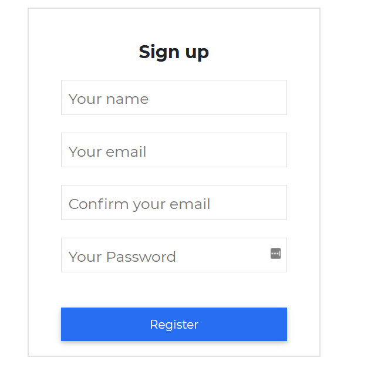

###### html
```html
<CDBCard>
    <CDBCardBody class="mx-4">
        <div class="text-center mt-4 mb-2">
            <p class="h4 font-weight-bold"> Sign up </p>
        </div>
        <CDBInput label="Your name" type="text" icon="user" iconClass="text-muted"></CDBInput>
        <CDBInput label="Your email" type="email" icon="envelope" iconClass="text-muted"></CDBInput>
        <CDBInput label="Confirm your email" type="email" icon="exclamation-triangle" iconClass="text-muted">
        </CDBInput>
        <CDBInput label="Your Password" type="password" icon="lock" iconClass="text-muted"></CDBInput>
        <CDBBtn color="primary" class="btn-block mt-5 mx-auto">
            Register
        </CDBBtn>
    </CDBCardBody>
</CDBCard>
```
###### typescript
```typescript
import { Component, OnInit } from '@angular/core';

@Component({
  selector: 'app-forms',
  templateUrl: './forms.component.html',
  styleUrls: ['./forms.component.scss'],
})
export class FormsComponent implements OnInit {
  option = [
    {
      text: 'Select Option',
      icon: 'stack-overflow',
    },
    {
      text: 'Another Option',
      icon: 'reddit',
    },
    {
      text: 'Option 3',
      icon: 'instagram',
    },
    {
      text: 'Option 4',
    },
    {
      text: 'Last Option',
    },
  ];

  constructor() {}

  ngOnInit(): void {}
}
```
## Sign Up Form Outside Label

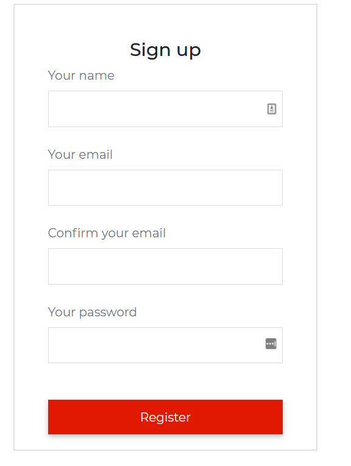

###### html
```html
<CDBCard>
    <CDBCardBody class="mx-4">
        <div class="text-center mt-4 mb-2">
            <p class="h4"> Sign up </p>
        </div>
        <label htmlFor="defaultRegisterName" class="text-muted m-0">
            Your name
        </label>
        <CDBInput id="defaultRegisterName" class="mt-n3" type="text"></CDBInput>
        <label htmlFor="defaultRegisterEmail" class="text-muted m-0">
            Your email
        </label>
        <CDBInput id="defaultRegisterEmail" class="mt-n3" type="email"></CDBInput>
        <label htmlFor="defaultRegisterEmailConfirm" class="text-muted m-0">
            Confirm your email
        </label>
        <CDBInput id="defaultRegisterEmailConfirm" class="mt-n3" type="email"></CDBInput>
        <label htmlFor="defaultRegisterPassword" class="text-muted m-0">
            Your password
        </label>
        <CDBInput id="defaultRegisterPassword" class="mt-n3" type="password"></CDBInput>
        <CDBBtn color="danger" class="btn-block mt-5 mx-auto">
            Register
        </CDBBtn>
    </CDBCardBody>
</CDBCard>
```
###### typescript
```typescript
import { Component, OnInit } from '@angular/core';

@Component({
  selector: 'app-forms',
  templateUrl: './forms.component.html',
  styleUrls: ['./forms.component.scss'],
})
export class FormsComponent implements OnInit {
  option = [
    {
      text: 'Select Option',
      icon: 'stack-overflow',
    },
    {
      text: 'Another Option',
      icon: 'reddit',
    },
    {
      text: 'Option 3',
      icon: 'instagram',
    },
    {
      text: 'Option 4',
    },
    {
      text: 'Last Option',
    },
  ];

  constructor() {}

  ngOnInit(): void {}
}
```
## Subscription Form with Icon


###### html
```html
<CDBCard>
    <CDBCardBody class="mx-4">
        <div class="text-center mt-4 mb-2">
            <p class="h4 font-weight-bold"> Subscribe </p>
        </div>
        <CDBInput label="Your name" type="text" icon="user" iconClass="text-muted"></CDBInput>
        <CDBInput label="Your email" type="email" icon="envelope" iconClass="text-muted"></CDBInput>
        <CDBBtn [outline]=true color="primary" class="btn-block mt-5 mx-auto">
            Send
            <CDBIcon [far]=true icon="paper-plane"></CDBIcon>
        </CDBBtn>
    </CDBCardBody>
</CDBCard>
```
###### typescript
```typescript
import { Component, OnInit } from '@angular/core';

@Component({
  selector: 'app-forms',
  templateUrl: './forms.component.html',
  styleUrls: ['./forms.component.scss'],
})
export class FormsComponent implements OnInit {
  option = [
    {
      text: 'Select Option',
      icon: 'stack-overflow',
    },
    {
      text: 'Another Option',
      icon: 'reddit',
    },
    {
      text: 'Option 3',
      icon: 'instagram',
    },
    {
      text: 'Option 4',
    },
    {
      text: 'Last Option',
    },
  ];

  constructor() {}

  ngOnInit(): void {}
}
```
## Subscription Form with Outside Label


###### html
```html
<CDBCard>
    <CDBCardBody class="mx-4">
        <div class="text-center mt-4 mb-2">
            <p class="h4"> Subscribe </p>
        </div>
        <label htmlFor="defaultSubscribeName" class="text-muted m-0">
            Your name
        </label>
        <CDBInput id="defaultSubscribeName" class="mt-n3" type="text"></CDBInput>
        <label htmlFor="defaultSubscribeEmail" class="text-muted m-0">
            Your email
        </label>
        <CDBInput id="defaultSubscribeEmail" class="mt-n3" type="email"></CDBInput>
        <CDBBtn [outline]=true color="danger" class="btn-block mt-5 mx-auto">
            Send
            <CDBIcon [far]=true icon="paper-plane"></CDBIcon>
        </CDBBtn>
    </CDBCardBody>
</CDBCard>
```
###### typescript
```typescript
import { Component, OnInit } from '@angular/core';

@Component({
  selector: 'app-forms',
  templateUrl: './forms.component.html',
  styleUrls: ['./forms.component.scss'],
})
export class FormsComponent implements OnInit {
  option = [
    {
      text: 'Select Option',
      icon: 'stack-overflow',
    },
    {
      text: 'Another Option',
      icon: 'reddit',
    },
    {
      text: 'Option 3',
      icon: 'instagram',
    },
    {
      text: 'Option 4',
    },
    {
      text: 'Last Option',
    },
  ];

  constructor() {}

  ngOnInit(): void {}
}
```
## Contact Form with Icon


###### html
```html
<CDBCard>
    <CDBCardBody class="mx-4">
        <div class="text-center mt-4 mb-2">
            <p class="h4 font-weight-bold"> Write to Us </p>
        </div>
        <CDBInput label="Your name" type="text" icon="user" iconClass="text-muted"></CDBInput>
        <CDBInput label="Your email" type="email" icon="envelope" iconClass="text-muted"></CDBInput>
        <CDBInput label="Subject" type="text" icon="tags" iconClass="text-muted"></CDBInput>
        <CDBInput label="Your message" type="textarea" icon="pencil-alt" iconClass="text-muted"></CDBInput>
        <CDBBtn [outline]=true color="secondary" class="btn-block mt-5 mx-auto">
            Send
            <CDBIcon [far]=true icon="paper-plane"></CDBIcon>
        </CDBBtn>
    </CDBCardBody>
</CDBCard>
```
###### typescript
```typescript
import { Component, OnInit } from '@angular/core';

@Component({
  selector: 'app-forms',
  templateUrl: './forms.component.html',
  styleUrls: ['./forms.component.scss'],
})
export class FormsComponent implements OnInit {
  option = [
    {
      text: 'Select Option',
      icon: 'stack-overflow',
    },
    {
      text: 'Another Option',
      icon: 'reddit',
    },
    {
      text: 'Option 3',
      icon: 'instagram',
    },
    {
      text: 'Option 4',
    },
    {
      text: 'Last Option',
    },
  ];

  constructor() {}

  ngOnInit(): void {}
}
```

## Contact Form with Icon


###### html
```html
<CDBCard>
    <CDBCardBody class="mx-4">
        <div class="text-center mt-4 mb-4">
            <p class="h4"> Write to Us </p>
        </div>
        <label htmlFor="defaultContactName" class="text-muted m-0">
            Your name
        </label>
        <CDBInput id="defaultContactName" class="mt-n3" type="text"></CDBInput>
        <label htmlFor="defaultContactEmail" class="text-muted m-0">
            Your email
        </label>
        <CDBInput id="defaultContactEmail" class="mt-n3" type="email"></CDBInput>
        <label htmlFor="defaultContactSubject" class="text-muted m-0">
            Subject
        </label>
        <CDBInput id="defaultContactSubject" class="mt-n3" type="text"></CDBInput>
        <label htmlFor="defaultContactMessage" class="text-muted m-0">
            Your message
        </label>
        <CDBInput id="defaultContactMessage" class="mt-n3" type="textarea"></CDBInput>
        <CDBBtn [outline]=true color="secondary" class="btn-block mt-5 mx-auto">
            Send
            <CDBIcon [far]=true icon="paper-plane"></CDBIcon>
        </CDBBtn>
    </CDBCardBody>
</CDBCard>
```
###### typescript
```typescript
import { Component, OnInit } from '@angular/core';

@Component({
  selector: 'app-forms',
  templateUrl: './forms.component.html',
  styleUrls: ['./forms.component.scss'],
})
export class FormsComponent implements OnInit {
  option = [
    {
      text: 'Select Option',
      icon: 'stack-overflow',
    },
    {
      text: 'Another Option',
      icon: 'reddit',
    },
    {
      text: 'Option 3',
      icon: 'instagram',
    },
    {
      text: 'Option 4',
    },
    {
      text: 'Last Option',
    },
  ];

  constructor() {}

  ngOnInit(): void {}
}
```
## Form Login

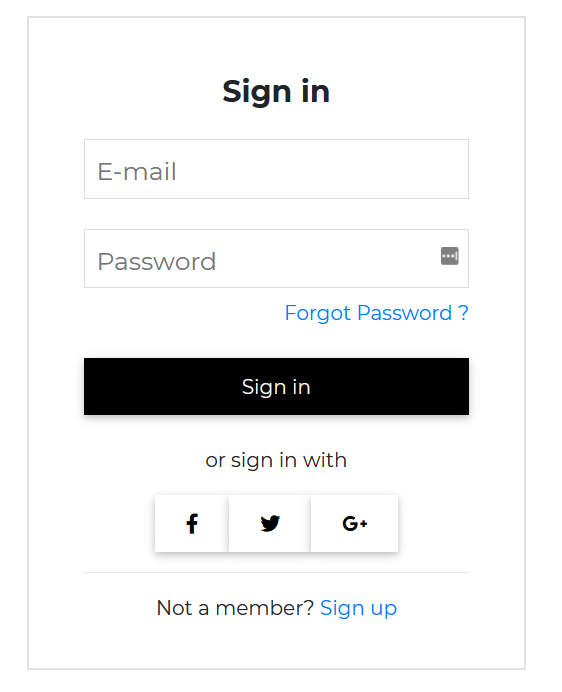

###### html
```html
<CDBCard>
    <CDBCardBody class="mx-4">
        <div class="text-center mt-4 mb-2">
            <p class="h4 font-weight-bold"> Sign in </p>
        </div>
        <CDBInput label="E-mail" type="email"></CDBInput>
        <CDBInput label="Password" type="password"></CDBInput>
        <p class="mt-n3 text-right">
            <CDBLink class="p-0" to="/">Forgot Password ?</CDBLink>
        </p>
        <CDBBtn color="dark" class="btn-block my-4 mx-0">
            Sign in
        </CDBBtn>
        <p class="text-center"> or sign in with</p>
        <div class="row my-3 d-flex justify-content-center">
            <CDBBtn color="white" class="m-0">
                <CDBIcon [fab]=true icon="facebook-f"></CDBIcon>
            </CDBBtn>
            <CDBBtn color="white" class="m-0">
                <CDBIcon [fab]=true icon="twitter"></CDBIcon>
            </CDBBtn>
            <CDBBtn color="white" class="m-0">
                <CDBIcon [fab]=true icon="google-plus-g"></CDBIcon>
            </CDBBtn>
        </div>
        <hr />
        <p class="text-center">Not a member? <CDBLink class="d-inline p-0" to="/">Sign up</CDBLink>
        </p>
    </CDBCardBody>
</CDBCard>
```
###### typescript
```typescript
import { Component, OnInit } from '@angular/core';

@Component({
  selector: 'app-forms',
  templateUrl: './forms.component.html',
  styleUrls: ['./forms.component.scss'],
})
export class FormsComponent implements OnInit {
  option = [
    {
      text: 'Select Option',
      icon: 'stack-overflow',
    },
    {
      text: 'Another Option',
      icon: 'reddit',
    },
    {
      text: 'Option 3',
      icon: 'instagram',
    },
    {
      text: 'Option 4',
    },
    {
      text: 'Last Option',
    },
  ];

  constructor() {}

  ngOnInit(): void {}
}
```
## Sign Up


###### html
```html
<CDBCard>
    <CDBCardBody class="mx-4">
        <div class="text-center mt-4 mb-2">
            <p class="h4"> Sign up </p>
        </div>
        <CDBInput label="E-mail" type="email"></CDBInput>
        <CDBInput label="Password" type="password"></CDBInput>
        <div class="d-flex align-items-center">
            <CDBCheckbox class="mr-2"></CDBCheckbox>
            <p class="mb-0 ml-2">Accept the <CDBLink class="d-inline p-0" to="/">terms and conditions
                </CDBLink>
            </p>
        </div>
        <div class="d-flex mt-4 align-items-center">
            <CDBBtn color="none"
                style="background: linear-gradient(0deg, rgba(37,212,214,1) 0%, rgba(110,112,200,1) 100%)"
                class="btn-block mx-0">
                Sign up
            </CDBBtn>
            <p class="ml-auto mb-0">Have an account? <CDBLink class="d-inline p-0" to="/">Log in</CDBLink>
            </p>
        </div>
    </CDBCardBody>
    <div class="pt-4"
        style="background: linear-gradient(0deg, rgba(37,212,214,1) 0%, rgba(110,112,200,1) 100%)">
        <p class="text-center m-0"> or sign up with</p>
        <div class="row mb-3 d-flex justify-content-center">
            <CDBBtn color="none" class="m-0">
                <CDBIcon [fab]=true icon="facebook-f"></CDBIcon>
            </CDBBtn>
            <CDBBtn color="none" class="m-0">
                <CDBIcon [fab]=true icon="twitter"></CDBIcon>
            </CDBBtn>
            <CDBBtn color="none" class="m-0">
                <CDBIcon [fab]=true icon="google-plus-g"></CDBIcon>
            </CDBBtn>
        </div>
    </div>
</CDBCard>
```
###### typescript
```typescript
import { Component, OnInit } from '@angular/core';

@Component({
  selector: 'app-forms',
  templateUrl: './forms.component.html',
  styleUrls: ['./forms.component.scss'],
})
export class FormsComponent implements OnInit {
  option = [
    {
      text: 'Select Option',
      icon: 'stack-overflow',
    },
    {
      text: 'Another Option',
      icon: 'reddit',
    },
    {
      text: 'Option 3',
      icon: 'instagram',
    },
    {
      text: 'Option 4',
    },
    {
      text: 'Last Option',
    },
  ];

  constructor() {}

  ngOnInit(): void {}
}
```
## Login Form

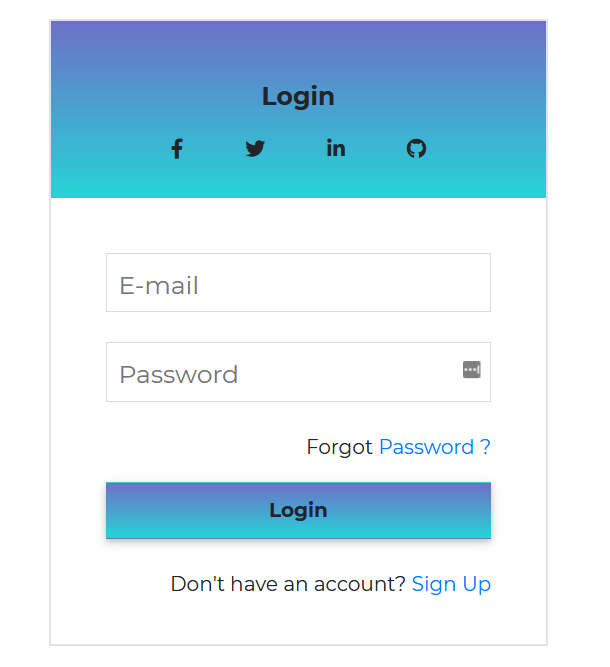

###### html
```html
<CDBCard>
    <div style="background: linear-gradient(0deg, rgba(37,212,214,1) 0%, rgba(110,112,200,1) 100%)"
        class="text-center">
        <p class="h5 mt-2 mt-5 mb-2 font-weight-bold">Login</p>
        <div class="row mb-3 d-flex justify-content-center">
            <CDBBtn color="none" class="m-0" style="box-shadow: none">
                <CDBIcon [fab]=true icon="facebook-f"></CDBIcon>
            </CDBBtn>
            <CDBBtn color="none" class="m-0" style="box-shadow: none">
                <CDBIcon [fab]=true icon="twitter"></CDBIcon>
            </CDBBtn>
            <CDBBtn color="none" class="m-0" style="box-shadow: none">
                <CDBIcon [fab]=true icon="linkedin-in"></CDBIcon>
            </CDBBtn>
            <CDBBtn color="none" class="m-0" style="box-shadow: none">
                <CDBIcon [fab]=true icon="github"></CDBIcon>
            </CDBBtn>
        </div>
    </div>
    <CDBCardBody class="mx-4">
        <CDBInput label="E-mail" type="email"></CDBInput>
        <CDBInput label="Password" type="password"></CDBInput>
        <p class="text-right">Forgot <CDBLink class="d-inline p-0 ml-auto" to="/">Password ?</CDBLink>
        </p>
        <CDBBtn color="none"
            style="background: linear-gradient(0deg, rgba(37,212,214,1) 0%, rgba(110,112,200,1) 100%)"
            class="btn-block my-3 mx-0 font-weight-bold">
            Login
        </CDBBtn>
        <p class=" text-right mt-4">Don't have an account? <CDBLink class="d-inline p-0" to="/">Sign Up
            </CDBLink>
        </p>

    </CDBCardBody>
</CDBCard>
```
###### typescript
```typescript
import { Component, OnInit } from '@angular/core';

@Component({
  selector: 'app-forms',
  templateUrl: './forms.component.html',
  styleUrls: ['./forms.component.scss'],
})
export class FormsComponent implements OnInit {
  option = [
    {
      text: 'Select Option',
      icon: 'stack-overflow',
    },
    {
      text: 'Another Option',
      icon: 'reddit',
    },
    {
      text: 'Option 3',
      icon: 'instagram',
    },
    {
      text: 'Option 4',
    },
    {
      text: 'Last Option',
    },
  ];

  constructor() {}

  ngOnInit(): void {}
}
```
## Sign Up with Background Image


###### html
```html
<CDBCard
    style=" background: url(https://images.unsplash.com/photo-1528287942171-fbe365d1d9ac?ixlib=rb-1.2.1&q=85&fm=jpg&crop=entropy&w=1200&cs=srgb&ixid=eyJh); background-size: cover; position: relative;">
    <CDBMask overlay="darkStrong" class="flex-center"></CDBMask>
    <div style="z-index: 2">
        <CDBCardBody class="mx-4">
            <div class="text-center mt-5 mb-2">
                <p class="h4 font-weight-bold text-primary"> Sign <span class="h4 font-weight-bold">up</span>
                </p>
            </div>
            <CDBInput [material]=true label="E-mail" type="email"></CDBInput>
            <CDBInput [material]=true label="Password" type="password"></CDBInput>
            <div class="d-flex mt-3 align-items-center justify-content-center">
                <CDBCheckbox></CDBCheckbox>
                <p class="text-white mb-0 ml-2">Accept the <CDBLink class="d-inline p-0" to="/">terms and
                        conditions</CDBLink>
                </p>
            </div>
            <CDBBtn color="primary" class="btn-block mx-0 my-4">
                Sign up
            </CDBBtn>
            <p class="text-white text-center mb-5">Have an account? <CDBLink class="d-inline p-0" to="/">Log
                    in
                </CDBLink>
            </p>
        </CDBCardBody>
    </div>
</CDBCard>
```
###### typescript
```typescript
import { Component, OnInit } from '@angular/core';

@Component({
  selector: 'app-forms',
  templateUrl: './forms.component.html',
  styleUrls: ['./forms.component.scss'],
})
export class FormsComponent implements OnInit {
  option = [
    {
      text: 'Select Option',
      icon: 'stack-overflow',
    },
    {
      text: 'Another Option',
      icon: 'reddit',
    },
    {
      text: 'Option 3',
      icon: 'instagram',
    },
    {
      text: 'Option 4',
    },
    {
      text: 'Last Option',
    },
  ];

  constructor() {}

  ngOnInit(): void {}
}
```

## Sign In Forms

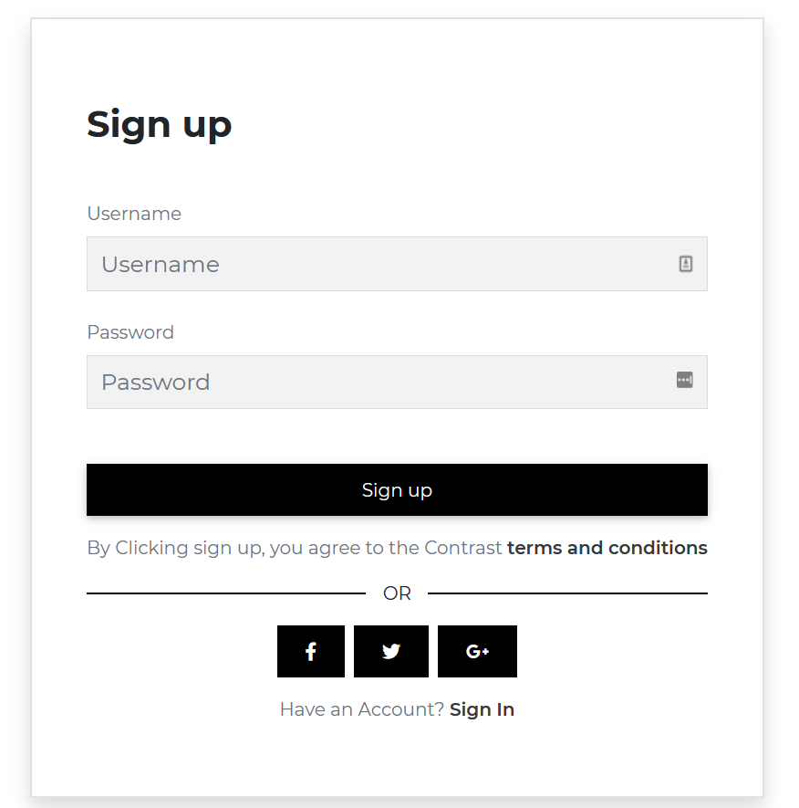
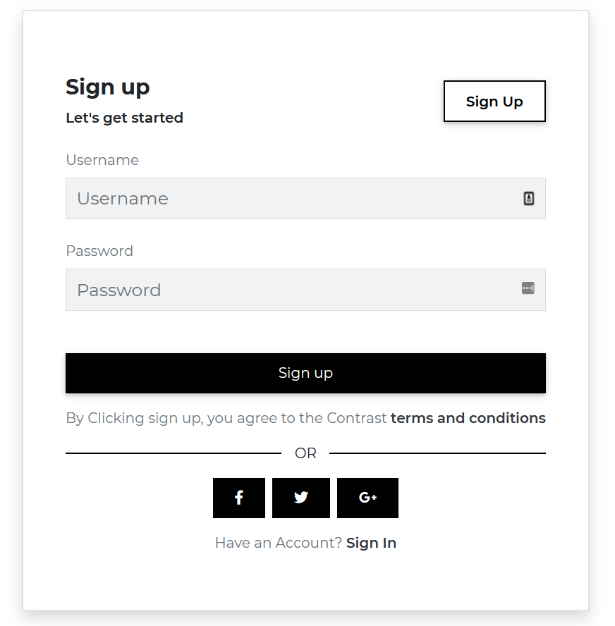
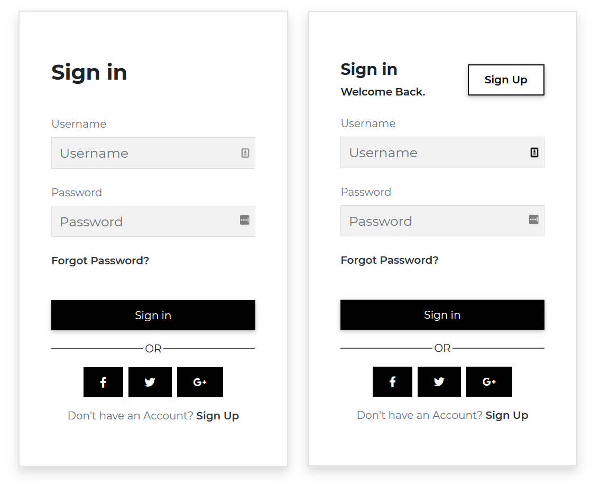


###### html
```html
<CDBCard class="shadow">
    <CDBCardBody class="p-5">
        <div class="mt-4 mb-5">
            <p class="h2 font-weight-bold">Sign up</p>
        </div>
        <label htmlFor="defaultRegisterUsername" class="text-muted m-0">
            Username
        </label>
        <CDBInput id="defaultRegisterUsername" [background]=true hint="Username" class="mt-n3" type="text">
        </CDBInput>
        <label htmlFor="defaultRegisterPassword" class="text-muted m-0">
            Password
        </label>
        <CDBInput id="defaultRegisterPassword" [background]=true hint="Password" class="mt-n3" type="password">
        </CDBInput>
        <CDBBtn color="dark" class="btn-block mb-3 mt-5">
            Sign up
        </CDBBtn>
        <p class="text-muted">By Clicking sign up, you agree to the Contrast <CDBLink style="font-weight: 600"
                class="d-inline p-0 text-dark" to="/">terms and conditions
            </CDBLink>
        </p>
        <div class="d-flex align-items-center">
            <span style="border: 0.5px solid black; width: 45%"></span>
            <span class="text-center" style="width: 10%">OR</span>
            <span style="border: 0.5px solid black; width: 45%"></span>
        </div>
        <div class="row my-3 d-flex justify-content-center">
            <CDBBtn [flat]=true color="dark">
                <CDBIcon [fab]=true icon="facebook-f"></CDBIcon>
            </CDBBtn>
            <CDBBtn color="dark" [flat]=true class="mx-2">
                <CDBIcon [fab]=true icon="twitter"></CDBIcon>
            </CDBBtn>
            <CDBBtn [flat]=true color="dark">
                <CDBIcon [fab]=true icon="google-plus-g"></CDBIcon>
            </CDBBtn>
        </div>
        <p class="text-muted text-center">Have an Account? <CDBLink style="font-weight: 600"
                class="d-inline p-0 text-dark" to="/">Sign In</CDBLink>
        </p>
    </CDBCardBody>
</CDBCard>
<CDBCard class="shadow">
    <CDBCardBody class="p-5">
        <div class="my-4 d-flex align-items-center">
            <div>
                <p class="h4 font-weight-bold">Sign up</p>
                <p class="m-0" style="font-weight: 600">Let's get started</p>
            </div>
            <div class="ml-auto">
                <CDBBtn [outline]=true color="dark" class="px-4" style="font-weight: 600">Sign Up
                </CDBBtn>
            </div>
        </div>
        <label htmlFor="defaultRegisterUsername" class="text-muted m-0">
            Username
        </label>
        <CDBInput id="defaultRegisterUsername" [background]=true hint="Username" class="mt-n3" type="text">
        </CDBInput>
        <label htmlFor="defaultRegisterPassword" class="text-muted m-0">
            Password
        </label>
        <CDBInput id="defaultRegisterPassword" [background]=true hint="Password" class="mt-n3" type="password">
        </CDBInput>
        <CDBBtn color="dark" class="btn-block mb-3 mt-5">
            Sign up
        </CDBBtn>
        <p class="text-muted">By Clicking sign up, you agree to the Contrast <CDBLink style="font-weight: 600"
                class="d-inline p-0 text-dark" to="/">terms and conditions
            </CDBLink>
        </p>
        <div class="d-flex align-items-center">
            <span style="border: 0.5px solid black; width: 45%"></span>
            <span class="text-center" style="width: 10%">OR</span>
            <span style="border: 0.5px solid black; width: 45%"></span>
        </div>
        <div class="row my-3 d-flex justify-content-center">
            <CDBBtn [flat]=true color="dark">
                <CDBIcon [fab]=true icon="facebook-f"></CDBIcon>
            </CDBBtn>
            <CDBBtn color="dark" [flat]=true class="mx-2">
                <CDBIcon [fab]=true icon="twitter"></CDBIcon>
            </CDBBtn>
            <CDBBtn [flat]=true color="dark">
                <CDBIcon [fab]=true icon="google-plus-g"></CDBIcon>
            </CDBBtn>
        </div>
        <p class="text-muted text-center">Have an Account? <CDBLink style="font-weight: 600"
                class="d-inline p-0 text-dark" to="/">Sign In</CDBLink>
        </p>
    </CDBCardBody>
</CDBCard>
</div>
<div class="example">
<CDBCard class="shadow">
    <CDBCardBody class="p-5">
        <div class="mt-4 mb-5">
            <p class="h2 font-weight-bold">Sign in</p>
        </div>
        <label htmlFor="defaultRegisterUsername" class="text-muted m-0">
            Username
        </label>
        <CDBInput id="defaultRegisterUsername" [background]=true hint="Username" class="mt-n3" type="text">
        </CDBInput>
        <label htmlFor="defaultRegisterPassword" class="text-muted m-0">
            Password
        </label>
        <CDBInput id="defaultRegisterPassword" [background]=true hint="Password" class="mt-n3" type="password">
        </CDBInput>
        <CDBLink style="font-weight: 600" class="d-inline p-0 text-dark" to="/">Forgot Password?</CDBLink>
        <CDBBtn color="dark" class="btn-block mb-3 mt-5">
            Sign in
        </CDBBtn>
        <div class="d-flex align-items-center">
            <span style="border: 0.5px solid #555; width: 45%"></span>
            <span class="text-center" style="width: 10%">OR</span>
            <span style="border: 0.5px solid #555; width: 45%"></span>
        </div>
        <div class="row my-3 d-flex justify-content-center">
            <CDBBtn [flat]=true color="dark">
                <CDBIcon [fab]=true icon="facebook-f"></CDBIcon>
            </CDBBtn>
            <CDBBtn color="dark" [flat]=true class="mx-2">
                <CDBIcon [fab]=true icon="twitter"></CDBIcon>
            </CDBBtn>
            <CDBBtn [flat]=true color="dark">
                <CDBIcon [fab]=true icon="google-plus-g"></CDBIcon>
            </CDBBtn>
        </div>
        <p class="text-muted text-center">Don't have an Account? <CDBLink style="font-weight: 600"
                class="d-inline p-0 text-dark" to="/">Sign Up</CDBLink>
        </p>
    </CDBCardBody>
</CDBCard>
<CDBCard class="shadow">
    <CDBCardBody class="p-5">
        <div class="my-4 d-flex align-items-center">
            <div>
                <p class="h4 font-weight-bold">Sign in</p>
                <p class="m-0" style="font-weight: 600">Welcome Back.</p>
            </div>
            <div class="ml-auto">
                <CDBBtn [outline]=true color="dark" class="px-4" style="font-weight: 600">Sign Up
                </CDBBtn>
            </div>
        </div>
        <label htmlFor="defaultRegisterUsername" class="text-muted m-0">
            Username
        </label>
        <CDBInput id="defaultRegisterUsername" [background]=true hint="Username" class="mt-n3" type="text">
        </CDBInput>
        <label htmlFor="defaultRegisterPassword" class="text-muted m-0">
            Password
        </label>
        <CDBInput id="defaultRegisterPassword" [background]=true hint="Password" class="mt-n3" type="password">
        </CDBInput>
        <CDBLink style="font-weight: 600" class="d-inline p-0 text-dark" to="/">Forgot Password?</CDBLink>
        <CDBBtn color="dark" class="btn-block mb-3 mt-5">
            Sign in
        </CDBBtn>
        <div class="d-flex align-items-center">
            <span style="border: 0.5px solid #555; width: 45%"></span>
            <span class="text-center" style="width: 10%">OR</span>
            <span style="border: 0.5px solid #555; width: 45%"></span>
        </div>
        <div class="row my-3 d-flex justify-content-center">
            <CDBBtn [flat]=true color="dark">
                <CDBIcon [fab]=true icon="facebook-f"></CDBIcon>
            </CDBBtn>
            <CDBBtn color="dark" [flat]=true class="mx-2">
                <CDBIcon [fab]=true icon="twitter"></CDBIcon>
            </CDBBtn>
            <CDBBtn [flat]=true color="dark">
                <CDBIcon [fab]=true icon="google-plus-g"></CDBIcon>
            </CDBBtn>
        </div>
        <p class="text-muted text-center">Don't have an Account? <CDBLink style="font-weight: 600"
                class="d-inline p-0 text-dark" to="/">Sign Up</CDBLink>
        </p>
    </CDBCardBody>
</CDBCard>
```
###### typescript
```typescript
import { Component, OnInit } from '@angular/core';

@Component({
  selector: 'app-forms',
  templateUrl: './forms.component.html',
  styleUrls: ['./forms.component.scss'],
})
export class FormsComponent implements OnInit {
  option = [
    {
      text: 'Select Option',
      icon: 'stack-overflow',
    },
    {
      text: 'Another Option',
      icon: 'reddit',
    },
    {
      text: 'Option 3',
      icon: 'instagram',
    },
    {
      text: 'Option 4',
    },
    {
      text: 'Last Option',
    },
  ];

  constructor() {}

  ngOnInit(): void {}
}
```

## API Reference: Contrast Angular Bootstrap Input Props

This section will build on your information about the props you get to use with the Contrast Angular Bootstrap Input component. You will find out what these props do, their default values, and how you would use them in your code.

The table below lists other prop options of the `CDBInput` component.

| Name            | Type        | Default      |   Description| Example      |
| :------------- | :----------: | -----------: | :----------: | -----------: |
| class      | String       |              |Adds custom classes	      |     class="myClass" |
| containerClass     | String       |           | Adds custom class to wrapping div | containerClass="wrapper" |
| error     | String       |           |  	Sets the error message for the labels data-error attribute | error="Ouch!" |
| hint     | String       |           |  	Sets the placeholder for the Input | hint="Placeholder" |
| value     | Number, Boolean or String       |           |  The value of the input element (use with the controlled input)	| value="I am controlled" onChange={this.handleChange} |
| material        | Boolean      | false        | Changes component styles for material theme | material=true |
| valueDefault     | Number or String       |           |  The default value of the input (use with the uncontrolled input)	| valueDefault="I am uncontrolled" |
| id     | String       |           | Required! Set the id of the input element 	| id="myId" |
| label     | String       |           | Add label to the component; you can attach jsx elements (f.e. links) 	| label="My custom input" |
| labelClass     | String       |           | Add custom class to label | labelClass="My custom label class" |
| labelId     | String       |           | Sets custom id to label | labelId="myId" |
| size     | String       |      lg     | Changes size of the component; available `lg` and `sm` | size="lg" |
| success     | String       |           | Sets the success message for the labels data-success attribute | success="Great!" |
| type     | String       |  text         | The type of the input element | type="checkbox" |
| inputRef     | Object or function       |           |  	Allows to attach Angular Ref to the input component; accepts only Callback Ref | inputRef={ref => this.myRef = ref } |
| icon     | String       |           |  Adds font awesome icon	| icon="caret-right" |
| iconBrand     | String       |           |  Use this property to set brand icon (`fab`)	| icon="twitter" iconBrand=true |
| iconLight     | String       |           |  Use this property to set light icon (`fal`)	| icon="twitter" iconLight=true   |
| iconRegular     | String       |           |  Use this property to set regular icon (`far`)	| icon="twitter" iconRegular=true |
| iconClass     | String       |           | Adds custom classes to icon element | icon="caret-right" iconClass="my-class" |
| disable        | Boolean      | false        | Disables Input component | disabled=true |
| group        | Boolean      | false        | Add .form-group class to the wrapping div | error=true |
| filled        | Boolean      | false        | Add filled-in style to checkbox/radio button | type="checkbox" filled=true |
| validate        | Boolean      | false        |  	Adds `.validate` class to the Input component | validate=true |
| gap        | Boolean      | false        | Creates gap inside checkbox/radio button | type="checkbox" gap=true |

## API Reference: Contrast Angular Bootstrap Card Props


The table below lists other prop options of the `CDBCard` component.

| Name            | Type        | Default      |   Description| Example      |
| :------------- | :----------: | -----------: | :----------: | -----------: |
| class      | String       |              |Adds custom classes	      |     class="myClass" |
| color          | String       |              | Sets background color | color="dark" |
| border         | Boolean      | false        | Gives border | border=true |


## API Reference: Contrast Angular Bootstrap Card Body Props

The table below lists other prop options of the `CDBCardBody` component.

| Name            | Type        | Default      |   Description| Example      |
| :------------- | :----------: | -----------: | :----------: | -----------: |
| class      | String       |              |Adds custom classes	      |   class="myClass" |
| cascade        | Boolean      | false        | Switches the CardBody to cascade style mode | cascade=true |


## API Reference: Contrast Angular Bootstrap Card Image Props

The table below lists other prop options of the `CDBCardImage` component.

| Name            | Type        | Default      |   Description| Example      |
| :------------- | :----------: | -----------: | :----------: | -----------: |
| class      | String       | |Adds custom classes	      |     class="myClass" |
| cascade        | Boolean      | false        | Switches the CardBody to cascade style mode | cascade=true |
| hover          | Boolean      | false        | Switches on hover behaviour | hover=true  |
| overlay        | String       | white-light  | Sets the color of hover overlay | overlay="white-light" |
| src            | String       |              | Source of the image | src="image_src" |
| top            | Boolean      | false        | Makes image fluid | top=true |


## API Reference: Contrast Angular Bootstrap Card Text Props

The table below lists other prop options of the `CDBCardText` component.

| Name            | Type        | Default      |   Description| Example      |
| :------------- | :----------: | -----------: | :----------: | -----------: |
| class      | String       |              |Adds custom classes	      |     class="myClass" |
| muted          | Boolean      | false        | Mutes the text color | muted=true |
| small          | Boolean      | false        | Uses html `small` as component's tag | small=true |


## API Reference: Contrast Angular Bootstrap Card Title Props

The table below lists other prop options of the `CDBCardTitle` component.

| Name            | Type        | Default      |   Description| Example      |
| :------------- | :----------: | -----------: | :----------: | -----------: |
| class      | String       |              |Adds custom classes	      |     class="myClass" |
| sub            | Boolean      | false        | Styles title as subtitle | sub=true |
