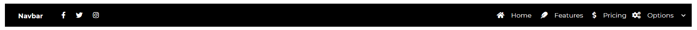
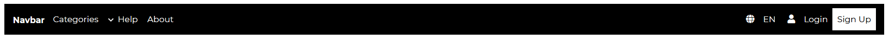

---
title: 'Navbar'
metaTitle: 'Angular Bootstrap Navbar'
metaDescription: 'Angular Bootstrap Navbar is a horizontal navigation component which apart from traditional, text links, might embed icons, dropdowns, avatars or search forms'
---# Angular Bootstrap Navbar

Angular Bootstrap Navbar is a user interface element that links a user to other sections of the website.

The Contrast Angular Bootstrap Navbar has predefined styles you can access via passing values into a prop on the component.

## Default Navbar

In this section of the tutorial we use the [CDBDropDown](https://www.devwares.com/docs/contrast/angular/components/dropdown) component to have dropdowns in our Navbar, the [CDBBtn](https://www.devwares.com/docs/contrast/angular/components/dropdown)component for our buttons, the [CDBIcon](https://www.devwares.com/docs/contrast/angular/components/icon) component for our icons, and the [CDBCollapse](https://www.devwares.com/docs/contrast/angular/components/collapse) component alongside the `CDBNavbar` component. For more information, check out our docs .



###### html

```html
<header>
  <CDBNavbar style="background-color: black;" [dark]="true" expand="lg" [scrolling]="true">
    <CDBNavBrand href="/">
      <strong>Navbar</strong>
    </CDBNavBrand>
    <CDBNavToggle (click)="content.toggleCollapse()"></CDBNavToggle>
    <CDBCollapse #content class="w-100" [navbar]="true" expand="lg">
      <CDBNavbarNav [left]="true">
        <CDBNavItem>
          <CDBNavLink to="/" style="color: #ffffff">
            <CDBIcon [fab]="true" icon="facebook-f"></CDBIcon>
          </CDBNavLink>
        </CDBNavItem>
        <CDBNavItem>
          <CDBNavLink to="/" style="color: #ffffff">
            <CDBIcon [fab]="true" icon="twitter"></CDBIcon>
          </CDBNavLink>
        </CDBNavItem>
        <CDBNavItem>
          <CDBNavLink to="/" style="color: #ffffff">
            <CDBIcon [fab]="true" icon="instagram"></CDBIcon>
          </CDBNavLink>
        </CDBNavItem>
      </CDBNavbarNav>
      <CDBNavbarNav [right]="true" class="align-items-center">
        <CDBNavItem [active]="true">
          <CDBBtn [flat]="true" color="dark" style="padding: 0">
            <CDBNavLink to="/" style="color: #ffffff">
              <CDBIcon class="mr-2" icon="home"></CDBIcon> Home
            </CDBNavLink>
          </CDBBtn>
        </CDBNavItem>
        <CDBNavItem>
          <CDBBtn [flat]="true" color="dark" style="padding: 0">
            <CDBNavLink to="#" style="color: #ffffff">
              <CDBIcon class="mr-2" icon="feather"></CDBIcon> Features
            </CDBNavLink>
          </CDBBtn>
        </CDBNavItem>
        <CDBNavItem>
          <CDBBtn [flat]="true" color="dark" style="padding: 0">
            <CDBNavLink to="#" style="color: #ffffff">
              <CDBIcon class="mr-2" icon="dollar-sign"></CDBIcon>
              Pricing
            </CDBNavLink>
          </CDBBtn>
        </CDBNavItem>
        <CDBNavItem>
          <CDBDropDown>
            <CDBDropDownToggle
              [caretDropDown]="true"
              style="padding: 0"
              color="dark"
              (click)="menu.toggleDropdown($event)"
            >
              <CDBIcon class="mr-2" icon="cogs"></CDBIcon> Options
            </CDBDropDownToggle>
            <CDBDropDownMenu #menu="cdbDropdownMenu" placement="bottom">
              Coming soon #pleaseStayUpdated.
            </CDBDropDownMenu>
          </CDBDropDown>
        </CDBNavItem>
      </CDBNavbarNav>
    </CDBCollapse>
  </CDBNavbar>
</header>
```

## Layout 2



###### html

```html
<header>
  <CDBNavbar style="background: black; color: #f4f4f4" [dark]="true" expand="lg" [scrolling]="true">
    <CDBNavBrand>
      <strong>Navbar</strong>
    </CDBNavBrand>
    <CDBNavToggle (click)="content2.toggleCollapse()" image="/assets/img/ball.png"></CDBNavToggle>
    <CDBCollapse #content2 class="w-100" [navbar]="true" expand="lg">
      <CDBNavbarNav [left]="true" class="align-items-center">
        <CDBNavItem>
          <CDBDropDown>
            <CDBDropDownToggle
              [caretDropDown]="true"
              style="padding: 0"
              color="dark"
              (click)="menu2.toggleDropdown($event)"
            >
              Categories
            </CDBDropDownToggle>
            <CDBDropDownMenu #menu2="cdbDropdownMenu" placement="bottom">
              Coming soon #pleaseStayUpdated.
            </CDBDropDownMenu>
          </CDBDropDown>
        </CDBNavItem>
        <CDBNavItem>
          <CDBBtn [flat]="true" color="dark" style="padding: 0">
            <CDBNavLink to="/" style="color: #ffffff">Help</CDBNavLink>
          </CDBBtn>
        </CDBNavItem>
        <CDBNavItem>
          <CDBBtn [flat]="true" color="dark" style="padding: 0">
            <CDBNavLink to="/" style="color: #ffffff">About</CDBNavLink>
          </CDBBtn>
        </CDBNavItem>
      </CDBNavbarNav>
      <CDBNavbarNav [right]="true">
        <CDBNavItem>
          <CDBBtn [flat]="true" color="dark" style="padding: 0">
            <CDBNavLink to="/" style="color: #ffffff">
              <CDBIcon class="mr-2" icon="globe"></CDBIcon>
              EN
            </CDBNavLink>
          </CDBBtn>
        </CDBNavItem>

        <CDBNavItem>
          <CDBBtn [flat]="true" color="dark" style="padding: 0">
            <CDBNavLink to="/" style="color: #ffffff">
              <CDBIcon class="mr-2" icon="user"></CDBIcon>
              Login
            </CDBNavLink>
          </CDBBtn>
        </CDBNavItem>
        <CDBNavItem>
          <CDBBtn color="white" style="padding: 0">
            <CDBNavLink to="/" style="color: #000000;">
              Sign Up
            </CDBNavLink>
          </CDBBtn>
        </CDBNavItem>
      </CDBNavbarNav>
    </CDBCollapse>
  </CDBNavbar>
</header>
```

# API

Here in this section you will find information about required modules and available inputs, outputs, methods and events of this component.

## Contrast Navbar Bootstrap Modules used

```typescript
import { NavbarModule } from 'cdbangular';
```

## API Reference: Contrast Navbar Inputs

The table below shows the possible input of the Navbar component.

| Name                  |       Type        | Default |                                                              Description                                                              |                   Example |
| :-------------------- | :---------------: | ------: | :-----------------------------------------------------------------------------------------------------------------------------------: | ------------------------: |
| class                 |      String       |         |                                                          Adds custom classes                                                          |           class="myClass" |
| color                 |      String       |   false |                                          Sets navbar background color. Use mdb color palette                                          |            color="indigo" |
| dark                  |      Boolean      |   false |                                       Change navbar's theme to dark (text color will be white)                                        |                 dark=true |
| light                 |      Boolean      |   false |                                       Change navbar's theme to light (text color will be black)                                       |                light=true |
| double                |      Boolean      |   false |                                              Allows navbar to be used along with Sidebar                                              |               double=true |
| expand                | Boolean or String |   false | Determines on which viewport navbar should be expanded. Accepts: `xs`, `sm`, `md`, `lg`, `xl`. If empty - navbar won't ever collapse. |               expand="xs" |
| fixed                 |      String       |         |                                      Sets Navbar position to fixed. Use `top` or `bottom` values                                      |               fixed="top" |
| scrolling             |      Boolean      |   false |                    Changes Navbar's size on scroll. Combine with prop transparent to archive color changing effect                    |            scrolling=true |
| scrollingNavbarOffset |      Number       |      50 |                                   Number of pixels after which the Navbar changes 'scrolling' state                                   | scrollingNavbarOffset=100 |
| transparent           |      Boolean      |   false |           Sets Navbar background to transparent. Combine with prop `scrolling` and `color` to archive color changing effect           |          transparent=true |
| sticky                |      String       |         |                                  enables navbar to stick to the when you reach its scroll position.                                   |             sticky="100%" |

## API Reference: Contrast Navbar Brand Properties

The table below shows the configuration options of the CDBNavBrand component.

| Name  |  Type  | Default |     Description     |                    Example |
| :---- | :----: | ------: | :-----------------: | -------------------------: |
| class | String |         | Adds custom classes |            class="myClass" |
| href  | String |         |   Sets passed URL   | href="./components/custom" |

## API Reference: Contrast Navbar Item Properties

The table below shows the configuration options of the CDBNavItem component.

| Name   |  Type   | Default |           Description            |         Example |
| :----- | :-----: | ------: | :------------------------------: | --------------: |
| class  | String  |         |       Adds custom classes        | class="myClass" |
| active | Boolean |         | Sets active state of the NavItem |     active=true |

## API Reference: Contrast Navbar Link Properties

The table below shows the configuration options of the CDBNavLink component.

| Name      |  Type   | Default |                  Description                   |                     Example |
| :-------- | :-----: | ------: | :--------------------------------------------: | --------------------------: |
| className | String  |         |              Adds custom classes               |             class="myClass" |
| active    | Boolean |         |        Sets active state of the NavLink        |                      active |
| disabled  | Boolean |         | Disables element, element could not be clicked | <CDBNavLink disabled ... /> |
| to        | String  |         |                Sets passed URL                 |    to="./components/custom" |
| link      | Boolean |         |                 Change NavLink                 |                   link=true |

## API Reference: Contrast Navbar Toggle Properties

The table below shows the configuration options of the CDBNavToggle component.

| Name  |  Type   | Default |                  Description                  |                Example |
| :---- | :-----: | ------: | :-------------------------------------------: | ---------------------: |
| class | String  |         |              Adds custom classes              |        class="myClass" |
| type  | String  |  button |        Changes elements type attribute        |          type="button" |
| image | String  |         |     Sets background-image of the toggler      | image="../asset/image" |
| left  | Boolean |         | Pulls element to the left side of the Navbar  |              left=true |
| right | Boolean |         | Pulls element to the right side of the Navbar |             right=true |

## API Reference: Contrast Navbar Nav Properties

The table below shows the configuration options of the CDBNavbarNav component.

| Name  |  Type   | Default |                  Description                  |         Example |
| :---- | :-----: | ------: | :-------------------------------------------: | --------------: |
| class | String  |         |              Adds custom classes              | class="myClass" |
| left  | Boolean |         | Pulls element to the left side of the Navbar  |       left=true |
| right | Boolean |         | Pulls element to the right side of the Navbar |      right=true |
