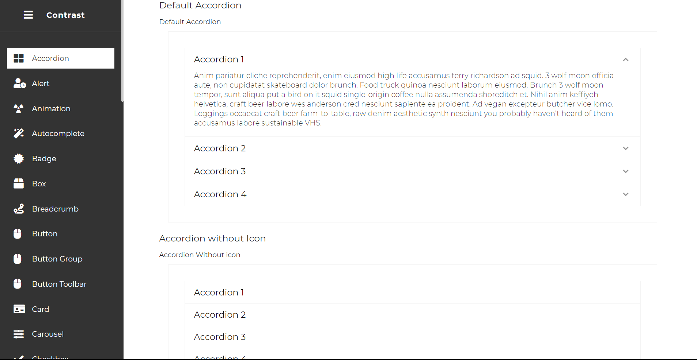
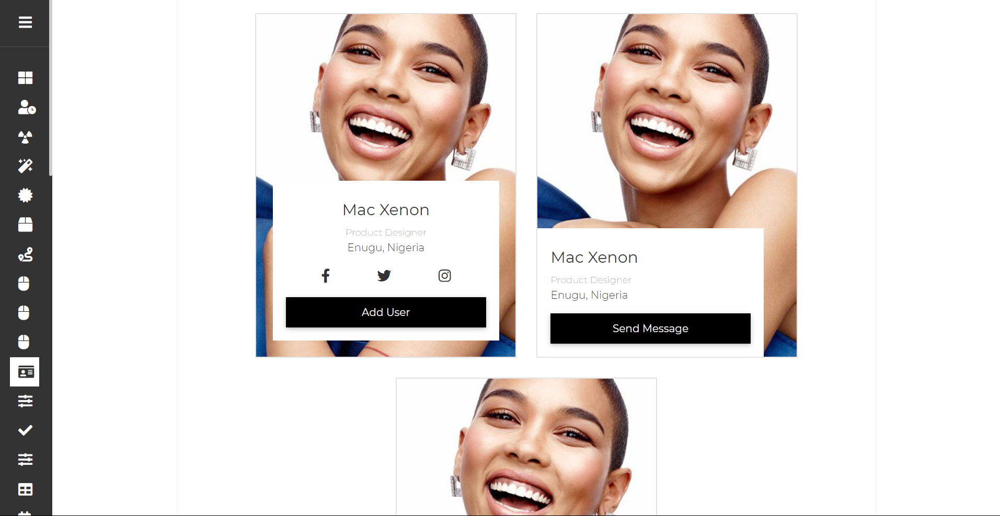
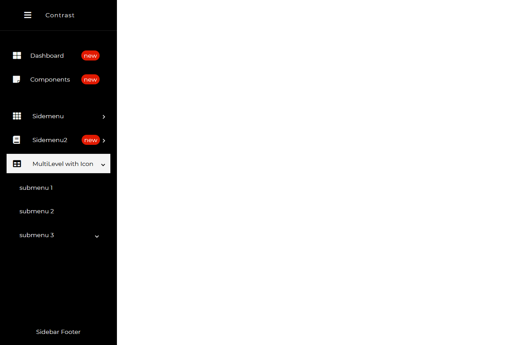

# Angular Bootstrap Sidebar

Angular Bootstrap Sidebar is a vertical navigation component which apart from traditional text links, might embed icons, dropdowns, avatars, or search forms.

By its clarity and simplicity, it remarkably increases User Experience. It allows you to navigate through small applications as well as vast portals swiftly. Multiple link embedding functionality enables you to implement more advanced content categorization, essential for more significant projects.

Thanks to CDB, you can quickly implement Sidebar in your projects using different, alluring Side Menus.

Navigation on the left is a live demo of the Sidebar.

## Importing the Contrast Angular Bootstrap Sidebar Module

To use the Contrast Angular Bootstrap Sidebar component in your project you need to import `SidebarModule`.

```typescript
import {SidebarModule } from 'cdbangular';
```

## Default Sidebar

To create a default Bootstrap sidebar using the UI library Contrast, you render the `CDBSidebar` component we get from importing the `SidebarModule`.

We get other components from the `SidebarModule` component that allow us to create our desired sidebar.

- `CDBSidebarHeader`: This is used to create the header, the top part of the sidebar. This component, in the block of code below, takes in a `isToggled` callback prop which takes a function as an argument that runs when we toggle the sidebar. It also takes in a `prefix`  prop  which indicates what element you want before the text in your header.
- `CDBSidebarContent`: This component is the body of the sidebar. It acts as a container that holds the sidebar menu and its items.
- `CDBSidebarMenu`: This component holds a group of items. This group of items is usually an unordered list of navigational links or text.
- `CDBSidebarMenuItem`: This component refers to each item in the `CDBSidebarMenu` container. In the block of code below, this component takes in two props, the icon prop, which indicates what icon you want before the text in the menu item, and the `link` prop, which defines the path you want the item to lead you to once you click on it.
- `CDBSidebarFooter`: This component is used to hold the footer of the sidebar. A sidebar's footer usually consists of a website's trademark etc.

With CDB Angular Bootstrap Sidebar we can add our own styling, as we can see in the block of code below, with style props like `textColor`, `backgroundColor` etc.

###### Expanded

###### Collapsed


###### html
```angular
<div class="app" style="display: flex; height: 100vh; overflow:scroll initial">
    <CDBSidebar textColor="#ffffff" backgroundColor="#333333">
        <CDBSidebarHeader [prefix]="icon" >
            <ng-template #icon>
                <i class="fa fa-bars fa-large"></i>
            </ng-template>

            Contrast
        </CDBSidebarHeader>

        <CDBSidebarContent>
            <CDBSidebarMenu class="sidebar-content">
                <CDBSidebarMenuItem link='/' icon="columns" >
                    Dashboard                   
                </CDBSidebarMenuItem>               
                <CDBSidebarMenuItem link='/tables' icon="table" >
                    Tables                  
                </CDBSidebarMenuItem>               
                <CDBSidebarMenuItem link='/profile' icon="user" >
                    Profile                   
                </CDBSidebarMenuItem>               
                <CDBSidebarMenuItem href='/404' icon="exclamation-circle" >
                    <span style="margin-left: 5px;">404 Page</span>                    
                </CDBSidebarMenuItem>                 
            </CDBSidebarMenu>
        </CDBSidebarContent>
        <div class="mt-auto">

            <CDBSidebarFooter style="text-align: center; margin-top: auto;">
                <div class="sidebar-btn-wrapper" style="padding: 20px 5px">
                    Sidebar Footer
                </div>
            </CDBSidebarFooter>
        </div>
    </CDBSidebar>
</div>

```

## Sidebar PRO

With the Contrast Angular Bootstrap Sidebar PRO package, we get access to the `CDBSidebarSubMenu` component, this component is used to create a menu inside the `CDBSidebarMenu`.




###### html
```angular
<CDBSidebar textColor="#f4f4f4" backgroundColor="#000000">
    <CDBSidebarHeader [prefix]="icon">
        <ng-template #icon>
            <CDBIcon icon="bars" size="lg"></CDBIcon>
        </ng-template>

        Contrast
    </CDBSidebarHeader>

    <CDBSidebarContent>
        <CDBSidebarMenu>
            <CDBSidebarMenuItem icon="th-large" [suffix]="badge1">
                <ng-template #badge1>
                    <CDBBadge color="danger" size="small" borderType="pill">new</CDBBadge>
                </ng-template>

                Dashboard
            </CDBSidebarMenuItem>

            <CDBSidebarMenuItem icon="sticky-note" [suffix]="badge2">
                <ng-template #badge2>
                    <CDBBadge color="danger" size="small" borderType="pill">new</CDBBadge>
                </ng-template>

                Components
            </CDBSidebarMenuItem>
        </CDBSidebarMenu>

        <CDBSidebarMenu>
            <CDBSidebarSubMenu title="Sidemenu" icon="th" textColor="#f4f4f4" backgroundColor="#000000">
                <CDBSidebarMenuItem>submenu 1</CDBSidebarMenuItem>
                <CDBSidebarMenuItem>submenu 2</CDBSidebarMenuItem>
                <CDBSidebarMenuItem>submenu 3</CDBSidebarMenuItem>
            </CDBSidebarSubMenu>

            <CDBSidebarSubMenu title="Sidemenu2" icon="book" [suffix]="badge3" textColor="#f4f4f4"
                backgroundColor="#000000">
                <ng-template #badge3>
                    <CDBBadge color="danger" size="small" borderType="pill">new</CDBBadge>
                </ng-template>

                <CDBSidebarMenuItem>submenu 1</CDBSidebarMenuItem>
                <CDBSidebarMenuItem>submenu 2</CDBSidebarMenuItem>
                <CDBSidebarMenuItem>submenu 3</CDBSidebarMenuItem>
            </CDBSidebarSubMenu>

            <CDBSidebarSubMenu title="MultiLevel with Icon" icon="table" textColor="#f4f4f4"
                backgroundColor="#000000">
                <CDBSidebarMenuItem>submenu 1</CDBSidebarMenuItem>
                <CDBSidebarMenuItem>submenu 2</CDBSidebarMenuItem>

                <CDBSidebarSubMenu title="submenu 3" textColor="#f4f4f4" backgroundColor="#000000">
                    <CDBSidebarMenuItem>submenu 3.1</CDBSidebarMenuItem>
                    <CDBSidebarMenuItem>submenu 3.2</CDBSidebarMenuItem>

                    <CDBSidebarSubMenu title="subnt" textColor="#f4f4f4" backgroundColor="#000000">
                        <CDBSidebarMenuItem>submenu 3.3.1</CDBSidebarMenuItem>
                        <CDBSidebarMenuItem>submenu 3.3.2</CDBSidebarMenuItem>
                        <CDBSidebarMenuItem>submenu 3.3.3</CDBSidebarMenuItem>
                    </CDBSidebarSubMenu>
                </CDBSidebarSubMenu>
            </CDBSidebarSubMenu>
        </CDBSidebarMenu>
    </CDBSidebarContent>

    <div class="mt-auto">
        <CDBSidebarFooter style="text-align: center">
            <div class="sidebar-btn-wrapper" style="padding: 20px 5px">
                Sidebar Footer
            </div>
        </CDBSidebarFooter>
    </div>
</CDBSidebar>
```

## API Reference: Contrast Angular Bootstrap Sidebar Props

This section will build on your information about the props you get to use with the Contrast Angular Bootstrap Sidebar component. You will learn what these props do, their default values, and how you would use them in your code.

The table below lists other prop options of the `CDBSidebar` component.

| Name            | Type        | Default      |   Description| Example      |
| :------------- | :----------: | -----------: | :----------: | -----------: |
| class| String       | |Adds custom classes	      |     class="myClass" |
| textColor            | String       | #fff | Changes default input tag | textColor="#000" |
| backgroundColor            | String       | #000          | Changes the text color | backgroundColor="#fff" |


## API Reference: Contrast Angular Bootstrap SidebarMenuItem Props

The table below lists other prop options of the `CDBSidebarMenuItem` component.

| Name            | Type        | Default      |   Description| Example      |
| :------------- | :----------: | -----------: | :----------: | -----------: |
| class| String       | |Adds custom classes	      |     class="myClass" |
| icon            | String       |           | Adds font-awesome icon| icon="envelope" |
| iconClassName            | String       |           | Adds custom classes to icon element | iconClassName="custom_class" icon="envelope" |
| active            | Boolean       | false          | Sets the menu item to active| active=true |


## API Reference: Contrast Angular Bootstrap SidebarSubMenu Props

The table below lists other prop options of the `CDBSidebarSubMenu` component.

| Name            | Type        | Default      |   Description| Example      |
| :------------- | :----------: | -----------: | :----------: | -----------: |
| class| String       | |Adds custom classes	      |     class="myClass" |
| icon            | String       |           | Adds font-awesome icon| icon="envelope" |
| iconClassName            | String       |           | Adds custom classes to icon element | iconClassName="custom_class" icon="envelope" |
| active            | Boolean       | false          | Sets the menu item to active| active=true |
| title            | node       |           | Sets the name of the sub menu | title="Submenu1" |
| defaultOpen            | Boolean       | false          | Render opened Sidebar submenu at page load  | defaultOpen=true |
| Open            | Boolean       | false          | Sidebar sub menu toggles accordingly to this property (opens/closes on change)   | Open=true |

