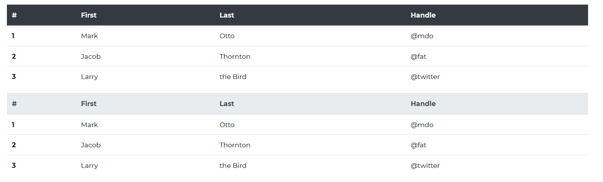
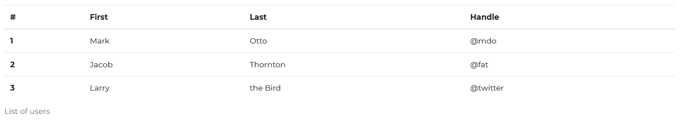

# Contrast Angular Bootstrap Table

Contrast Angular Bootstrap Tables are component with basic tables features. They let you aggregate a huge amount of data and present it in a clear and orderly way.

Angular Bootstrap tables provide additional benefits like responsiveness, and the possibility to manipulate the styles of the tables. You can enhance your tables by adding buttons, checkboxes, panels, and many other additional elements. You can also use an advanced data tables options like sort, search or pagination.

## Importing the Contrast Angular Bootstrap Table Module

To use the Contrast Angular Bootstrap Table component in your project you need to import `TableModule`.

```ts
import {TableModule } from 'cdbangular';
```

## Default Table


###### HTML
```html
<table CdbTable>
    <thead>
        <tr>
            <th *ngFor="let head of headElements" scope="col">{{head}} </th>
        </tr>
    </thead>
    <tbody>
        <tr mdbTableCol *ngFor="let el of elements">
            <th scope="row">{{el.id}}</th>
            <td>{{el.first}}</td>
            <td>{{el.last}}</td>
            <td>{{el.handle}}</td>
        </tr>
    </tbody>
</table>
```
###### TypeScript
```ts
import { Component, OnInit } from '@angular/core';

@Component({
  selector: 'app-table',
  templateUrl: './table.component.html',
  styleUrls: ['./table.component.scss'],
})
export class TableComponent implements OnInit {
  elements: any = [
    { id: 1, first: 'Mark', last: 'Otto', handle: '@mdo' },
    { id: 2, first: 'Jacob', last: 'Thornton', handle: '@fat' },
    { id: 3, first: 'Larry', last: 'the Bird', handle: '@twitter' },
  ];

  headElements = ['#', 'First', 'Last', 'Handle'];

  elements2: any = [
    {
      id: 1,
      heading1: 'Cell',
      heading2: 'Cell',
      heading3: 'Cell',
      heading4: 'Cell',
      heading5: 'Cell',
      heading6: 'Cell',
      heading7: 'Cell',
      heading8: 'Cell',
      heading9: 'Cell',
    },
    {
      id: 2,
      heading1: 'Cell',
      heading2: 'Cell',
      heading3: 'Cell',
      heading4: 'Cell',
      heading5: 'Cell',
      heading6: 'Cell',
      heading7: 'Cell',
      heading8: 'Cell',
      heading9: 'Cell',
    },
    {
      id: 3,
      heading1: 'Cell',
      heading2: 'Cell',
      heading3: 'Cell',
      heading4: 'Cell',
      heading5: 'Cell',
      heading6: 'Cell',
      heading7: 'Cell',
      heading8: 'Cell',
      heading9: 'Cell',
    },
  ];
  headElements2 = [
    '#',
    'Heading',
    'Heading',
    'Heading',
    'Heading',
    'Heading',
    'Heading',
    'Heading',
    'Heading',
    'Heading',
  ];

  constructor() {}

  ngOnInit(): void {}
}
```


## Table Head Options



###### HTML
```html
<table CdbTable>
    <thead class="text-white thead-dark">
        <tr>
            <th *ngFor="let head of headElements" scope="col">{{head}} </th>
        </tr>
    </thead>
    <tbody>
        <tr mdbTableCol *ngFor="let el of elements">
            <th scope="row">{{el.id}}</th>
            <td>{{el.first}}</td>
            <td>{{el.last}}</td>
            <td>{{el.handle}}</td>
        </tr>
    </tbody>
</table>
<table CdbTable>
    <thead class="text-white thead-light">
        <tr>
            <th *ngFor="let head of headElements" scope="col">{{head}} </th>
        </tr>
    </thead>
    <tbody>
        <tr mdbTableCol *ngFor="let el of elements">
            <th scope="row">{{el.id}}</th>
            <td>{{el.first}}</td>
            <td>{{el.last}}</td>
            <td>{{el.handle}}</td>
        </tr>
    </tbody>
</table>
```
###### TypeScript
```ts
import { Component, OnInit } from '@angular/core';

@Component({
  selector: 'app-table',
  templateUrl: './table.component.html',
  styleUrls: ['./table.component.scss'],
})
export class TableComponent implements OnInit {
  elements: any = [
    { id: 1, first: 'Mark', last: 'Otto', handle: '@mdo' },
    { id: 2, first: 'Jacob', last: 'Thornton', handle: '@fat' },
    { id: 3, first: 'Larry', last: 'the Bird', handle: '@twitter' },
  ];

  headElements = ['#', 'First', 'Last', 'Handle'];

  elements2: any = [
    {
      id: 1,
      heading1: 'Cell',
      heading2: 'Cell',
      heading3: 'Cell',
      heading4: 'Cell',
      heading5: 'Cell',
      heading6: 'Cell',
      heading7: 'Cell',
      heading8: 'Cell',
      heading9: 'Cell',
    },
    {
      id: 2,
      heading1: 'Cell',
      heading2: 'Cell',
      heading3: 'Cell',
      heading4: 'Cell',
      heading5: 'Cell',
      heading6: 'Cell',
      heading7: 'Cell',
      heading8: 'Cell',
      heading9: 'Cell',
    },
    {
      id: 3,
      heading1: 'Cell',
      heading2: 'Cell',
      heading3: 'Cell',
      heading4: 'Cell',
      heading5: 'Cell',
      heading6: 'Cell',
      heading7: 'Cell',
      heading8: 'Cell',
      heading9: 'Cell',
    },
  ];
  headElements2 = [
    '#',
    'Heading',
    'Heading',
    'Heading',
    'Heading',
    'Heading',
    'Heading',
    'Heading',
    'Heading',
    'Heading',
  ];

  constructor() {}

  ngOnInit(): void {}
}
```

## Striped Table

Set the `striped` prop to true, to give your table have stripes.


###### HTML
```html
<table CdbTable [striped]="true">
    <thead>
        <tr>
            <th *ngFor="let head of headElements" scope="col">{{head}} </th>
        </tr>
    </thead>
    <tbody>
        <tr mdbTableCol *ngFor="let el of elements">
            <th scope="row">{{el.id}}</th>
            <td>{{el.first}}</td>
            <td>{{el.last}}</td>
            <td>{{el.handle}}</td>
        </tr>
    </tbody>
</table>
```
###### TypeScript
```ts
import { Component, OnInit } from '@angular/core';

@Component({
  selector: 'app-table',
  templateUrl: './table.component.html',
  styleUrls: ['./table.component.scss'],
})
export class TableComponent implements OnInit {
  elements: any = [
    { id: 1, first: 'Mark', last: 'Otto', handle: '@mdo' },
    { id: 2, first: 'Jacob', last: 'Thornton', handle: '@fat' },
    { id: 3, first: 'Larry', last: 'the Bird', handle: '@twitter' },
  ];

  headElements = ['#', 'First', 'Last', 'Handle'];

  elements2: any = [
    {
      id: 1,
      heading1: 'Cell',
      heading2: 'Cell',
      heading3: 'Cell',
      heading4: 'Cell',
      heading5: 'Cell',
      heading6: 'Cell',
      heading7: 'Cell',
      heading8: 'Cell',
      heading9: 'Cell',
    },
    {
      id: 2,
      heading1: 'Cell',
      heading2: 'Cell',
      heading3: 'Cell',
      heading4: 'Cell',
      heading5: 'Cell',
      heading6: 'Cell',
      heading7: 'Cell',
      heading8: 'Cell',
      heading9: 'Cell',
    },
    {
      id: 3,
      heading1: 'Cell',
      heading2: 'Cell',
      heading3: 'Cell',
      heading4: 'Cell',
      heading5: 'Cell',
      heading6: 'Cell',
      heading7: 'Cell',
      heading8: 'Cell',
      heading9: 'Cell',
    },
  ];
  headElements2 = [
    '#',
    'Heading',
    'Heading',
    'Heading',
    'Heading',
    'Heading',
    'Heading',
    'Heading',
    'Heading',
    'Heading',
  ];

  constructor() {}

  ngOnInit(): void {}
}
```

## Bordered Table

Give the table a `bordered` prop to true to give your table borders.


###### HTML
```html
<table CdbTable [bordered]="true">
    <thead>
        <tr>
            <th *ngFor="let head of headElements" scope="col">{{head}} </th>
        </tr>
    </thead>
    <tbody>
        <tr mdbTableCol *ngFor="let el of elements">
            <th scope="row">{{el.id}}</th>
            <td>{{el.first}}</td>
            <td>{{el.last}}</td>
            <td>{{el.handle}}</td>
        </tr>
    </tbody>
</table>
```
###### TypeScript
```ts
import { Component, OnInit } from '@angular/core';

@Component({
  selector: 'app-table',
  templateUrl: './table.component.html',
  styleUrls: ['./table.component.scss'],
})
export class TableComponent implements OnInit {
  elements: any = [
    { id: 1, first: 'Mark', last: 'Otto', handle: '@mdo' },
    { id: 2, first: 'Jacob', last: 'Thornton', handle: '@fat' },
    { id: 3, first: 'Larry', last: 'the Bird', handle: '@twitter' },
  ];

  headElements = ['#', 'First', 'Last', 'Handle'];

  elements2: any = [
    {
      id: 1,
      heading1: 'Cell',
      heading2: 'Cell',
      heading3: 'Cell',
      heading4: 'Cell',
      heading5: 'Cell',
      heading6: 'Cell',
      heading7: 'Cell',
      heading8: 'Cell',
      heading9: 'Cell',
    },
    {
      id: 2,
      heading1: 'Cell',
      heading2: 'Cell',
      heading3: 'Cell',
      heading4: 'Cell',
      heading5: 'Cell',
      heading6: 'Cell',
      heading7: 'Cell',
      heading8: 'Cell',
      heading9: 'Cell',
    },
    {
      id: 3,
      heading1: 'Cell',
      heading2: 'Cell',
      heading3: 'Cell',
      heading4: 'Cell',
      heading5: 'Cell',
      heading6: 'Cell',
      heading7: 'Cell',
      heading8: 'Cell',
      heading9: 'Cell',
    },
  ];
  headElements2 = [
    '#',
    'Heading',
    'Heading',
    'Heading',
    'Heading',
    'Heading',
    'Heading',
    'Heading',
    'Heading',
    'Heading',
  ];

  constructor() {}

  ngOnInit(): void {}
}
```


## Borderless Table

Set the `borderless` prop to true for your table to have no borders.


###### HTML
```html
<table CdbTable [borderless]="true">
    <thead>
        <tr>
            <th *ngFor="let head of headElements" scope="col">{{head}} </th>
        </tr>
    </thead>
    <tbody>
        <tr mdbTableCol *ngFor="let el of elements">
            <th scope="row">{{el.id}}</th>
            <td>{{el.first}}</td>
            <td>{{el.last}}</td>
            <td>{{el.handle}}</td>
        </tr>
    </tbody>
</table>
```
###### TypeScript
```ts
import { Component, OnInit } from '@angular/core';

@Component({
  selector: 'app-table',
  templateUrl: './table.component.html',
  styleUrls: ['./table.component.scss'],
})
export class TableComponent implements OnInit {
  elements: any = [
    { id: 1, first: 'Mark', last: 'Otto', handle: '@mdo' },
    { id: 2, first: 'Jacob', last: 'Thornton', handle: '@fat' },
    { id: 3, first: 'Larry', last: 'the Bird', handle: '@twitter' },
  ];

  headElements = ['#', 'First', 'Last', 'Handle'];

  elements2: any = [
    {
      id: 1,
      heading1: 'Cell',
      heading2: 'Cell',
      heading3: 'Cell',
      heading4: 'Cell',
      heading5: 'Cell',
      heading6: 'Cell',
      heading7: 'Cell',
      heading8: 'Cell',
      heading9: 'Cell',
    },
    {
      id: 2,
      heading1: 'Cell',
      heading2: 'Cell',
      heading3: 'Cell',
      heading4: 'Cell',
      heading5: 'Cell',
      heading6: 'Cell',
      heading7: 'Cell',
      heading8: 'Cell',
      heading9: 'Cell',
    },
    {
      id: 3,
      heading1: 'Cell',
      heading2: 'Cell',
      heading3: 'Cell',
      heading4: 'Cell',
      heading5: 'Cell',
      heading6: 'Cell',
      heading7: 'Cell',
      heading8: 'Cell',
      heading9: 'Cell',
    },
  ];
  headElements2 = [
    '#',
    'Heading',
    'Heading',
    'Heading',
    'Heading',
    'Heading',
    'Heading',
    'Heading',
    'Heading',
    'Heading',
  ];

  constructor() {}

  ngOnInit(): void {}
}
```
## Hoverable Rows


###### HTML
```html
<table CdbTable [hoverable]="true">
    <thead>
        <tr>
            <th *ngFor="let head of headElements" scope="col">{{head}} </th>
        </tr>
    </thead>
    <tbody>
        <tr mdbTableCol *ngFor="let el of elements">
            <th scope="row">{{el.id}}</th>
            <td>{{el.first}}</td>
            <td>{{el.last}}</td>
            <td>{{el.handle}}</td>
        </tr>
    </tbody>
</table>
```
###### TypeScript
```ts
import { Component, OnInit } from '@angular/core';

@Component({
  selector: 'app-table',
  templateUrl: './table.component.html',
  styleUrls: ['./table.component.scss'],
})
export class TableComponent implements OnInit {
  elements: any = [
    { id: 1, first: 'Mark', last: 'Otto', handle: '@mdo' },
    { id: 2, first: 'Jacob', last: 'Thornton', handle: '@fat' },
    { id: 3, first: 'Larry', last: 'the Bird', handle: '@twitter' },
  ];

  headElements = ['#', 'First', 'Last', 'Handle'];

  elements2: any = [
    {
      id: 1,
      heading1: 'Cell',
      heading2: 'Cell',
      heading3: 'Cell',
      heading4: 'Cell',
      heading5: 'Cell',
      heading6: 'Cell',
      heading7: 'Cell',
      heading8: 'Cell',
      heading9: 'Cell',
    },
    {
      id: 2,
      heading1: 'Cell',
      heading2: 'Cell',
      heading3: 'Cell',
      heading4: 'Cell',
      heading5: 'Cell',
      heading6: 'Cell',
      heading7: 'Cell',
      heading8: 'Cell',
      heading9: 'Cell',
    },
    {
      id: 3,
      heading1: 'Cell',
      heading2: 'Cell',
      heading3: 'Cell',
      heading4: 'Cell',
      heading5: 'Cell',
      heading6: 'Cell',
      heading7: 'Cell',
      heading8: 'Cell',
      heading9: 'Cell',
    },
  ];
  headElements2 = [
    '#',
    'Heading',
    'Heading',
    'Heading',
    'Heading',
    'Heading',
    'Heading',
    'Heading',
    'Heading',
    'Heading',
  ];

  constructor() {}

  ngOnInit(): void {}
}
```
## Small Table


###### HTML
```html
<table CdbTable [small]="true">
    <thead>
        <tr>
            <th *ngFor="let head of headElements" scope="col">{{head}} </th>
        </tr>
    </thead>
    <tbody>
        <tr mdbTableCol *ngFor="let el of elements">
            <th scope="row">{{el.id}}</th>
            <td>{{el.first}}</td>
            <td>{{el.last}}</td>
            <td>{{el.handle}}</td>
        </tr>
    </tbody>
</table>
```
###### TypeScript
```ts
import { Component, OnInit } from '@angular/core';

@Component({
  selector: 'app-table',
  templateUrl: './table.component.html',
  styleUrls: ['./table.component.scss'],
})
export class TableComponent implements OnInit {
  elements: any = [
    { id: 1, first: 'Mark', last: 'Otto', handle: '@mdo' },
    { id: 2, first: 'Jacob', last: 'Thornton', handle: '@fat' },
    { id: 3, first: 'Larry', last: 'the Bird', handle: '@twitter' },
  ];

  headElements = ['#', 'First', 'Last', 'Handle'];

  elements2: any = [
    {
      id: 1,
      heading1: 'Cell',
      heading2: 'Cell',
      heading3: 'Cell',
      heading4: 'Cell',
      heading5: 'Cell',
      heading6: 'Cell',
      heading7: 'Cell',
      heading8: 'Cell',
      heading9: 'Cell',
    },
    {
      id: 2,
      heading1: 'Cell',
      heading2: 'Cell',
      heading3: 'Cell',
      heading4: 'Cell',
      heading5: 'Cell',
      heading6: 'Cell',
      heading7: 'Cell',
      heading8: 'Cell',
      heading9: 'Cell',
    },
    {
      id: 3,
      heading1: 'Cell',
      heading2: 'Cell',
      heading3: 'Cell',
      heading4: 'Cell',
      heading5: 'Cell',
      heading6: 'Cell',
      heading7: 'Cell',
      heading8: 'Cell',
      heading9: 'Cell',
    },
  ];
  headElements2 = [
    '#',
    'Heading',
    'Heading',
    'Heading',
    'Heading',
    'Heading',
    'Heading',
    'Heading',
    'Heading',
    'Heading',
  ];

  constructor() {}

  ngOnInit(): void {}
}
```
## Captions



###### HTML
```html
<table CdbTable>
    <caption>List of users</caption>
    <thead>
        <tr>
            <th *ngFor="let head of headElements" scope="col">{{head}} </th>
        </tr>
    </thead>
    <tbody>
        <tr mdbTableCol *ngFor="let el of elements">
            <th scope="row">{{el.id}}</th>
            <td>{{el.first}}</td>
            <td>{{el.last}}</td>
            <td>{{el.handle}}</td>
        </tr>
    </tbody>
</table>
```
###### TypeScript
```ts
import { Component, OnInit } from '@angular/core';

@Component({
  selector: 'app-table',
  templateUrl: './table.component.html',
  styleUrls: ['./table.component.scss'],
})
export class TableComponent implements OnInit {
  elements: any = [
    { id: 1, first: 'Mark', last: 'Otto', handle: '@mdo' },
    { id: 2, first: 'Jacob', last: 'Thornton', handle: '@fat' },
    { id: 3, first: 'Larry', last: 'the Bird', handle: '@twitter' },
  ];

  headElements = ['#', 'First', 'Last', 'Handle'];

  elements2: any = [
    {
      id: 1,
      heading1: 'Cell',
      heading2: 'Cell',
      heading3: 'Cell',
      heading4: 'Cell',
      heading5: 'Cell',
      heading6: 'Cell',
      heading7: 'Cell',
      heading8: 'Cell',
      heading9: 'Cell',
    },
    {
      id: 2,
      heading1: 'Cell',
      heading2: 'Cell',
      heading3: 'Cell',
      heading4: 'Cell',
      heading5: 'Cell',
      heading6: 'Cell',
      heading7: 'Cell',
      heading8: 'Cell',
      heading9: 'Cell',
    },
    {
      id: 3,
      heading1: 'Cell',
      heading2: 'Cell',
      heading3: 'Cell',
      heading4: 'Cell',
      heading5: 'Cell',
      heading6: 'Cell',
      heading7: 'Cell',
      heading8: 'Cell',
      heading9: 'Cell',
    },
  ];
  headElements2 = [
    '#',
    'Heading',
    'Heading',
    'Heading',
    'Heading',
    'Heading',
    'Heading',
    'Heading',
    'Heading',
    'Heading',
  ];

  constructor() {}

  ngOnInit(): void {}
}
```
## Responsive Tables


###### HTML
```html
<table CdbTable [responsive]="true">

    <thead>
        <tr>
            <th *ngFor="let head of headElements2" scope="col">{{head}} </th>
        </tr>
    </thead>

    <tbody>
        <tr mdbTableCol *ngFor="let el of elements2">
            <th scope="row">{{el.id}}</th>
            <td>{{el.heading1}}</td>
            <td>{{el.heading2}}</td>
            <td>{{el.heading3}}</td>
            <td>{{el.heading4}}</td>
            <td>{{el.heading5}}</td>
            <td>{{el.heading6}}</td>
            <td>{{el.heading7}}</td>
            <td>{{el.heading8}}</td>
            <td>{{el.heading9}}</td>
        </tr>
    </tbody>
</table>
```

###### TypeScript
```ts
import { Component, OnInit } from '@angular/core';

@Component({
  selector: 'app-table',
  templateUrl: './table.component.html',
  styleUrls: ['./table.component.scss'],
})
export class TableComponent implements OnInit {
  elements: any = [
    { id: 1, first: 'Mark', last: 'Otto', handle: '@mdo' },
    { id: 2, first: 'Jacob', last: 'Thornton', handle: '@fat' },
    { id: 3, first: 'Larry', last: 'the Bird', handle: '@twitter' },
  ];

  headElements = ['#', 'First', 'Last', 'Handle'];

  elements2: any = [
    {
      id: 1,
      heading1: 'Cell',
      heading2: 'Cell',
      heading3: 'Cell',
      heading4: 'Cell',
      heading5: 'Cell',
      heading6: 'Cell',
      heading7: 'Cell',
      heading8: 'Cell',
      heading9: 'Cell',
    },
    {
      id: 2,
      heading1: 'Cell',
      heading2: 'Cell',
      heading3: 'Cell',
      heading4: 'Cell',
      heading5: 'Cell',
      heading6: 'Cell',
      heading7: 'Cell',
      heading8: 'Cell',
      heading9: 'Cell',
    },
    {
      id: 3,
      heading1: 'Cell',
      heading2: 'Cell',
      heading3: 'Cell',
      heading4: 'Cell',
      heading5: 'Cell',
      heading6: 'Cell',
      heading7: 'Cell',
      heading8: 'Cell',
      heading9: 'Cell',
    },
  ];
  headElements2 = [
    '#',
    'Heading',
    'Heading',
    'Heading',
    'Heading',
    'Heading',
    'Heading',
    'Heading',
    'Heading',
    'Heading',
  ];

  constructor() {}

  ngOnInit(): void {}
}
```

## API Reference: Contrast Angular Bootstrap Table Props

This section will build on your information about the props you get to use with the Contrast Angular Bootstrap Table component. You will find out what these props do, their default values, and how you would use them in your code.


The table below lists other prop options of the `CDBTable` component.

| Name            | Type        | Default      |   Description| Example      |
| :------------- | :----------: | -----------: | :----------: | -----------: |
| class      | String       |              |Adds custom classes	      |     class="myClass" |
| wrapperClassName      | String       |              |Adds custom wrapper class	      |     wrapperClassName="myWrapperClass" |
| autoWidth        | Boolean      | false        | Automatically adjust columns width to the content. | autoWidth=true |
| bordered        | Boolean      | false        | Adds border on all table's and cell's sides. | bordered=true |
| borderless        | Boolean      | false        | Disables border on all table's and cell's sides. | borderless=true |
| btn        | Boolean      | false        | Adds a button | btn=true |
| dark        | Boolean      | false        | Enables the dark style | dark=true |
| fixed        | Boolean      | false        | Sets fixed columns width. | fixed=true |
| hover        | Boolean      | false        | Adds hover state on table rows (rows are marked on light-grey color). | hover=true |
| maxHeight            | String       |           | Sets table's maxHeight. You can use px, vh or whatever fits to your needs. | maxHeight="200px" |
| tHead            | String       |           | Changes the color of the table head text | tHead="#000" |
| responsive        | Boolean      | false        | Makes table scrollable horizontally when screen width is smaller than table content (under 768px). It make use of `overflow-y: hidden` which clips off content that goes beyond the bottom or top edge of the table.  | responsive=true |
| responsiveSm        | Boolean      | false        | Makes table scrollable horizontally on under 576px wide screens. | responsiveSm=true |
| responsiveMd        | Boolean      | false        | Makes table scrollable horizontally on under 768px wide screens. | responsiveMd=true |
| responsiveLg        | Boolean      | false        | Makes table scrollable horizontally on under 992px wide screens. | responsiveLg=true |
| responsiveXl        | Boolean      | false        | Makes table scrollable horizontally on under 1200px wide screens. | responsiveXl=true |
| scrollY        | Boolean      | false        | Allows table to be scrolled vertically if it's content is higher than 200px. Combine it with maxHeight to manipulate table's height. | scrollY=true |
| small        | Boolean      | false        | Cuts cell's padding by half. | small=true |
| striped        | Boolean      | false        | Adds zebra-striping to any table row. | striped=true |


## API Reference: Contrast Angular Bootstrap Table Header Props

The table below lists other prop options of the `CDBTableHeader` component.

| Name            | Type        | Default      |   Description| Example      |
| :------------- | :----------: | -----------: | :----------: | -----------: |
| class| String       |              |Adds custom classes	      |     class="myClass" |
| color      | String       |              | Changes TableHead background color. Use CDB color classes  |     color="primary-color" |
| textWhite        | Boolean      | false        | Sets TableHead's font color to white. | textWhite=true |
| columns        | Array[Objects]      | false        |  	Binds your data into the component.  | columns=[columns] |


## API Reference: Contrast Angular Bootstrap Table Body Props

The table below lists other prop options of the `CDBTableBody` component.

| Name            | Type        | Default      |   Description| Example      |
| :------------- | :----------: | -----------: | :----------: | -----------: |
| class| String       |              |Adds custom classes	      |     class="myClass" |
| color      | String       |              | Changes TableBody background color. Use CDB color classes  |     color="primary-color" |
| textWhite        | Boolean      | false        | Sets TableBody's font color to white. | textWhite=true |
| rows        | Array[Objects]      | false        |  	Binds your data into the component.  | rows=[rows] |


## API Reference: Contrast Bootstrap Table Footer Props

The table below lists other prop options of the `CDBTableFooter` component.

| Name            | Type        | Default      |   Description| Example      |
| :------------- | :----------: | -----------: | :----------: | -----------: |
| class| String       |              |Adds custom classes	      |     <CDBTableFooter class="myClass" |
| color      | String       |              | Changes TableFooter background color. Use CDB color classes  |    color="primary-color" |
| textWhite        | Boolean      | false        | Sets TableFooter's font color to white. | textWhite=true |
| columns        | Array[Objects]      | false        |  	Binds your data into the component.  | columns=[columns] |
