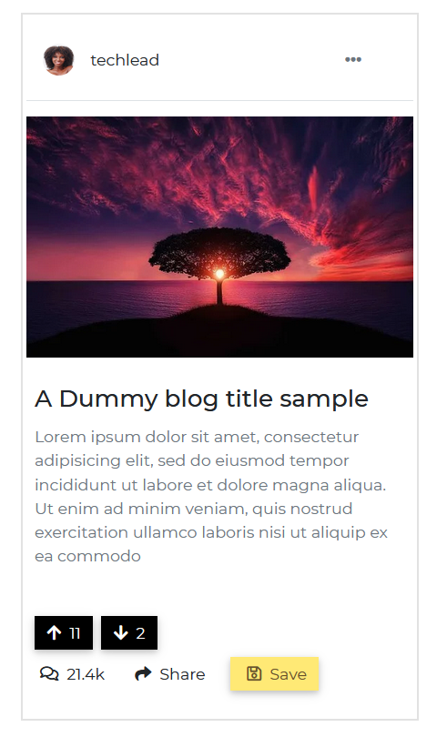
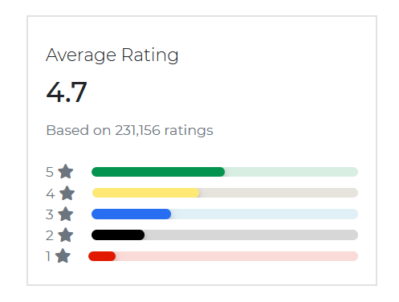

These are some components that can be found in the Contrast Bootstrap Angular library

<i/>

## Contrast Bootstrap Angular Widgets

Bootstrap 5 Widgets are third-party applications that are embedded into the website's body as a stand-alone feature. 

An example of Contrast Angular Bootstrap widget is the direct contact widget; like we have on our website, which allows your users to contact you easily.

## Importing the Contrast Angular Bootstrap Card Module

To use the Contrast Angular Bootstrap Card component in your project you need to import `CardModule`.

```TS
import {CardModule } from 'cdbangular';
```

## Blog Card

We use the [CDBCard](https://www.devwares.com/docs/contrast/angular/components/card) component to create our widgets. Check our docs for more information on the `CDBCard` component. 



The widget above has a dropdown, icons, and buttons. To have these things in your project you would have to import the [CDBDropDown](https://www.devwares.com/docs/contrast/angular/components/dropdown) ( and dropdown affiliated components, see in the docs), [CDBIcons](https://www.devwares.com/docs/contrast/angular/components/icon), [CDBBtn](https://www.devwares.com/docs/contrast/angular/components/buttons). 

We also import [CDBPane](https://www.devwares.com/docs/contrast/angular/components/pane) for the top of this widget.


###### HTML
```html
<CDBCard style="width: 25rem">
    <CDBCardBody class="p-1">
        <CDBChip class="border-bottom p-3">
            <CDBChipImage size="xs"
                src="https://media.istockphoto.com/photos/beautiful-woman-wearing-brown-curly-hairstyle-picture-id495006065?s=170x170">
            </CDBChipImage>
            <CDBCardText class="m-0 ml-3">techlead</CDBCardText>
            <div class="ml-auto">
                <CDBDropDown>
                    <CDBDropDownToggle color="white" class="flat" (click)="menu.toggleDropdown($event)">
                        <CDBIcon class="text-muted" [fas]=true icon="ellipsis-h"></CDBIcon>
                    </CDBDropDownToggle>
                    <CDBDropDownMenu #menu="cdbDropdownMenu">
                        <CDBDropDownItem [disabled]=true>Edit Profile</CDBDropDownItem>
                        <CDBDropDownItem [divider]=true></CDBDropDownItem>
                        <CDBDropDownItem>Action 1</CDBDropDownItem>
                        <CDBDropDownItem>Action 2</CDBDropDownItem>
                    </CDBDropDownMenu>
                </CDBDropDown>
            </div>
        </CDBChip>
        <CDBCardImage class="img-fluid my-3"
            src="https://cdn.pixabay.com/photo/2015/04/23/22/00/tree-736885__340.jpg"></CDBCardImage>
        <div class="mx-2 mb-4">
            <CDBCardTitle>A Dummy blog title sample</CDBCardTitle>
            <CDBCardText class="text-muted mb-5">Lorem ipsum dolor sit amet, consectetur adipisicing elit,
                sed
                do eiusmod
                tempor incididunt ut labore et dolore magna aliqua. Ut enim ad minim veniam,
                quis nostrud exercitation ullamco laboris nisi ut aliquip ex ea commodo</CDBCardText>
            <div>
                <CDBBtn color="dark" class="py-1 mr-2">
                    <CDBIcon class="pl-0" [fas]=true icon="arrow-up"></CDBIcon> 11
                </CDBBtn>
                <CDBBtn color="dark" class="py-1">
                    <CDBIcon class="pl-0" [fas]=true icon="arrow-down"></CDBIcon> 2
                </CDBBtn>
            </div>
            <div class="my-2">
                <CDBBtn [flat]=true color="none" class="p-0">
                    <CDBIcon [far]=true icon="comments"></CDBIcon> 21.4k
                </CDBBtn>
                <CDBBtn [flat]=true color="none" class="p-0 mx-4">
                    <CDBIcon [fas]=true icon="share"></CDBIcon> Share
                </CDBBtn>
                <CDBBtn color="warning" class="py-1">
                    <CDBIcon [far]=true icon="save"></CDBIcon> Save
                </CDBBtn>
            </div>
        </div>
    </CDBCardBody>
</CDBCard>
```


## Widget Cards


###### HTML
```html
<CDBCard style="width: 25rem">
    <CDBCardBody>
        <CDBCardTitle class="lead">Total Downloads</CDBCardTitle>
        <CDBCardTitle tag="h2">1,057,891</CDBCardTitle>
        <CDBCardText [small]=true [muted]=true>Oct 1 - Dec 31,
            <CDBIcon [fas]=true icon="globe"></CDBIcon> Worldwide</CDBCardText>
    </CDBCardBody>
</CDBCard>
```


## Counter Card


###### HTML
```html
<CDBCard style="width: 25rem">
    <CDBCardBody>
        <CDBIcon size="2x" class="p-4 bg-primary" [fas]=true icon="chart-line"></CDBIcon>
        <CDBCardTitle class="lead">Customers</CDBCardTitle>
        <CDBCardTitle tag="h2">852k</CDBCardTitle>
        <CDBCardText [small]=true [muted]=true>Oct 1 - Dec 31,
            <CDBIcon [fas]=true icon="globe"></CDBIcon>
            Worldwide
        </CDBCardText>
        <CDBCardText class="text-success">
            <CDBIcon [fas]=true icon="angle-up"></CDBIcon>
            27.4%
            <span style="font-size: 0.9em" class="ml-2 text-muted">Since last quarter</span>
        </CDBCardText>
    </CDBCardBody>
</CDBCard>
```


## Invoices


###### HTML
```html
<CDBCard style="width: 25rem">
    <CDBCardBody class="p-0">
        <CDBChip class="py-3 px-3 border-bottom">
            <div>
                <CDBCardTitle class="mb-3 mt-0 lead">Order History</CDBCardTitle>
                <CDBCardText class="text-muted">Manage billing information and view receipts</CDBCardText>
            </div>
        </CDBChip>
        <CDBChip class="py-3 px-3 border-bottom">
            <div>
                <CDBCardTitle class="mb-3 mt-0 h6">Invoice #120345</CDBCardTitle>
                <CDBCardText class="text-muted">Billed August 21, 2019</CDBCardText>
            </div>
            <div class="ml-auto">
                <CDBBtn [outline]=true size="small" color="success" [flat]=true>Pay now</CDBBtn>
            </div>
        </CDBChip>
        <CDBChip class="py-3 px-3">
            <div>
                <CDBCardTitle class="mb-3 mt-0 h6">Invoice #120344</CDBCardTitle>
                <CDBCardText class="text-muted">Billed July 21, 2019</CDBCardText>
            </div>
        </CDBChip>
    </CDBCardBody>
</CDBCard>
```


## Ratings



###### HTML
```html
<CDBCard style="width: 25rem">
    <CDBCardBody>
        <CDBCardTitle class="lead">Average Rating</CDBCardTitle>
        <CDBCardTitle tag="h2">4.7</CDBCardTitle>
        <!-- <CDBRating [feedback]=true></CDBRating> -->
        <CDBCardText [muted]=true>Based on 231,156 ratings</CDBCardText>
        <div class="text-muted mt-4">
            <div class="d-flex align-items-center">
                <span>5</span>
                <CDBIcon [fas]=true icon="star" class="mr-3"></CDBIcon>
                <CDBProgress [value]=50 color="success"></CDBProgress>
            </div>
            <div class="d-flex align-items-center">
                <span>4</span>
                <CDBIcon [fas]=true icon="star" class="mr-3"></CDBIcon>
                <CDBProgress [value]=40 color="warning"></CDBProgress>
            </div>
            <div class="d-flex align-items-center">
                <span>3</span>
                <CDBIcon [fas]=true icon="star" class="mr-3"></CDBIcon>
                <CDBProgress [value]=30 color="primary"></CDBProgress>
            </div>
            <div class="d-flex align-items-center">
                <span>2</span>
                <CDBIcon [fas]=true icon="star" class="mr-3"></CDBIcon>
                <CDBProgress [value]=20 color="dark"></CDBProgress>
            </div>
            <div class="d-flex align-items-center">
                <span>1</span>
                <CDBIcon [fas]=true icon="star" class="mr-3"></CDBIcon>
                <CDBProgress [value]=10 color="danger"></CDBProgress>
            </div>
        </div>
    </CDBCardBody>
</CDBCard>
```

## Events


###### HTML
```html
<CDBCard style="width: 25rem">
    <CDBCardTitle class="lead p-4 border-bottom" style="font-weight: 600">Events</CDBCardTitle>
    <CDBCardBody class="py-0">
        <CDBChip class="border-bottom pb-2">
            <CDBIcon size="4x" [far]=true icon="calendar-alt" class="text-danger"></CDBIcon>
            <div class="ml-3">
                <CDBCardTitle class="mb-1 lead" style="font-weight: 600">Newmarket Nights</CDBCardTitle>
                <CDBCardText class="mb-2">Organized by University of Oxford</CDBCardText>
                <CDBCardText class="mb-0 small text-muted">Time: 6:00AM</CDBCardText>
                <CDBCardText class="mb-0 small text-muted">Place: Cambridge Boat Club, Cambridge</CDBCardText>
            </div>
        </CDBChip>
        <CDBChip class="border-bottom pb-2">
            <CDBIcon size="4x" [far]=true icon="calendar-alt" class="text-danger"></CDBIcon>
            <div class="ml-3">
                <CDBCardTitle class="mb-1 lead" style="font-weight: 600">Noco Hemp Expo</CDBCardTitle>
                <CDBCardText class="mb-2">Organized by University of Oxford</CDBCardText>
                <CDBCardText class="mb-0 small text-muted">Thu, 12 Sep - Sat, 18 Sep 2020</CDBCardText>
                <CDBCardText class="mb-0 small text-muted">PPlace: Denver Expo Club, USA</CDBCardText>
            </div>
        </CDBChip>
        <CDBChip class="pb-2">
            <CDBIcon size="4x" [far]=true icon="calendar-alt" class="text-danger"></CDBIcon>
            <div class="ml-3">
                <CDBCardTitle class="mb-1 lead" style="font-weight: 600">Canadian National Exhibition (CNE)
                </CDBCardTitle>
                <CDBCardText class="mb-2">Organized by University of Oxford</CDBCardText>
                <CDBCardText class="mb-0 small text-muted">Fri, 20 Sep - Mon, 07 Oct 2020</CDBCardText>
                <CDBCardText class="mb-0 small text-muted">Place: Toronto , Canada</CDBCardText>
            </div>
        </CDBChip>
    </CDBCardBody>
    <CDBCardText class="p-4 text-center pointer border-top">See All</CDBCardText>
</CDBCard>
```


## Alerts and Notifications


###### HTML
```html
<CDBCard style="width: 25rem">
    <CDBCardBody class="py-0">
        <CDBCardTitle class="lead m-0 py-3 border-bottom">Alerts & Notifications</CDBCardTitle>
        <CDBChip class="py-3 border-bottom">
            <div>
                <CDBCardTitle class="my-0 mb-2 h6">Company News</CDBCardTitle>
                <p class="small m-0">Get Rocket news, announcements, and product updates</p>
            </div>
            <CDBCheckbox class="ml-auto"></CDBCheckbox>
        </CDBChip>
        <CDBChip class="py-3 border-bottom">
            <div>
                <CDBCardTitle class="my-0 mb-2 h6">Account Activity</CDBCardTitle>
                <p class="small m-0">Get important notifications about you or activity you've missed</p>
            </div>
            <CDBCheckbox class="ml-auto"></CDBCheckbox>
        </CDBChip>
        <CDBChip class="py-3">
            <div>
                <CDBCardTitle class="my-0 mb-2 h6">Meetups Near You</CDBCardTitle>
                <p class="small m-0">Get an email when a Dribbble Meetup is posted close to my location</p>
            </div>
            <CDBCheckbox class="ml-auto"></CDBCheckbox>
        </CDBChip>
    </CDBCardBody>
</CDBCard>
```


## API Reference: Contrast Angular Bootstrap Card Props

This section will build on your information about the props you get to use with the Contrast Angular Bootstrap Card component. You will find out what these props do, their default values, and how you would use them in your code.

The table below lists other prop options of the `CDBCard` component.


| Name            | Type        | Default      |   Description| Example      |
| :------------- | :----------: | -----------: | :----------: | -----------: |
| class      | String       |              |Adds custom classes	      |     class="myClass" |
| color          | String       |              | Sets background color | color="dark" |
| border         | Boolean      | false        | Gives border | border=true |


## API Reference: Contrast Angular Bootstrap Card Body Properties

The table below lists other prop options of the `CDBCardBody` component.

| Name            | Type        | Default      |   Description| Example      |
| :------------- | :----------: | -----------: | :----------: | -----------: |
| class      | String       |              |Adds custom classes	      |   class="myClass" |
| cascade        | Boolean      | false        | Switches the card's body to cascade style mode | cascade=true |


## API Reference: Contrast Angular Bootstrap Card Image Properties

The table below lists other prop options of the `CDBCardBodyImage` component.


| Name            | Type        | Default      |   Description| Example      |
| :------------- | :----------: | -----------: | :----------: | -----------: |
| class      | String       | |Adds custom classes	      |     class="myClass" |
| cascade        | Boolean      | false        | Switches the card's body image to cascade style mode | cascade=true |
| hover          | Boolean      | false        | Switches on hover behaviour | hover=true  |
| overlay        | String       | white-light  | Sets the color of hover overlay | overlay="white-light" |
| src            | String       |              | Source of the image | src="image_src" |
| top            | Boolean      | false        | Makes image fluid | top=true |


## API Reference: Contrast Card Text Properties

The table below shows the configuration options of the CDBCardText component.

| Name            | Type        | Default      |   Description| Example      |
| :------------- | :----------: | -----------: | :----------: | -----------: |
| class      | String       |              |Adds custom classes	      |     class="myClass" |
| muted          | Boolean      | false        | Mutes the text color | muted=true |
| small          | Boolean      | false        | Uses html `small` as component's tag | small=true |


## API Reference: Contrast Card Title Properties

The table below lists other prop options of the `CDBCardTitle` component.

| Name            | Type        | Default      |   Description| Example      |
| :------------- | :----------: | -----------: | :----------: | -----------: |
| class      | String       |              |Adds custom classes	      |     class="myClass" |
| sub            | Boolean      | false        | Styles title as subtitle | sub=true |
