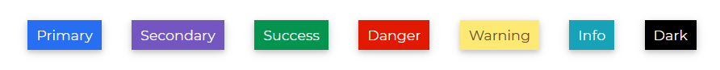
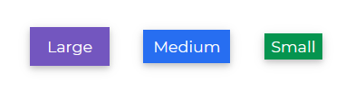

# Bootstrap 5 Badges

Bootstrap 5 Badges are used to convey and show messages. Badges can be used to display notifications such as unread messages, missed phone calls, and so on.

## Default Badges

Using relative font sizing and `em` units, the Contrast Bootstrap 5 Badge scales to fit the size of the immediate parent element.



###### html

```html
<button class="btn btn-dark">
  Notifications
  <span class="badge bg-light text-dark ml-2">4</span>
  <span class="badge bg-primary">Primary</span>
  <span class="badge bg-secondary">Secondary</span>
  <span class="badge bg-success">Success</span>
  <span class="badge bg-danger">Danger</span>
  <span class="badge bg-warning text-dark">Warning</span>
  <span class="badge bg-info">Info</span>
  <span class="badge bg-light text-dark">Light</span>
  <span class="badge bg-dark text-light">Dark</span>
</button>
```

## Pill Badges

The Contrast Bootstrap 5 Badge adds a `class` of `badge-pill` to your span. This gives the badges a more rounded appearance.


###### html

```html
<span class="badge badge-pill bg-primary">Primary</span>
<span class="badge badge-pill bg-secondary">Secondary</span>
<span class="badge badge-pill bg-success">Success</span>
<span class="badge badge-pill bg-danger">Danger</span>
<span class="badge badge-pill bg-warning text-dark">Warning</span>
<span class="badge badge-pill bg-info">Info</span>
<span class="badge badge-pill bg-light text-dark">Light</span>
<span class="badge badge-pill bg-dark text-light">Dark</span>
```

## Contextual Variations

To define how little or how large you want your Contrast Bootstrap badge to be, give your `span` element a `class` of badge and append the size code of the badge you want (lg for a large badge, and sm for small). For example `<span class="badge badge-lg ">Large</span>`.



###### html

```html
<span class="badge badge-lg bg-primary">Large</span>
<span class="badge bg-secondary">Normal</span>
<span class="badge badge-sm bg-success">Small</span>
```

## Flat Badges

To remove shadows from your badges, use the `badge-flat` class.


###### html

```html
<span class="badge badge-flat bg-dark">Flat Badge</span>
```

## Badges with Icons

<a href="/product/bootstrap-contrast-pro"><span class="badge badge-lg badge-pro">Pro Component</span></a>

We can nest the icon element in our `badge` span to allowus use icons in our badges.


###### html

```html
<span class="badge bg-primary"><i class="fa fa-facebook"></i></span>
<span class="badge bg-secondary"><i class="fa fa-snapchat-ghost"></i></span>
<span class="badge bg-success"><i class="fa fa-anchor"></i></span>
<span class="badge bg-danger"><i class="fa fa-twitter"></i></span>
<span class="badge bg-warning text-dark"><i class="fa fa-bomb"></i></span>
<span class="badge bg-info"><i class="fa fa-heart"></i></span>
<span class="badge bg-light text-dark">
  <i class="fa fa-btc"></i>
</span>
<span class="badge bg-dark text-light"><i class="fa fa-apple"></i></span>
```
