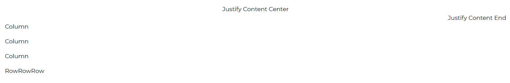
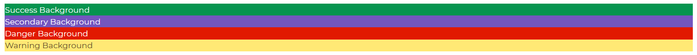

# Bootstrap 5 Box

Bootstrap 5 boxes are layout components that assist in the creation of build components for CSS utility purposes.

Bootstrap Box component can become any element from `ElementType` like `div`, `span`, `img`, `video` etc.


###### HTML

```html
<span>Span</span>
<div>Div</div>
<p>Paragraph</p>
<section>Section</section>
```

## Display

We can define display styles for our boxes by giving our `div` a `class` of d and then appending the display style we want (flex, block, inline). For example `<div class="d-flex">Display FLex</div>`, for a display style of 'flex'.


###### html

```html
<div class="d-flex">Display FLex</div>
<div class="d-block">Display Block</div>
<div class="d-inline">Display Inline</div>
```

## Flex

To determine the flex orientation of your elements. We add a flex 'class' to our element, which adds the direction ( column or row). For example `<div class="d-flex flex-column"></div>`.



###### html

```html
<div class="d-flex flex-column">
  <p>Coloumn</p>
  <p>Coloumn</p>
  <p>Coloumn</p>
</div>
<div class="d-flex flex-row">
  <p>row</p>
  <p>row</p>
  <p>row</p>
</div>
```

## Colors

By giving our element a `class` of text and appending the color code we desire, we may set text colors for it. For example `<div class="text-danger">Danger</div>`.


###### html

```html
<div class="text-danger">Danger</div>
<div class="text-success">Success</div>
<div class="text-warning">Warning</div>
<div class="text-primary">Primary</div>
```

## Background Colors

You can give the elements a backdrop color with the Contrast Boostrap 5 Box component. To accomplish so, we give the div element the `class` of `bg` and append the desired color code to it. For example `<div class="bg-danger">Danger</div>`.



###### html

```html
<div class="bg-danger">Danger</div>
<div class="bg-success">Success</div>
<div class="bg-warning">Warning</div>
<div class="bg-primary">Primary</div>
```
