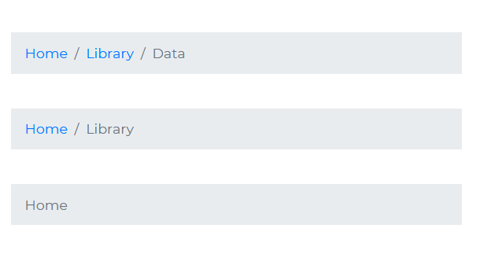

# Bootstrap 5 Breadcrumb

Bootstrap 5 Breadcrumb is a component that indicates to users where they are on a website or in a Web application. It's a navigational tool that allows visitors to track their journeys and keep track of where they are on the page.

## Navigation BreadCrumb



###### html

```html
<nav aria-label="breadcrumb">
  <ol class="breadcrumb">
    <li class="breadcrumb-item active">Home</li>
  </ol>
</nav>

<nav aria-label="breadcrumb">
  <ol class="breadcrumb">
    <li class="breadcrumb-item text-primary">Home</li>
    <li class="breadcrumb-item active" aria-current="page">Library</li>
  </ol>
</nav>

<nav aria-label="breadcrumb">
  <ol class="breadcrumb breadcrumb-flat">
    <li class="breadcrumb-item">Home</li>
    <li class="breadcrumb-item">Library</li>
    <li class="breadcrumb-item active" aria-current="page">Data</li>
  </ol>
</nav>
```
