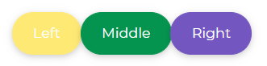
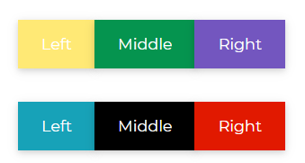
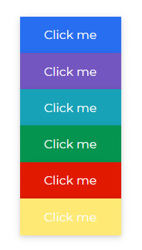
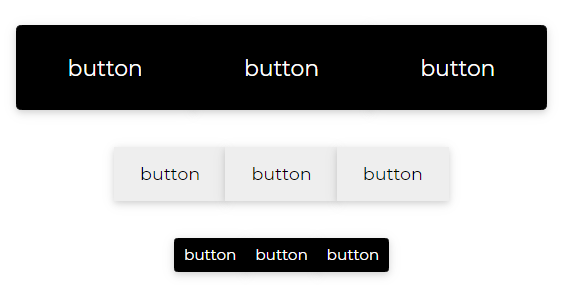

# Bootstrap 5 ButtonGroup

A Bootstrap 5 button group is a vertical column that bundles a set of buttons into a single line or stack.

Applications of Bootstrap button group:

- Group of pricing options
- Buying a a group of licenses from our PRO CDB website

## Basic Button Groups


###### html

```html
<button type="button" class="btn btn-primary">Click me</button>
<button type="button" class="btn btn-secondary">Click me</button>
<button type="button" class="btn btn-info">Click me</button>
<button type="button" class="btn btn-success">Click me</button>
<button type="button" class="btn btn-danger">Click me</button>
<button type="button" class="btn btn-warning">Click me</button>
```

## Basic Circular Groups



###### html

```html
<button type="button" class="btn btn-rounded btn-warning">
  Left
</button>
<button type="button" class="btn btn-rounded btn-success">
  Middle
</button>
<button type="button" class="btn btn-rounded btn-secondary">
  Right
</button>
```

## Basic Button Groups in Different Groups



###### html

```html
<div class="btn-group" role="group" aria-label="Basic example">
  <button type="button" class="btn btn-warning">
    Left
  </button>
  <button type="button" class="btn btn-success">
    Middle
  </button>
  <button type="button" class="btn btn-secondary">
    Right
  </button>
</div>

<div class="btn-group" role="group" aria-label="Basic example">
  <button type="button" class="btn btn-info">
    Left
  </button>
  <button type="button" class="btn btn-dark">
    Middle
  </button>
  <button type="button" class="btn btn-danger">
    Right
  </button>
</div>
```

## Vertical Button Groups

Make a group of buttons appear vertically stacked instead of horizontally stacked.



###### html

```html
<div class="btn-group-vertical" role="group" aria-label="Basic example">
  <button type="button" class="btn btn-primary">Click me</button>
  <button type="button" class="btn btn-secondary">Click me</button>
  <button type="button" class="btn btn-info">Click me</button>
  <button type="button" class="btn btn-success">Click me</button>
  <button type="button" class="btn btn-danger">Click me</button>
  <button type="button" class="btn btn-warning">Click me</button>
</div>
```

## Different Sizing for Button Groups



###### html

```html
<div class="btn-group btn-group-lg" role="group" aria-label="Basic example">
  <button type="button" class="btn btn-dark">button</button>
  <button type="button" class="btn btn-dark">button</button>
  <button type="button" class="btn btn-dark">button</button>
</div>

<div class="btn-group" role="group" aria-label="Basic example">
  <button type="button" class="btn btn-light">button</button>
  <button type="button" class="btn btn-light">button</button>
  <button type="button" class="btn btn-light">button</button>
</div>

<div class="btn-group btn-group-sm" role="group" aria-label="Basic example">
  <button type="button" class="btn btn-dark">button</button>
  <button type="button" class="btn btn-dark">button</button>
  <button type="button" class="btn btn-dark">button</button>
</div>
```
