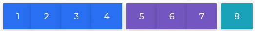

# ButtonToolbar

Bootstrap 5 ButtonToolbar enables you to combine several button groups to create more advanced button components.

For more complicated components, combine sets of button groups into button toolbars. To space out groups, buttons, and other elements, use utility classes as needed.

## Default ButtonToolbar

To use the Contrast Bootstrap 5 ButtonToolbar in your project, use the `btn-toolbar` class.



###### html

```html
<div class="btn-toolbar" role="toolbar" aria-label="Toolbar with button groups">
  <div class="btn-group mr-2" role="group" aria-label="First group">
    <button type="button" class="btn btn-primary">1</button>
    <button type="button" class="btn btn-primary">2</button>
    <button type="button" class="btn btn-primary">3</button>
    <button type="button" class="btn btn-primary">4</button>
  </div>
  <div class="btn-group mr-2" role="group" aria-label="Second group">
    <button type="button" class="btn btn-secondary">5</button>
    <button type="button" class="btn btn-secondary">6</button>
    <button type="button" class="btn btn-secondary">7</button>
  </div>
  <div class="btn-group" role="group" aria-label="Third group">
    <button type="button" class="btn btn-info">8</button>
  </div>
</div>
```
