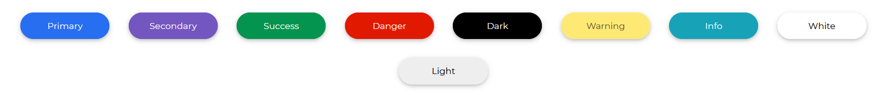

# Boootstrap 5 Button

Users can interact with your website using the Bootstrap 5 button. In terms of size, form, and color, they are simple to alter. They include a number of pre-defined button styles, each with its own logical function and a few more features.

Bootstrap has a range of button styles, each with its own logical function and a few extras tossed in for good measure.

## Default Buttons

Giving the buttons the classes `btn` and `btn-primary` (primary designating our button's background color) lets them to use the Contrast Bootstrap button's predefined style.


###### html

```html
<button class="btn btn-primary">Primary</button>
<button class="btn btn-secondary">Secondary</button>
<button class="btn btn-success">Success</button>
<button class="btn btn-danger">Danger</button>
<button class="btn btn-warning">Warning</button>
<button class="btn btn-info">Info</button>
<button class="btn btn-light">Light</button>
<button class="btn btn-dark">Dark</button>
<button class="btn btn-link">Link</button>
```

## Circular Buttons

The class `btn-rounded` provides our Contrast Bootstrap Button a more rounded look.



###### html

```html
<button type="button" class="btn btn-rounded btn-primary">
  Primary
</button>
<button type="button" class="btn btn-rounded btn-secondary">
  Secondary
</button>
<button type="button" class="btn btn-rounded btn-success">
  Success
</button>
<button type="button" class="btn btn-rounded btn-danger">
  Danger
</button>
<button type="button" class="btn btn-rounded btn-warning">
  Warning
</button>
<button type="button" class="btn btn-rounded btn-info">Info</button>
<button type="button" class="btn btn-rounded btn-light">Light</button>
<button type="button" class="btn btn-rounded btn-dark">Dark</button>
<button type="button" class="btn btn-rounded btn-link">Link</button>
```

## Outline Buttons

We use the `class` `btn-outline-primary` to make our buttons have only an outline and no background color. The color of the outline of your button is determined by the last word applied to the class name.


###### html

```html
<button type="button" class="btn btn-outline-primary">Primary</button>
<button type="button" class="btn btn-outline-secondary">
  Secondary
</button>
<button type="button" class="btn btn-outline-success">Success</button>
<button type="button" class="btn btn-outline-danger">Danger</button>
<button type="button" class="btn btn-outline-warning">Warning</button>
<button type="button" class="btn btn-outline-info">Info</button>
<button type="button" class="btn btn-outline-light">Light</button>
<button type="button" class="btn btn-outline-dark">Dark</button>
<button type="button" class="btn btn-link">Link</button>
```

## Button Sizes

We can use the terms `btn-sm` (small size buttons), `btn-md` (medium or default sized button), and finally `btn-lg` to express how big or small we want our button to be ( a large sized button).


###### html

```html
<button type="button" class="btn btn-primary btn-lg">Large button</button>
<button type="button" class="btn btn-secondary btn-md">
  Normal button
</button>
<button type="button" class="btn btn-success btn-sm">
  Small button
</button>
```

## Buttons with Icons

<a href="/product/bootstrap-contrast-pro"><span class="badge badge-lg badge-pro">Pro Component</span></a>


On our website, we use the `i` element to add icons. We can have icons on our button by nesting a `i` tag in our button.

###### html

```html
<button type="button" class="btn btn-primary">
  <i class="fa fa-book"></i>
  <span> Primary </span>
</button>
<button type="button" class="btn btn-secondary">
  <i class="fa fa-user"></i>
  <span>Secondary </span>
</button>
<button type="button" class="btn btn-success">
  <i class="fa fa-check"></i>
  <span> Success </span>
</button>
<button type="button" class="btn btn-danger">
  <i class="fa fa-times"></i>
  <span> Cancel </span>
</button>
<button type="button" class="btn btn-dark btn-rounded">
  <i class="fa fa-home"></i>
  <span> Home </span>
</button>
<button type="button" class="btn btn-info btn-rounded">
  <i class="fa fa-book"></i>
  <span> Read </span>
</button>
<button type="button" class="btn btn-outline-warning btn-rounded">
  <i class="fa fa-lock"></i>
  <span> Lock </span>
</button>
```

## Block Button

To make our Contrast Bootstrap 5 Button a block element, which means it will take up the entire width of the page or container it is in.


```html
<button type="button" class="btn btn-block btn-primary">
  Primary
</button>
<button type="button" class="btn btn-block btn-secondary">
  Secondary
</button>
<button type="button" class="btn btn-block btn-success">
  Success
</button>
<button type="button" class="btn btn-block btn-danger">Danger</button>
<button type="button" class="btn btn-block btn-warning">
  Warning
</button>
<button type="button" class="btn btn-block btn-info">Info</button>
<button type="button" class="btn btn-block btn-light">Light</button>
<button type="button" class="btn btn-block btn-dark">Dark</button>
<button type="button" class="btn btn-block btn-link">Link</button>
```
