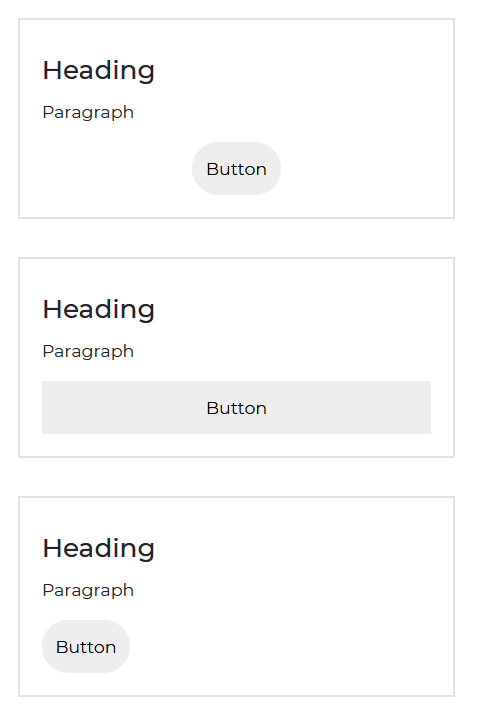
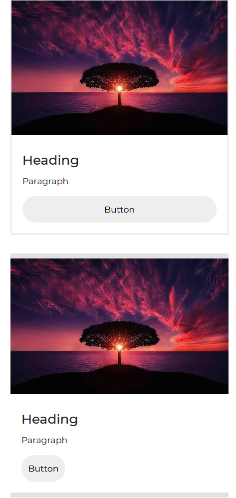
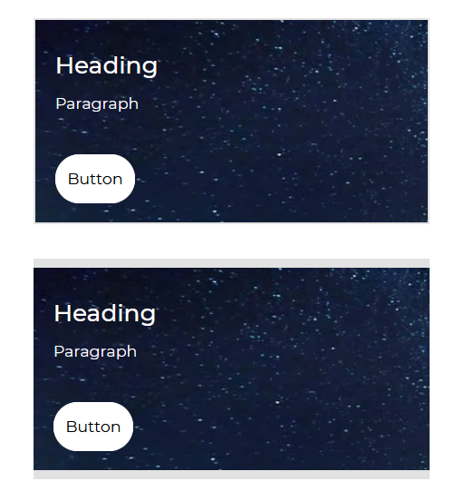
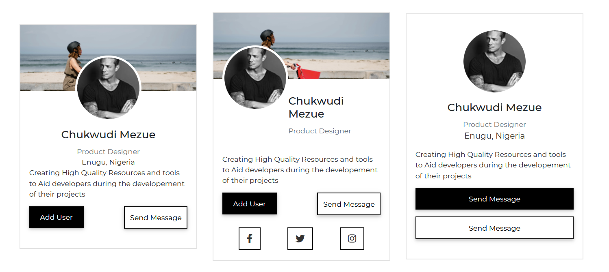
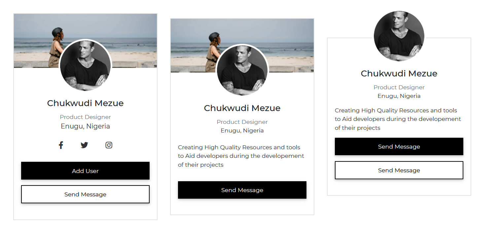

# Bootstrap 5 Card

A flexible and configurable Bootstrap 5 card is a content container. It contains headers and footers, as well as a wealth of information, proper background colors, and a variety of display options.

Card components show material made up of various pieces with shadows, depth, and hover effects.

Bootstrap 5 Cards use the least amount of HTML and styles possible while still providing a lot of control and customization.

## Default Card

To use Contrast Bootstrap's predefined card styles in your project, use the `card` class.

`card-title` for titles and `card-text` for texts in our card are two more classes that allow you to use Contrast Bootstrap default styles.


###### Html

```html
<div class="card" style="width: 25rem">
  
  <div class="card-body">
    <div class="card-title">Basic</div>
    <div class="card-text">
      This is just a card text Get important notifications about you or activity you've missed
    </div>
    <div class="d-flex pt-3 pb-3">
      <button class="btn btn-primary">Button</button>
    </div>
  </div>
</div>
```

## Simple Cards



###### Html

```html
<div class="card" style="width: 25rem">
  <div class="card-body">
    <h2 class="card-title">Heading</h2>
    <p class="card-text">Paragraph</p>
    <div class="d-flex justify-content-center">
      <button class="btn btn-light btn-flat btn-rounded">
        Button
      </button>
    </div>
  </div>
</div>
<div class="card" style="width: 25rem">
  <div class="card-body">
    <h2 class="card-title">Heading</h2>
    <button class="btn btn-flat btn-block btn-light">Button</button>
  </div>
</div>
<div class="card" style="width: 25rem">
  <div class="card-body">
    <h2 class="card-title">Heading</h2>
    <p class="card-text">Paragraph</p>
    <button class="btn btn-flat btn-rounded btn-light">Button</button>
  </div>
</div>
```

## Bordered Cards

Use the `card-border` class to give your card borders.


###### Html

```html
<div class="card card-border" style="width: 25rem">
  <div class="card-body">
    <h2 class="card-title">Heading</h2>
    <p class="card-text">Paragraph</p>
    <div class="d-flex justify-content-center">
      <button class="btn btn-light btn-flat btn-rounded">
        Button
      </button>
    </div>
  </div>
</div>
<div class="card card-border" style="width: 25rem">
  <div class="card-body">
    <h2 class="card-title">Heading</h2>
    <button class="btn btn-flat btn-block btn-light">Button</button>
  </div>
</div>
<div class="card card-border" style="width: 25rem">
  <div class="card-body">
    <h2 class="card-title">Heading</h2>
    <p class="card-text">Paragraph</p>
    <button class="btn btn-flat btn-rounded btn-light">Button</button>
  </div>
</div>
```

## Artwork Top Cards



###### Html

```html
<div class="card" style="width: 25rem">
  
  <div class="card-body">
    <h2 class="card-title">Heading</h2>
    <p class="card-text">Paragraph</p>
    <div class="d-flex justify-content-center">
      <button class="btn btn-light btn-block">
        Button
      </button>
    </div>
  </div>
</div>
<div class="card card-border" style="width: 25rem">
  
  <div class="card-body">
    <h2 class="card-title">Heading</h2>
    <p class="card-text">Paragraph</p>
    <button class="btn btn-flat btn-light">Button</button>
  </div>
</div>
```

## Artwork Middle Cards


###### Html

```html
<div class="card" style="width: 25rem">
  <div class="card-body">
    <h2 class="card-title">Heading</h2>
    <p class="card-text">Paragraph</p>
  </div>
  <div class="cdb-iframe" role="cdb-iframe" src="https://www.youtube.com/embed/LebxiFwmYBc"></div>
  <div class="card-body">
    <button class="btn btn-light btn-flat btn-rounded">Button</button>
  </div>
</div>
<div class="card" style="width: 25rem">
  <div class="card-body">
    <h2 class="card-title">Heading</h2>
    <p class="card-text">Paragraph</p>
  </div>
  <div class="cdb-iframe" role="cdb-iframe" src="https://www.youtube.com/embed/LebxiFwmYBc"></div>
  <div class="card-body">
    <button class="btn btn-block btn-light btn-flat btn-rounded">Button</button>
  </div>
</div>
```

## Widget Cards


###### Html

```html
<div class="card" style="width: 25rem">
  <div class="card-body">
    <div class="lead">Total Downloads</div>
    <h2 class="card-title">1,057,891</h2>
    <p class="small text-muted">Oct 1 - Dec 31,<i class="fa fa-globe"></i> Worldwide</p>
  </div>
</div>
```

## Profile Display Card


###### Html

```html
<div class="card" style="width:25rem">
  
  
  <div class="card-body d-flex flex-column align-items-center my-4">
    <h2 class="card-title">Sam Russo</h2>
    <p class="card-text">Senior Software Developer</p>
    <p class="text-muted card-text">Detroit, USA</p>
    <div>
      <button class="btn btn-sm btn-dark"><i class="fa fa-user-plus"></i> Connect</button>
      <button class="btn btn-warning btn-sm text-dark">
        Send Message
      </button>
    </div>
  </div>
</div>
```

## Profile List Card


###### Html

```html
<div class="card" style="width:25rem">
  <h2 class="card-title lead p-3 border-bottom">Team Members</h2>
  <div class="py-0 card-body">
    <div class="pane mt-2">
      
      <div class="ml-3">
        <h2 class="card-title my-0 h6">Warren Briggs</h2>
        <p class="small m-0"><i class="fa fa-circle small p-0 mr-1"></i>Online</p>
      </div>
      <button class="btn btn-success btn-sm ml-auto flat">Add</button>
    </div>
    <div class="pane mt-4">
      
      <div class="ml-3">
        <h2 class="card-title my-0 h6">Lu Chen</h2>
        <p class="small m-0"><i class="fa fa-circle small text-warning mr-1"></i>In a meeting</p>
      </div>
      <button class="btn btn-success btn-sm ml-auto flat">Add</button>
    </div>
    <div class="pane mt-4">
      
      <div class="ml-3">
        <h2 class="card-title my-0 h6">Lilah Loselev</h2>
        <p class="small m-0"><i class="fa fa-circle small text-muted mr-1"></i>Not Available</p>
      </div>
      <button class="btn btn-success btn-sm ml-auto flat">Add</button>
    </div>
    <div class="pane my-4">
      
      <div class="ml-3">
        <h2 class="card-title my-0 h6">Danny</h2>
        <p class="small m-0"><i class="fa fa-circle small text-danger mr-1"></i>Offline</p>
      </div>
      <button class="btn btn-success btn-sm ml-auto flat">Add</button>
    </div>
  </div>
</div>
```

## Artwork Full Cards



###### Html

```html
<div
  class="card"
  style="
    width: 25rem;
    background-image: url('https://cdn.pixabay.com/photo/2018/08/14/13/23/ocean-3605547_960_720.jpg');
  "
>
  <div class="card-body" style="color: white">
    <h2 class="card-title">Heading</h2>
    <p class="card-text">Paragraph</p>
  </div>
  <div class="card-body">
    <button class="btn btn-light btn-rounded btn-flat">Button</button>
  </div>
</div>

<div
  class="card card-border"
  style="
    width: 25rem;
    background-image: url('https://cdn.pixabay.com/photo/2018/08/14/13/23/ocean-3605547_960_720.jpg');
  "
>
  <div class="card-body" style="color: white">
    <h2 class="card-title">Heading</h2>
    <p class="card-text">Paragraph</p>
  </div>
  <div class="card-body">
    <button class="btn btn-light btn-block btn-rounded">
      Button
    </button>
  </div>
</div>
```

## Profile Cards





###### Html

```html
<div
  class="card m-0"
  style="
    position: relative;
    width: 100%;
    max-width: 25rem;
    height: 33rem;
    padding: 25px;
    background-image: url('../img/rectangle.png');
    background-repeat: no-repeat;
    background-position: center;
  "
>
  <div
    class="card-body"
    style="
      background-color: white;
      width: calc(100% - 50px);
      text-align: center;
      align: center;
      position: absolute;
      bottom: 25px;
    "
  >
    <h2 class="card-title" style="color: #333333" class="font-weight-normal">
      Chukwudi Mezue
    </h2>
    <p class="card-text" style="color: #333333; font-size: 0.9rem" class="font-weight-lighter">
      Product Designer
    </p>
    <p style="color: #333333" class="card-text font-weight-light">
      Enugu, Nigeria
    </p>
    <div
      class="card-body"
      style="
        display: flex;
        justify-content: center;
        margin: 20px 0;
      "
    >
      <i class="fa fa-lg fa-facebook" style="color: #333333"></i>
      <i class="fa fa-lg fa-twitter mx-3" style="color: #333333"></i>
      <i class="fa fa-lg fa-instagram" style="color: #333333"></i>
    </div>
    <button class="btn btn-dark btn-block mr-0">Add User</button>
  </div>
</div>

<div
  class="card m-0 mt-4"
  style="
    position: relative;
    width: 100%;
    max-width: 25rem;
    height: 33rem;
    padding: 25px;
    background-image: url('../img/rectangle.png');
    background-repeat: no-repeat;
    background-position: center;
  "
>
  <div
    class="card-body"
    style="
      background-color: white;
      width: calc(100% - 50px);
      text-align: center;
      align: center;
      position: absolute;
      bottom: 25px;
    "
  >
    <h2 class="card-title" style="color: #333333" class="font-weight-normal">
      Chukwudi Mezue
    </h2>
    <p class="card-text" style="color: #333333; font-size: 0.9rem" class="font-weight-lighter">
      Product Designer
    </p>
    <p style="color: #333333" class="card-text font-weight-light">
      Enugu, Nigeria
    </p>
    <button class="btn btn-dark btn-block mr-0">Send Message</button>
  </div>
</div>

<div
  class="card m-0 mt-4"
  style="
    position: relative;
    width: 100%;
    max-width: 25rem;
    height: 33rem;
    padding: 25px;
    background-image: url('../img/rectangle.png');
    background-repeat: no-repeat;
    background-position: center;
  "
>
  <div
    class="card-body"
    style="
      background-color: white;
      width: calc(100% - 50px);
      text-align: center;
      align: center;
      position: absolute;
      bottom: 25px;
    "
  >
    <h2 style="color: #333333" class="font-weight-normal">
      Mac Xenon
    </h2>
    <p style="color: #333333; font-size: 0.9rem" class="font-weight-lighter">
      Product Designer
    </p>
    <p style="color: #333333" class="font-weight-light">
      Enugu, Nigeria
    </p>
    <div
      class="card-body"
      style="
        display: flex;
        justify-content: center;
        margin: 20px 0;
      "
    >
      <i class="fa fa-lg fa-facebook" style="color: #333333"></i>
      <i class="fa fa-lg fa-twitter mx-3" style="color: #333333"></i>
      <i class="fa fa-lg fa-instagram" style="color: #333333"></i>
    </div>
    <button class="btn btn-dark btn-block mr-0">Add User</button>
  </div>
</div>

<div
  class="card m-0 mt-4"
  style="
    position: relative;
    width: 100%;
    max-width: 25rem;
    height: 33rem;
    background-image: url('../img/rectangle.png');
    background-repeat: no-repeat;
    background-position: center;
  "
>
  <div
    class="card-body"
    style="
      background-color: white;
      width: calc(100% - 50px);
      text-align: left;
      align: center;
      position: absolute;
      bottom: 0;
    "
  >
    <h2 style="color: #333333" class="font-weight-normal">
      Mac Xenon
    </h2>
    <p style="color: #333333; font-size: 0.9rem" class="font-weight-lighter">
      Product Designer
    </p>
    <p style="color: #333333" class="font-weight-light">
      Enugu, Nigeria
    </p>
    <button class="btn btn-dark btn-block mr-0">Send Message</button>
  </div>
</div>

<div
  class="card m-0 mt-4"
  style="
    position: relative;
    width: 100%;
    max-width: 25rem;
    height: 33rem;
    background-image: url('../img/rectangle.png');
    background-repeat: no-repeat;
    background-position: center;
  "
>
  <div
    class="card-body"
    style="
      background-color: white;
      width: 100%;
      text-align: center;
      align: center;
      position: absolute;
      bottom: 0;
    "
  >
    <h2 style="color: #333333" class="font-weight-normal">
      Mac Xenon
    </h2>
    <p style="color: #333333; font-size: 0.9rem" class="font-weight-lighter">
      Product Designer
    </p>
    <p style="color: #333333" class="font-weight-light">
      Enugu, Nigeria
    </p>
    <button class="btn btn-dark btn-block mr-0" color="dark" block>
      Send Message
    </button>
    <div
      class="card-body"
      style="
        display: flex;
        justify-content: center;
        margin: 20px 0;
      "
    >
      <i class="fa fa-lg fa-facebook text-dark"></i>

      <i class="fa fa-lg fa-twitter text-dark mx-3"></i>

      <i class="fa fa-lg fa-instagram text-dark"></i>
    </div>
  </div>
</div>

<div class="card m-0 mt-4" style="width: 100%; max-width: 25rem;">
  
  
  <div class="card-body d-flex flex-column align-items-center mb-4 pt-1">
    <h4>Chukwudi Mezue</h4>
    <p class="text-muted">Product Designer</p>
    <p style="font-size:16;color:#333;">Enugu, Nigeria</p>
    <p style="color:#333;">
      Creating High Quality Resources and tools to Aid developers during the developement of their
      projects
    </p>
    <div class="d-flex justify-content-between w-100">
      <button class="w-50 mr-4 btn btn-dark">Add User</button>
      <button class="w-50 btn btn-outline-dark mr-0">Send Message</button>
    </div>
  </div>
</div>

<div class="card mt-4" style="width: 100%; max-width: 25rem;">
  
  <div class="card-body d-flex justify-content-between">
    
    <div class="align-items-left pt-1 pb-0">
      <h4>Chukwudi Mezue</h4>
      <p class="text-muted">Product Designer</p>
    </div>
  </div>
  <div class="card-body d-flex flex-column align-items-center mb-2">
    <p style="color:#333;">
      Creating High Quality Resources and tools to Aid developers during the developement of their
      projects
    </p>
    <div class="d-flex justify-content-between w-100">
      <button class="w-50 mr-4 btn btn-dark">Add User</button>
      <button class="w-50 btn btn-outline-dark mr-0">Send Message</button>
    </div>
  </div>
  <div
    style="
    display:flex;
    justify-content: center;
    margin:0 0 20px;
  "
  >
    <button class="btn btn-block btn-outline-dark btn-flat btn-sm">
      <i class="fa-lg fa fa-facebook-f"></i>
    </button>
    <button class="btn btn-block btn-outline-dark btn-flat btn-sm">
      <i class="fa-lg fa fa-twitter"></i>
    </button>
    <button class="btn btn-block btn-outline-dark btn-flat mr-0 btn-sm">
      <i class="fa-lg fa fa-instagram"></i>
    </button>
  </div>
</div>

<div class="card mt-4" style="width: 100%; max-width: 25rem;">
  
  <div class="card-body d-flex flex-column align-items-center mb-4 pt-1">
    <h4>Chukwudi Mezue</h4>
    <p class="text-muted">Product Designer</p>
    <p style="font-size:16;color:#333;">Enugu, Nigeria</p>
    <p style="color:#333;">
      Creating High Quality Resources and tools to Aid developers during the developement of their
      projects
    </p>
    <div class="w-100">
      <button class="btn btn-block btn-dark">Send Message</button>
      <button class="btn btn-block btn-outline-dark mr-0">Send Message</button>
    </div>
  </div>
</div>

<div class="card m-0 mt-4" style="width: 100%; max-width: 25rem;">
  
  
  <div class="card-body d-flex flex-column align-items-center mb-4 pt-1">
    <h4>Chukwudi Mezue</h4>
    <p class="text-muted">Product Designer</p>
    <p style="font-size:16;color:#333;">Enugu, Nigeria</p>
    <div
      style="
      width:100%;
      display:flex;
      justify-content:space-between;
      padding:0 70px;
      margin:10px 0 30px;"
    >
      <i class="fa-lg fa text-dark fa-facebook-f"></i>
      <i class="fa-lg fa text-dark fa-twitter"></i>
      <i class="fa-lg fa text-dark fa-instagram"></i>
    </div>
    <div class="w-100">
      <button class="btn btn-block btn-dark">Add User</button>
      <button class="btn btn-block btn-outline-dark mr-0">Send Message</button>
    </div>
  </div>
</div>

<div class="card mt-4" style="width: 100%; max-width: 25rem;">
  
  
  <div class="card-body d-flex flex-column align-items-center mb-4 pt-1">
    <h4>Chukwudi Mezue</h4>
    <p class="text-muted">Product Designer</p>
    <p style="font-size:16;color:#333;">Enugu, Nigeria</p>
    <p style="color:#333; margin:20px 0 30px;">
      Creating High Quality Resources and tools to Aid developers during the developement of their
      projects
    </p>
    <div class="w-100">
      <button class="btn btn-dark btn-block mb-0 mr-0">Send Message</button>
    </div>
  </div>
</div>

<div class="card mx-0" style="width: 100%; max-width: 25rem; margin-top:6rem;">
  
  <div class="card-body d-flex flex-column align-items-center mb-4 pt-1">
    <h4>Chukwudi Mezue</h4>
    <p class="text-muted">Product Designer</p>
    <p style="font-size:16;color:#333;">Enugu, Nigeria</p>
    <p style="color:#333;">
      Creating High Quality Resources and tools to Aid developers during the developement of their
      projects
    </p>
    <div class="w-100">
      <button class="btn btn-dark btn-block mb-3">Send Message</button>
      <button class="btn btn-outline-dark btn-block">Send Message</button>
    </div>
  </div>
</div>
```
