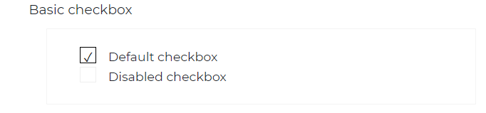
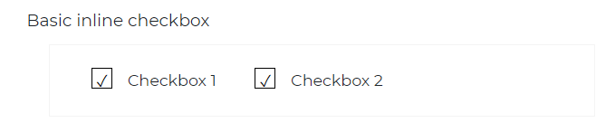
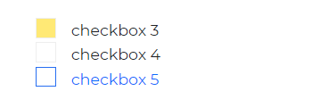

# Bootstrap 5 Checkbox

Bootstrap 5 Checkbox is a component that allows a user to make multiple selections. This term is commonly used in forms and surveys.

They are used to pick one or more items from a list, whereas `radios` are used to select one option from several.

## Default Checkbox



###### html

```html
<div class="custom-check">
  <input class="custom-check-input" type="checkbox" value="" id="defaultCheck1" />
  <label class="custom-check-label" for="defaultCheck1">
    Default checkbox
  </label>
</div>

<div class="custom-check">
  <input class="custom-check-input" type="checkbox" value="" id="defaultCheck2" disabled />
  <label class="custom-check-label" for="defaultCheck2">
    Disabled checkbox
  </label>
</div>
```

## Inline Checkbox

<a href="/product/bootstrap-contrast-pro"><span class="badge badge-lg badge-pro">Pro Component</span></a>



###### html

```html
<div class="custom-check form-check-inline">
  <input class="custom-check-input" type="checkbox" value="" id="Checkbox1" />
  <label class="custom-check-label" for="Checkbox1">
    Checkbox 1
  </label>
</div>

<div class="custom-check form-check-inline">
  <input class="custom-check-input" type="checkbox" value="" id="Checkbox2" />
  <label class="custom-check-label" for="Checkbox2">
    Checkbox 2
  </label>
</div>
```

## Different Styling for Checkbox

<a href="/product/bootstrap-contrast-pro"><span class="badge badge-lg badge-pro">Pro Component</span></a>



###### html

```html
<div class="custom-check">
  <input
    class="custom-check-input text-primary bg-warning"
    type="checkbox"
    value=""
    id="Checkbox3"
  />
  <label class="custom-check-label" for="Checkbox3">
    checkbox 3
  </label>
</div>

<div class="custom-check">
  <input class="custom-check-input" type="checkbox" value="" id="Checkbox4" />
  <label class="custom-check-label" for="Checkbox4">
    checkbox 4
  </label>
</div>

<div class="custom-check">
  <input
    class="custom-check-input border-primary text-primary"
    type="checkbox"
    value=""
    id="Checkbox5"
  />
  <label class="custom-check-label text-primary" for="Checkbox5">
    checkbox 5
  </label>
</div>
```
