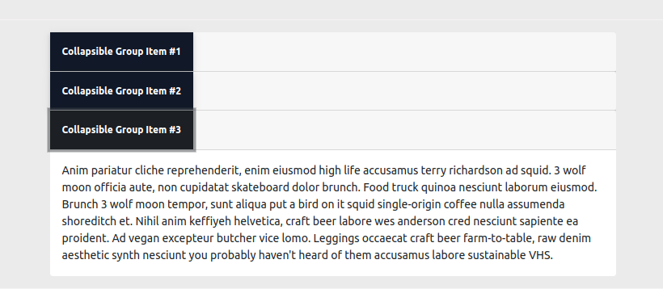

# Bootstrap 5 Collapse

Content can be toggled by using the Bootstrap 5 Collapse component. It can be used to organize a large number of texts and/or visuals into collapsible items.

They're utilized to reveal and conceal information. Buttons, also known as anchors, are utilized as triggers for certain items that you toggle. When you collapse an element, the `height` value will animate to `0`.

## Default Collapse

<Collapse1/>

## Collapse

###### HTML

```html
<div class="container container-collapse">
  <div class="blockcode">
    <div class="header">Collapse</div>
    <div class="example2">
      <a
        class="btn btn-light"
        style="width: fit-content"
        data-toggle="collapse"
        href="#collapseExample"
        role="button"
        aria-expanded="false"
        aria-controls="collapseExample"
      >
        Collapse
      </a>
      <div>
        <div class="collapse" id="collapseExample">
          <div class="card card-body">
            Anim pariatur cliche reprehenderit, enim eiusmod high life accusamus terry richardson ad
            squid. Nihil anim keffiyeh helvetica, craft beer labore wes anderson cred nesciunt
            sapiente ea proident.
          </div>
        </div>
      </div>
    </div>
  </div>
</div>
```

## Multiple targets

<Collapse2/>

###### HTML

```html
<div class="container container-collapse">
  <div class="blockcode">
    <div class="header">Multiple Targets</div>
    <div class="example2">
      <p class="d-flex flex-wrap">
        <a
          class="btn btn-light mr-0 mb-2"
          data-toggle="collapse"
          href="#multiCollapseExample1"
          role="button"
          aria-expanded="false"
          aria-controls="multiCollapseExample1"
        >
          Toggle first element
        </a>
        <button
          class="btn btn-light mr-0 mb-2"
          type="button"
          data-toggle="collapse"
          data-target="#multiCollapseExample2"
          aria-expanded="false"
          aria-controls="multiCollapseExample2"
        >
          Toggle second element
        </button>
        <button
          class="btn btn-light mr-0 mb-2"
          type="button"
          data-toggle="collapse"
          data-target=".multi-collapse"
          aria-expanded="false"
          aria-controls="multiCollapseExample1 multiCollapseExample2"
        >
          Toggle both elements
        </button>
      </p>
      <div class="row">
        <div class="col">
          <div class="collapse multi-collapse" id="multiCollapseExample1">
            <div class="card card-body">
              Anim pariatur cliche reprehenderit, enim eiusmod high life accusamus terry richardson
              ad squid. Nihil anim keffiyeh helvetica, craft beer labore wes anderson cred nesciunt
              sapiente ea proident.
            </div>
          </div>
        </div>
        <div class="col">
          <div class="collapse multi-collapse" id="multiCollapseExample2">
            <div class="card card-body">
              Anim pariatur cliche reprehenderit, enim eiusmod high life accusamus terry richardson
              ad squid. Nihil anim keffiyeh helvetica, craft beer labore wes anderson cred nesciunt
              sapiente ea proident.
            </div>
          </div>
        </div>
      </div>
    </div>
  </div>
</div>
```

## Collapse Vertical



```html
<div class="container container-collapse">
  <div class="blockcode">
    <div class="header">Collapse</div>
    <div class="example m-0 p-0">
      <div class="accordion" style="width: 100%; max-width: 50rem" id="accordionExample">
        <div class="card" style="border: none !important">
          <div class="card-header p-0" id="headingOne">
            <h2 class="mb-0">
              <button
                class="btn btn-light text-left mr-0 p-3 rounded-0"
                type="button"
                data-toggle="collapse"
                data-target="#collapseOne"
                aria-expanded="true"
                aria-controls="collapseOne"
              >
                Collapsible Group Item #1
              </button>
            </h2>
          </div>

          <div
            id="collapseOne"
            class="collapse show"
            aria-labelledby="headingOne"
            data-parent="#accordionExample"
          >
            <div class="card-body">
              Anim pariatur cliche reprehenderit, enim eiusmod high life accusamus terry richardson
              ad squid. 3 wolf moon officia aute, non cupidatat skateboard dolor brunch. Food truck
              quinoa nesciunt laborum eiusmod. Brunch 3 wolf moon tempor, sunt aliqua put a bird on
              it squid single-origin coffee nulla assumenda shoreditch et. Nihil anim keffiyeh
              helvetica, craft beer labore wes anderson cred nesciunt sapiente ea proident. Ad vegan
              excepteur butcher vice lomo. Leggings occaecat craft beer farm-to-table, raw denim
              aesthetic synth nesciunt you probably haven't heard of them accusamus labore
              sustainable VHS.
            </div>
          </div>
        </div>
        <div class="card" style="border: none !important">
          <div class="card-header p-0" id="headingTwo">
            <h2 class="mb-0">
              <button
                class="btn btn-light text-left collapsed p-3 rounded-0 mr-0"
                type="button"
                data-toggle="collapse"
                data-target="#collapseTwo"
                aria-expanded="false"
                aria-controls="collapseTwo"
              >
                Collapsible Group Item #2
              </button>
            </h2>
          </div>
          <div
            id="collapseTwo"
            class="collapse"
            aria-labelledby="headingTwo"
            data-parent="#accordionExample"
          >
            <div class="card-body">
              Anim pariatur cliche reprehenderit, enim eiusmod high life accusamus terry richardson
              ad squid. 3 wolf moon officia aute, non cupidatat skateboard dolor brunch. Food truck
              quinoa nesciunt laborum eiusmod. Brunch 3 wolf moon tempor, sunt aliqua put a bird on
              it squid single-origin coffee nulla assumenda shoreditch et. Nihil anim keffiyeh
              helvetica, craft beer labore wes anderson cred nesciunt sapiente ea proident. Ad vegan
              excepteur butcher vice lomo. Leggings occaecat craft beer farm-to-table, raw denim
              aesthetic synth nesciunt you probably haven't heard of them accusamus labore
              sustainable VHS.
            </div>
          </div>
        </div>
        <div class="card" style="border: none !important">
          <div class="card-header p-0" id="headingThree">
            <h2 class="mb-0">
              <button
                class="btn btn-light text-left collapsed p-3 rounded-0 mr-0"
                type="button"
                data-toggle="collapse"
                data-target="#collapseThree"
                aria-expanded="false"
                aria-controls="collapseThree"
              >
                Collapsible Group Item #3
              </button>
            </h2>
          </div>
          <div
            id="collapseThree"
            class="collapse"
            aria-labelledby="headingThree"
            data-parent="#accordionExample"
          >
            <div class="card-body">
              Anim pariatur cliche reprehenderit, enim eiusmod high life accusamus terry richardson
              ad squid. 3 wolf moon officia aute, non cupidatat skateboard dolor brunch. Food truck
              quinoa nesciunt laborum eiusmod. Brunch 3 wolf moon tempor, sunt aliqua put a bird on
              it squid single-origin coffee nulla assumenda shoreditch et. Nihil anim keffiyeh
              helvetica, craft beer labore wes anderson cred nesciunt sapiente ea proident. Ad vegan
              excepteur butcher vice lomo. Leggings occaecat craft beer farm-to-table, raw denim
              aesthetic synth nesciunt you probably haven't heard of them accusamus labore
              sustainable VHS.
            </div>
          </div>
        </div>
      </div>
    </div>
  </div>
</div>
```
