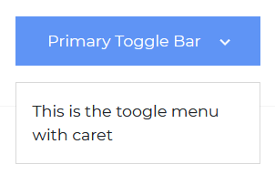
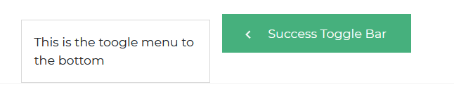
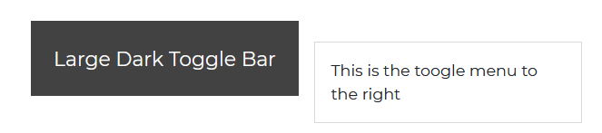
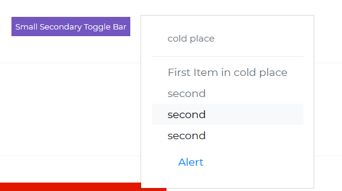
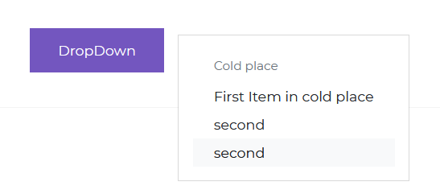
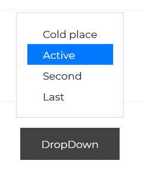

# Bootstrap 5 DropDown

Dropdown in Bootstrap 5 is a toggleable menu that can contain additional links or content. You can create complex navigation and link classification with it.

Dropdowns are vital parts in more complex navigation systems because they allow you to place all of the most relevant links in our navigation bar (or other component acting as navigation - such as SideNav)

CDB dropdowns are not only highly functional, but they are also really appealing visually. After they open a link, it gives them these distinctive Material Design effects like shadows, vibrant hues, and attractive waves.

It's an intentional design decision that they're toggled by clicking rather than hovering. Why?

Because CDB is a "mobile first" framework, we avoid hovering over functional parts and interactions because it degrades the user experience of mobile device users.

The Bootstrap Contrast By modifying props and prop values, we can give our dropdown component several predefined styles.

## Dark Toggle Bar


###### html

```html
<div class="dropdown">
  <button
    class="btn btn-dark dropdown-toggle"
    type="button"
    id="dropdownMenuButton"
    data-toggle="dropdown"
    aria-haspopup="true"
    aria-expanded="false"
  >
    Dark Toggle Bar
  </button>
  <div class="dropdown-menu" aria-labelledby="dropdownMenuButton">
    <a class="dropdown-item" href="#">This is the toggle menu</a>
  </div>
</div>
```

## Primary Toggler with Caret



###### html

```html
<div class="dropdown">
  <button
    class="btn btn-primary dropdown-toggle"
    type="button"
    id="dropdownMenuButton"
    data-toggle="dropdown"
    aria-haspopup="true"
    aria-expanded="false"
  >
    Primary Toggle Bar
  </button>
  <div class="dropdown-menu" aria-labelledby="dropdownMenuButton">
    <a class="dropdown-item" href="#">This is the toggle menu with caret</a>
  </div>
</div>
```

## Secondary Toggle Bar


###### html

```html
<div class="btn-group dropright">
  <button
    class="btn btn-secondary dropdown-toggle"
    type="button"
    id="dropdownMenuButton"
    data-toggle="dropdown"
    aria-haspopup="true"
    aria-expanded="false"
  >
    Secondary Toggle Bar as Nav
  </button>
  <div class="dropdown-menu" aria-labelledby="dropdownMenuButton">
    <a class="dropdown-item" href="#">This is the toggle menu to the right</a>
  </div>
</div>
```

## Danger Toggle Bar


###### html

```html
<div class="btn-group dropup">
  <button
    class="btn btn-danger dropdown-toggle"
    type="button"
    id="dropdownMenuButton"
    data-toggle="dropdown"
    aria-haspopup="true"
    aria-expanded="false"
  >
    Danger Toggle Bar
  </button>
  <div class="dropdown-menu" aria-labelledby="dropdownMenuButton">
    <a class="dropdown-item" href="#">This is the toggle menu to the top</a>
  </div>
</div>
```

## Success Toggle Bar



###### html

```html
<div class="btn-group dropleft">
  <button
    class="btn btn-success dropdown-toggle"
    type="button"
    id="dropdownMenuButton"
    data-toggle="dropdown"
    aria-haspopup="true"
    aria-expanded="false"
  >
    Success Toggle Bar
  </button>
  <div class="dropdown-menu" aria-labelledby="dropdownMenuButton">
    <a class="dropdown-item" href="#">This is the toggle menu to the left</a>
  </div>
</div>
```

## Large DropDown



###### html

```html
<div class="container">
  <div class="dropdown">
    <button
      class="btn btn-dark btn-lg dropdown-toggle"
      type="button"
      id="dropdownMenuButton"
      data-toggle="dropdown"
      aria-expanded="false"
    >
      Large Dark Toggle Bar
    </button>
    <ul class="dropdown-menu" aria-labelledby="dropdownMenuButton">
      <li><span class="dropdown-item">This is the toggle menu to the right</span></li>
    </ul>
  </div>
</div>
```

## Small Dropdown



###### html

```html
<div class="container">
  <div class="dropdown dropright">
    <button
      class="btn btn-secondary btn-sm dropdown-toggle"
      type="button"
      id="dropdownMenuButton"
      data-toggle="dropdown"
      aria-expanded="false"
    >
      small secondary toggle bar
    </button>
    <ul class="dropdown-menu" aria-labelledby="dropdownMenuButton">
      <li><span class="dropdown-item">cold place</span></li>
      <div class="dropdown-divider"></div>
      <li><span class="dropdown-item">First Item in Cold Place</span></li>
      <li><span class="dropdown-item">second</span></li>
      <li><span class="dropdown-item">second</span></li>
      <li><span class="dropdown-item">second</span></li>
      <li>
        <span class="dropdown-item"><a href="/docs/contrast/react/components/alert">Alert</a></span>
      </li>
    </ul>
  </div>
</div>
```

## Disabled Danger Toggle Bar


###### html

```html
<div class="container">
  <div class="dropdown">
    <button
      class="btn btn-danger dropdown-toggle"
      type="button"
      id="dropdownMenuButton"
      data-toggle="dropdown"
      aria-expanded="false"
    >
      Disabled Danger Toggle Bar
    </button>
  </div>
</div>
```

## Menu with Header



###### html

```html
<div class="container">
  <div class="dropdown">
    <button
      class="btn btn-secondary dropdown-toggle"
      type="button"
      id="dropdownMenuButton"
      data-toggle="dropdown"
      aria-expanded="false"
    >
      Dropdown
    </button>
    <ul class="dropdown-menu" aria-labelledby="dropdownMenuButton">
      <li><span class="dropdown-header">Cold place</span></li>
      <li><span class="dropdown-item">First Item in Cold Place</span></li>
      <li><span class="dropdown-item">second</span></li>
      <li><span class="dropdown-item">second</span></li>
    </ul>
  </div>
</div>
```

## Menu with Divider


###### html

```html
<div class="container">
  <div class="dropdown dropleft">
    <button
      class="btn btn-warning text-dark dropdown-toggle"
      type="button"
      id="dropdownMenuButton"
      data-toggle="dropdown"
      aria-expanded="false"
    >
      Dropdown
    </button>
    <ul class="dropdown-menu" aria-labelledby="dropdownMenuButton">
      <li>
        <span class="dropdown-item"><a href="/docs/contrast/react/components/alert">Alert</a></span>
      </li>
      <div class="dropdown-divider"></div>
      <li><span class="dropdown-item">First Item in Cold Place</span></li>
      <li><span class="dropdown-item">second</span></li>
      <li><span class="dropdown-item">second</span></li>
    </ul>
  </div>
</div>
```

## Disabled Menu Items


###### html

```html
<div class="container">
  <div class="dropdown dropup">
    <button
      class="btn btn-success dropdown-toggle"
      type="button"
      id="dropdownMenuButton"
      data-toggle="dropdown"
      aria-expanded="false"
    >
      Dropdown
    </button>
    <ul class="dropdown-menu" aria-labelledby="dropdownMenuButton">
      <li><span class="dropdown-item">Cold place</span></li>
      <li><span class="dropdown-item disabled">Disabled</span></li>
      <li><span class="dropdown-item">Second</span></li>
      <li><span class="dropdown-item">Last</span></li>
    </ul>
  </div>
</div>
```

## Active Menu Items



###### html

```html
<div class="container">
  <div class="dropdown dropup">
    <button
      class="btn btn-dark dropdown-toggle"
      type="button"
      id="dropdownMenuButton"
      data-toggle="dropdown"
      aria-expanded="false"
    >
      Dropdown
    </button>
    <ul class="dropdown-menu" aria-labelledby="dropdownMenuButton">
      <li><span class="dropdown-item">Cold place</span></li>
      <li><span class="dropdown-item active">Active</span></li>
      <li><span class="dropdown-item">Second</span></li>
      <li><span class="dropdown-item">Last</span></li>
    </ul>
  </div>
</div>
```
