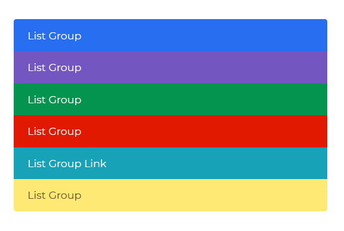

---

title: 'LIstGroup'
metaTitle: 'Bootstrap 5 ListGroup - Bootstrap CSS tutorial'
metaDescription: 'Bootstrap 5 List group is one of our interesting components that you can use in your web applications to display simple lists of elements as well as complex ones.'

---# Bootstrap 5 LIstGroup

Bootstrap 5 List group is one of our interesting components that you can use in your web applications to display simple lists of elements as well as complex ones

## List Group with Badges


###### html

```html
<ul class="list-group" style="width: 28rem">
  <li class="list-group-item">List Group</li>
  <li class="list-group-item">List Group</li>
  <li class="list-group-item">List Group</li>
  <li class="list-group-item">List Group</li>
  <li class="list-group-item">List Group</li>
</ul>
```

## List Group as Link


###### html

```html
<div class="list-group" style="width: 28rem">
  <a href="#" class="list-group-item list-group-item-action active">
    List Group
  </a>
  <a class="list-group-item list-group-item-action" href="#">
    List Group
  </a>
  <a class="list-group-item list-group-item-action" href="#">
    List Group
  </a>
  <a class="list-group-item list-group-item-action" href="#">
    List Group
  </a>
  <a class="list-group-item list-group-item-action" href="#">
    List Group
  </a>
</div>
```

## Label


###### html

```html
<div class="list-group" style="width: 28rem">
  <div class="list-group-item d-flex justify-content-between align-items-center">
    List Group
    <div class="badge bg-primary">19</div>
  </div>
  <div class="list-group-item d-flex justify-content-between align-items-center">
    List Group
    <div class="badge bg-secondary">19</div>
  </div>
  <div class="list-group-item d-flex justify-content-between align-items-center">
    List Group
    <div class="badge bg-success">19</div>
  </div>
  <div class="list-group-item d-flex justify-content-between align-items-center">
    List Group
    <div class="badge bg-danger">19</div>
  </div>
  <div class="list-group-item d-flex justify-content-between align-items-center">
    List Group
    <div class="badge bg-warning">19</div>
  </div>
  <div class="list-group-item d-flex justify-content-between align-items-center">
    List Group
    <div class="badge bg-info">19</div>
  </div>
  <div class="list-group-item d-flex justify-content-between align-items-center">
    List Group
    <div class="badge bg-dark">19</div>
  </div>
</div>
```

## Color List Group



###### html

```html
<ul class="list-group" style="width: 28rem">
  <li class="list-group-item list-group-item-primary">List Group</li>
  <li class="list-group-item list-group-item-secondary">List Group</li>
  <li class="list-group-item list-group-item-success">List Group</li>
  <li class="list-group-item list-group-item-danger">List Group</li>
  <li class="list-group-item list-group-item-warning">List Group</li>
  <li class="list-group-item list-group-item-info">List Group</li>
  <li class="list-group-item list-group-item-light">List Group</li>
  <li class="list-group-item list-group-item-dark">List Group</li>
  <li class="list-group-item">List Group</li>
</ul>
```
