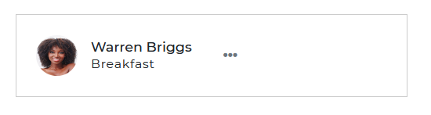

# Bootstrap Pane

The Bootstrap 5 Pane component is used to display information in the form of a card. It's commonly found in chat UIs and other similar applications.

<i/>

## Pane with Location Marker

The 'Warren Briggs' location is described in the Contrast Bootstrap 5 Pane below. To access Contrast Bootstrap's predefined pane styling, use the `pane` class, and the icon element to include icons in your pane.


###### html

```html
          <div class="pane">
            
            <div class="ml-3">
              <div class="panel-title">Warren Briggs</div>
              <p class="panel-text panel-text">Australia</p>
            </div>
            <p class="ml-auto mb-0 text-danger">
              300m <i class="fas fa-map-marker-alt"></i>
            </p>
          </div>
        </div>
```

<i/>

## Pane with Dropdown

In this section of the tutorial we use dropdowns in our pane, to understand the Contrast Bootstrap dropdowns, go
[here](https://www.devwares.com/docs/contrast/javascript/components/dropdown).



###### html

```html
         <div class="pane">
            
            <div class="ml-3">
              <div class="panel-title">Warren Briggs</div>
              <p class="panel-text panel-text">Breafast</p>
            </div>

            <div class="dropdown ml-auto">
              <button
                class="btn btn-white btn-flat dropdown-toggle dropdown-toggle-false mr-0"
                type="button"
                id="dropdownMenuButton"
                data-toggle="dropdown"
                aria-expanded="false"
              >
                <i class="fa fa-ellipsis-h" aria-hidden="true"></i>
              </button>
              <ul class="dropdown-menu" aria-labelledby="dropdownMenuButton">
                <li>
                  <a class="dropdown-item disabled" href="#">Edit Profile</a>
                </li>
                <li><a class="dropdown-divider" href="#"></a></li>
                <li><a class="dropdown-item" href="#">Action</a></li>
                <li><a class="dropdown-item" href="#">Action 2</a></li>
              </ul>
            </div>
          </div>
        </div>
```
