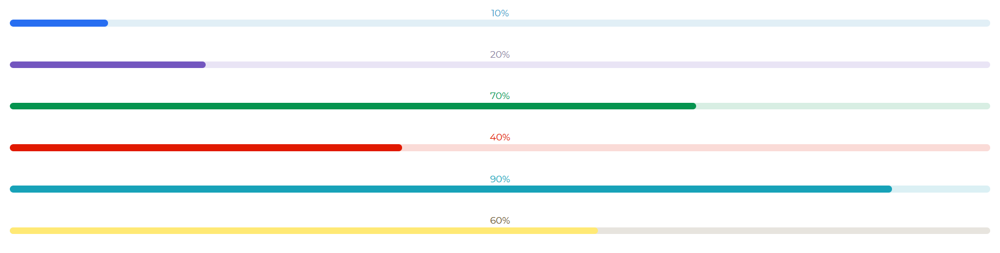

---
title: 'Progress'
metaTitle: 'Bootstrap 5 Progress - Bootstrap CSS tutorial'
metaDescription: 'Bootstrap 5 Progress bar is a component that shows the progress of a process in which the user is involved.'
---# Bootstrap 5 Progress

Bootstrap 5 Progress bar is a component that shows the progress of a process in which the user is involved. Color, shape, and animation can all be altered.

If your website takes too long to load, including a simple progress bar will make your user feel less anxious. The requested content will be available in a few seconds.”.

## Rect Progress Default

Use a `class` of `progress` to integrate Contrast Bootstrap 5 into your project. The `min` property represents the progress bar's minimum value, while the `max` property represents the progress bar's maximum value.

Use a `progress-bar` class to build the real progress bar.


###### html

```html
<div class="progress-container">
  <div class="progress-text progress-text-dark">69%</div>
  <div class="progress progress-dark" role="progress" min="0" max="100" value="69">
    <div class="progress-bar"></div>
  </div>
</div>
```

## Rect Progress Color Variants

You can customize the color of your progress bar with the Contrast Bootstrap 5 Progress. To do so, give your progress `div` a progress class and add the color code (e.g. primary, secondary, success, etc.) you desire for your progress bar to it.. For example `<div class = "progress progress-secondary"></div>`



###### html

```html
<div class="progress-container">
  <div class="progress-text progress-text-primary">20%</div>
  <div class="progress progress-primary" role="progress" min="0" max="100" value="20">
    <div class="progress-bar"></div>
  </div>
</div>

<div class="progress-container">
  <div class="progress-text progress-text-secondary">30%</div>
  <div class="progress progress-secondary" role="progress" min="0" max="100" value="30">
    <div class="progress-bar"></div>
  </div>
</div>

<div class="progress-container">
  <div class="progress-text progress-text-danger">80%</div>
  <div class="progress progress-danger" role="progress" min="0" max="100" value="80">
    <div class="progress-bar"></div>
  </div>
</div>

<div class="progress-container">
  <div class="progress-text progress-text-success">43%</div>
  <div class="progress progress-success" role="progress" min="0" max="100" value="43">
    <div class="progress-bar"></div>
  </div>
</div>

<div class="progress-container">
  <div class="progress-text progress-text-warning">72%</div>
  <div class="progress progress-warning" role="progress" min="0" max="100" value="72">
    <div class="progress-bar"></div>
  </div>
</div>

<div class="progress-container">
  <div class="progress-text progress-text-info">3%</div>
  <div class="progress progress-info" role="progress" min="0" max="100" value="3">
    <div class="progress-bar"></div>
  </div>
</div>
```

## Rect Progress bar with Height

Use the `height` property to customize your progress bar height.


###### html

```html
          <div class="progress-container">
            <div class="progress-text progress-text-dark">50%</div>
            <div
              class="progress progress-dark"
              role="progress"
              min="0"
              max="100"
              value="50"
              height="40"
            >
              <div class="progress-bar"></div>
            </div>
          </div>
          <div class="progress-container">
            <div class="progress-text progress-text-dark">90%</div>
            <div
              class="progress progress-dark"
              role="progress"
              min="0"
              max="100"
              value="90"
              height="5"
            >
              <div class="progress-bar"></div>
            </div>
          </div>
        </div>
```

###### Script

```js
    <script src="../build/cdbbootstrap.js"></script>
    <script>
      [].slice
        .call(document.querySelectorAll('[role=progress]'))
        .forEach(progress => {
          new CDB.Progress(progress);
        });
    </script>
```
