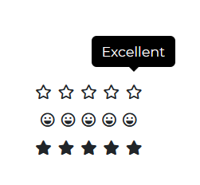

---
title: "Rating"
metaTitle: "Bootstrap 5 Rating - Bootstrap CSS tutorial"
metaDescription: "
The interactive icons in the Bootstrap 5 Rating component allow consumers to share their thoughts on your product."

---# Bootstrap 5 Rating

The interactive icons in the Bootstrap 5 Rating component allow consumers to share their thoughts on your product. This allows you to obtain input from your product's users in order to improve the product's outcome.

## Default Rating



######html

```html
<div id="rating1" class="star-rating" role="rating" data-rating="3">
  <span class="star" data-value="1">&#9733;<span class="star-notification">Abysmal</span></span>
  <span class="star" data-value="2">&#9733;<span class="star-notification">Bad</span></span>
  <span class="star" data-value="3">&#9733;<span class="star-notification">Ok</span></span>
  <span class="star" data-value="4">&#9733;<span class="star-notification">Good</span></span>
  <span class="star" data-value="5">&#9733;<span class="star-notification">Excellent</span></span>
</div>
```

```js
<script>
  const ratings = document.getElementById('rating1'); const rating1 = new CDB.Rating(ratings);
  rating1.getRating;
</script>
```
