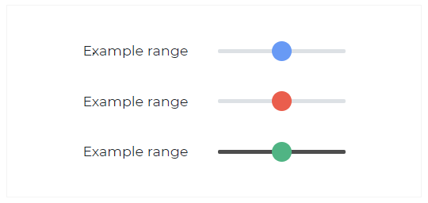

---
title: 'Slider'
metaTitle: 'Bootstrap Slider - Bootstrap CSS tutorial'
metaDescription: 'The React Bootstrap 5 Slider is an interactive component that allows users to choose a value from a range of potential values on a sliding bar.'
---# Bootstrap 5 Slider

The React Bootstrap 5 Slider is an interactive component that allows users to choose a value from a range of potential values on a sliding bar.

## Slider



```html
<label for="customRange1">Example range</label>
<input type="range" class="custom-range" id="customRange1" min="0" max="100" value="50" />

<label for="customRange2">Example range</label>
<input
  type="range"
  class="custom-range thumb-danger"
  id="customRange2"
  min="0"
  max="100"
  value="50"
/>

<label for="customRange3">Example range</label>
<input
  type="range"
  class="custom-range thumb-success bg-dark"
  id="customRange3"
  min="0"
  max="100"
  value="50"
/>
```
