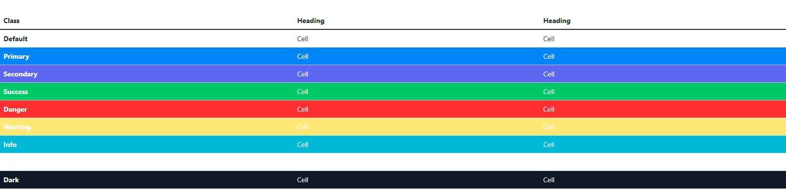
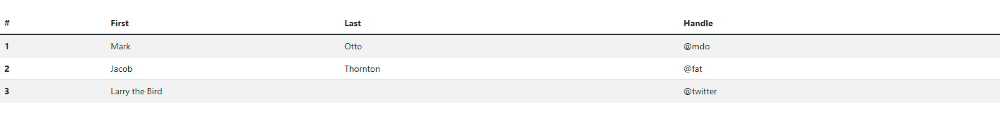
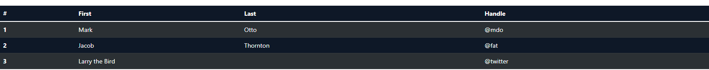

---
title: 'Table'
metaTitle: ' Bootstrap 5 Tables - Bootstrap CSS tutorial'
metaDescription: 'Bootstrap 5 Tables are component with basic tables features.'
---# Bootstrap 5 Table

Bootstrap 5 Tables are a component that includes basic table functionality. They enable you to compile large amounts of data and show it in a logical and ordered manner.

Additional advantages of Bootstrap tables include responsiveness and the ability to customize table styles. Add buttons, checkboxes, panels, and a variety of other items to your tables to make them more appealing. You can also use advanced data table features such as sorting, searching, and pagination..

## Default Table


###### html

```html
<table CdbTable>
  <thead>
    <tr>
      <th *ngFor="let head of headElements" scope="col">{{head}}</th>
    </tr>
  </thead>
  <tbody>
    <tr mdbTableCol *ngFor="let el of elements">
      <th scope="row">{{el.id}}</th>
      <td>{{el.first}}</td>
      <td>{{el.last}}</td>
      <td>{{el.handle}}</td>
    </tr>
  </tbody>
</table>
```

## Variants


###### html

```html
<table class="table">
  <thead>
    <tr>
      <th scope="col">Class</th>
      <th scope="col">Heading</th>
      <th scope="col">Heading</th>
    </tr>
  </thead>
  <tbody>
    <tr>
      <th scope="row">Default</th>
      <td>Cell</td>
      <td>Cell</td>
    </tr>

    <tr class="table-primary">
      <th scope="row">Primary</th>
      <td>Cell</td>
      <td>Cell</td>
    </tr>
    <tr class="table-secondary">
      <th scope="row">Secondary</th>
      <td>Cell</td>
      <td>Cell</td>
    </tr>
    <tr class="table-success">
      <th scope="row">Success</th>
      <td>Cell</td>
      <td>Cell</td>
    </tr>
    <tr class="table-danger">
      <th scope="row">Danger</th>
      <td>Cell</td>
      <td>Cell</td>
    </tr>
    <tr class="table-warning">
      <th scope="row">Warning</th>
      <td>Cell</td>
      <td>Cell</td>
    </tr>
    <tr class="table-info">
      <th scope="row">Info</th>
      <td>Cell</td>
      <td>Cell</td>
    </tr>
    <tr class="table-light">
      <th scope="row">Light</th>
      <td>Cell</td>
      <td>Cell</td>
    </tr>
    <tr class="table-dark">
      <th scope="row">Dark</th>
      <td>Cell</td>
      <td>Cell</td>
    </tr>
  </tbody>
</table>
```

## Striped Table

To make your table stripes, use the `table-striped` class.



###### html

```html
<table class="table table-striped">
  <thead>
    <tr>
      <th scope="col">#</th>
      <th scope="col">First</th>
      <th scope="col">Last</th>
      <th scope="col">Handle</th>
    </tr>
  </thead>
  <tbody>
    <tr>
      <th scope="row">1</th>
      <td>Mark</td>
      <td>Otto</td>
      <td>@mdo</td>
    </tr>
    <tr>
      <th scope="row">2</th>
      <td>Jacob</td>
      <td>Thornton</td>
      <td>@fat</td>
    </tr>
    <tr>
      <th scope="row">3</th>
      <td colspan="2">Larry the Bird</td>
      <td>@twitter</td>
    </tr>
  </tbody>
</table>
```

## Dark tables



###### html

```html
<table class="table table-dark table-striped">
  <thead>
    <tr>
      <th scope="col">#</th>
      <th scope="col">First</th>
      <th scope="col">Last</th>
      <th scope="col">Handle</th>
    </tr>
  </thead>
  <tbody>
    <tr>
      <th scope="row">1</th>
      <td>Mark</td>
      <td>Otto</td>
      <td>@mdo</td>
    </tr>
    <tr>
      <th scope="row">2</th>
      <td>Jacob</td>
      <td>Thornton</td>
      <td>@fat</td>
    </tr>
    <tr>
      <th scope="row">3</th>
      <td colspan="2">Larry the Bird</td>
      <td>@twitter</td>
    </tr>
  </tbody>
</table>
```

## Hoverable Rows



###### html

```html
<table class="table table-hover">
  <thead>
    <tr>
      <th scope="col">#</th>
      <th scope="col">First</th>
      <th scope="col">Last</th>
      <th scope="col">Handle</th>
    </tr>
  </thead>
  <tbody>
    <tr>
      <th scope="row">1</th>
      <td>Mark</td>
      <td>Otto</td>
      <td>@mdo</td>
    </tr>
    <tr>
      <th scope="row">2</th>
      <td>Jacob</td>
      <td>Thornton</td>
      <td>@fat</td>
    </tr>
    <tr>
      <th scope="row">3</th>
      <td colspan="2">Larry the Bird</td>
      <td>@twitter</td>
    </tr>
  </tbody>
</table>
```
