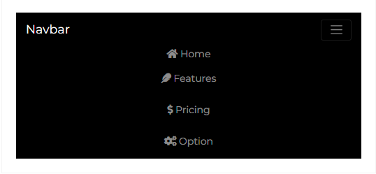

---

title: 'Navbar'
metaTitle: 'Bootstrap 5 Navbar'
metaDescription: 'The Bootstrap 5 Navbar is a horizontal navigation component that can contain icons, dropdowns, avatars, and search forms in addition to typical text links.'
githubUrl: "https://github.com/Devwares-Team/DOCS-Contrast/blob/master/content/contrast/javascript/navigation/navbar.md"
---
# Bootstrap 5 Navbar

The Bootstrap 5 Navbar is a horizontal navigation component that can contain icons, dropdowns, avatars, and search forms in addition to typical text links.

Contrast Design Bootstrap offers attractive Navbars with Material Design elements (such as shadows, living colors or charming wave effects triggered by clicking on the link). Aside from typical text links, the Bootstraps 5 Navbar can include regular and social icons, dropdowns, avatars, and search forms.

## Default Navbar

<Navbar1/>

```html
<header>
  <nav class="navbar navbar-expand-md navbar-dark bg-dark">
    <a class="navbar-brand" href="#">Navbar</a>
    <button
      class="navbar-toggler"
      type="button"
      data-toggle="collapse"
      data-target="#navbarSupportedContent"
      aria-controls="navbarSupportedContent"
      aria-expanded="false"
      aria-label="Toggle navigation"
    >
      <span class="navbar-toggler-icon"></span>
    </button>

    <div class="collapse navbar-collapse " id="navbarSupportedContent">
      <ul class="navbar-nav">
        <li class="nav-item active">
          <a class="nav-link" href="#">
            <i class="fa fa-home"></i>
            Home
          </a>
        </li>
        <li class="nav-item">
          <a class="nav-link" href="#">
            <i class="fas fa-feather"></i>
            Features
          </a>
        </li>
        <li class="nav-item dropdown">
          <a class="nav-link" href="#">
            <i class="fa fa-dollar"></i>
            Pricing
          </a>
        </li>
        <li class="nav-item">
          <a class="nav-link" href="#">
            <i class="fa fa-cogs"></i>
            Option
          </a>
        </li>
      </ul>
    </div>
  </nav>
</header>
```

## Example 2

<Navbar2/>

```html
<header>
  <nav class="navbar navbar-expand-md navbar-dark bg-dark">
    <a class="navbar-brand" href="#">Navbar</a>
    <button
      class="navbar-toggler"
      type="button"
      data-toggle="collapse"
      data-target="#navbarSupportedContent"
      aria-controls="navbarSupportedContent"
      aria-expanded="false"
      aria-label="Toggle navigation"
    >
      <span class="navbar-toggler-icon"></span>
    </button>

    <div class="collapse navbar-collapse " id="navbarSupportedContent">
      <ul class="navbar-nav mr-auto">
        <li class="nav-item">
          <a class="nav-link" href="#">
            <i class="fas fa-feather"></i>
            About
          </a>
        </li>
        <li class="nav-item dropdown">
          <a class="nav-link" href="#">
            <i class="fa fa-dollar"></i>
            Pricing
          </a>
        </li>
      </ul>

      <ul class="navbar-nav">
        <li class="nav-item">
          <a class="nav-link" href="#">
            <i class="fa fa-globe"></i>
            EN
          </a>
        </li>
        <li class="nav-item dropdown">
          <a class="nav-link" href="#">
            <i class="fa fa-user"></i>
            Login
          </a>
        </li>
        <li class="nav-item">
          <button class="btn bg-white nav-link text-dark">
            Sign Up
          </button>
        </li>
      </ul>
    </div>
  </nav>
</header>
```
## Mobile View
The Bootstrap 5 Navbar is a responsive component, it shows and hide navbar contents by its parent breakpoint. It uses a toggle element to set the display of its content.


#### Mobile View - Collapsed

