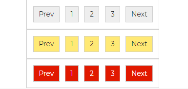
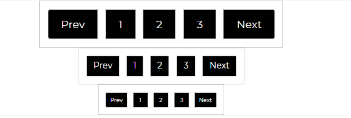

---
title: 'Pagination'
metaTitle: 'Bootstrap 5 Pagination'
metaDescription: 'Bootstrap 5 Pagination is a component that indicates the presence of a succession of linked content over numerous pages and allows navigation between them.'
---# Bootstrap 5 Pagination

Bootstrap 5 Pagination is a component that indicates the presence of a succession of linked content over numerous pages and allows navigation between them.

For pagination, we use a huge block of connected links, which makes connections easy to spot and scalable—all while delivering large hit zones. List HTML elements are used in pagination so that screen readers may announce the number of available links. We utilize a wrapping `<nav>` element to signal to screen readers and other assistive technology that this is a navigation section.

## Default Pagination


###### html

```html
<nav aria-label="Page navigation example">
  <ul class="pagination">
    <li class="page-item">
      <a class="page-link" href="#">Prev</a>
    </li>
    <li class="page-item">
      <a class="page-link" href="#">1</a>
    </li>
    <li class="page-item">
      <a class="page-link" href="#">2</a>
    </li>
    <li class="page-item">
      <a class="page-link" href="#">3</a>
    </li>
    <li class="page-item"><a class="page-link" href="#">Next</a></li>
  </ul>
</nav>
```

## Rounded Pagination

To make your pagination links more rounded, use the `page-link-round` property.


###### html

```html
<nav aria-label="Page navigation example">
  <ul class="pagination pagination-dark">
    <li class="page-item">
      <a class="page-link page-link-round" href="#">Prev</a>
    </li>
    <li class="page-item">
      <a class="page-link page-link-round" href="#">1</a>
    </li>
    <li class="page-item">
      <a class="page-link page-link-round" href="#">2</a>
    </li>
    <li class="page-item">
      <a class="page-link page-link-round" href="#">3</a>
    </li>
    <li class="page-item">
      <a class="page-link page-link-round" href="#">Next</a>
    </li>
  </ul>
</nav>
```

## Different Pagination Styling



###### html

```html
            <ul class="pagination">
              <li class="page-item">
                <a class="page-link text-dark bg-light" href="#">Prev</a>
              </li>
              <li class="page-item"
                <a class="page-link text-dark bg-light" href="#">1</a>\
              </li>
              <li class="page-item">
                <a class="page-link text-dark bg-light" href="#">2</a>
              </li>
              <li class="page-item">
                <a class="page-link text-dark bg-light" href="#">3</a>
              </li>
              <li class="page-item">
                <a class="page-link text-dark bg-light" href="#">Next</a>
              </li>
            </ul>
          </nav>

          <nav aria-label="Page navigation example">
            <ul class="pagination">
              <li class="page-item">
                <a class="page-link text-dark bg-warning" href="#">Prev</a>
              </li>
              <li class="page-item">
                <a class="page-link text-dark bg-warning" href="#">1</a>
              </li>
              <li class="page-item">
                <a class="page-link text-dark bg-warning" href="#">2</a>
              </li>
              <li class="page-item">
                <a class="page-link text-dark bg-warning" href="#">3</a>
              </li>
              <li class="page-item">
                <a class="page-link text-dark bg-warning" href="#">Next</a>
              </li>
            </ul>
          </nav>

          <nav aria-label="Page navigation example">
            <ul class="pagination">
              <li class="page-item">
                <a class="page-link text-white bg-danger" href="#">Prev</a>
              </li>
              <li class="page-item">
                <a class="page-link text-white bg-danger" href="#">1</a>
              </li>
              <li class="page-item">
                <a class="page-link text-white bg-danger" href="#">2</a>
              </li>
              <li class="page-item">
                <a class="page-link text-white bg-danger" href="#">3</a>
              </li>
              <li class="page-item">
                <a class="page-link text-white bg-danger" href="#">Next</a>
              </li>
            </ul>
          </nav>
```

## Different Sizes

With the Contrast Bootstrap Pagination we can define how little or large you want your pagination to be. Use `pagination-lg` to have a much larger pagination, and `pagination-sm` to have a smaller sized pagination. The default size is medium.



###### html

```html
<nav aria-label="Page navigation example">
  <ul class="pagination pagination-lg">
    <li class="page-item">
      <a class="page-link" href="#">Prev</a>
    </li>
    <li class="page-item">
      <a class="page-link" href="#">1</a>
    </li>
    <li class="page-item">
      <a class="page-link" href="#">2</a>
    </li>
    <li class="page-item">
      <a class="page-link" href="#">3</a>
    </li>
    <li class="page-item"><a class="page-link" href="#">Next</a></li>
  </ul>
</nav>

<nav aria-label="Page navigation example">
  <ul class="pagination">
    <li class="page-item">
      <a class="page-link" href="#">Prev</a>
    </li>
    <li class="page-item">
      <a class="page-link" href="#">1</a>
    </li>
    <li class="page-item">
      <a class="page-link" href="#">2</a>
    </li>
    <li class="page-item">
      <a class="page-link" href="#">3</a>
    </li>
    <li class="page-item"><a class="page-link" href="#">Next</a></li>
  </ul>
</nav>

<nav aria-label="Page navigation example">
  <ul class="pagination pagination-sm">
    <li class="page-item">
      <a class="page-link" href="#">Prev</a>
    </li>
    <li class="page-item">
      <a class="page-link" href="#">1</a>
    </li>
    <li class="page-item">
      <a class="page-link" href="#">2</a>
    </li>
    <li class="page-item">
      <a class="page-link" href="#">3</a>
    </li>
    <li class="page-item"><a class="page-link" href="#">Next</a></li>
  </ul>
</nav>
```
