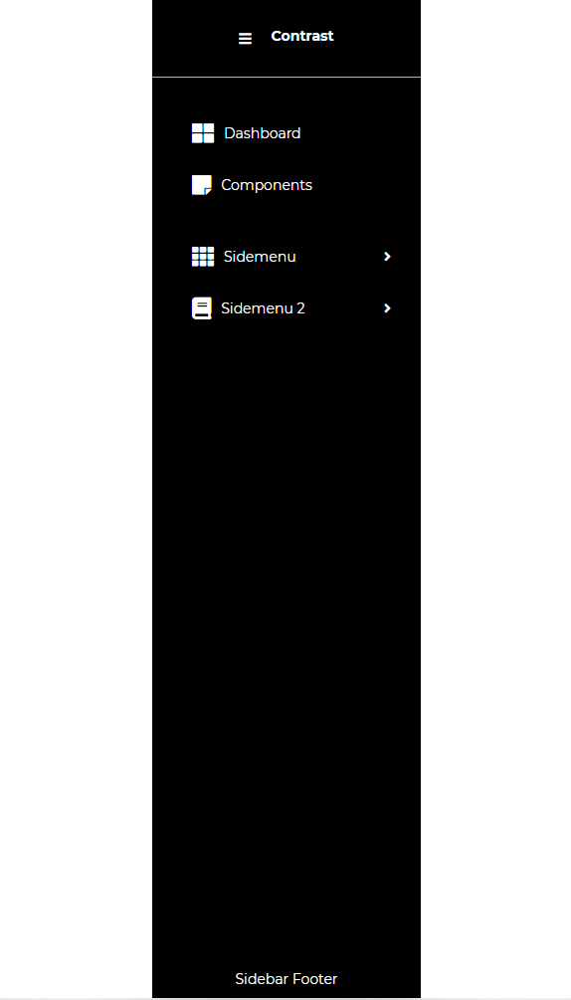
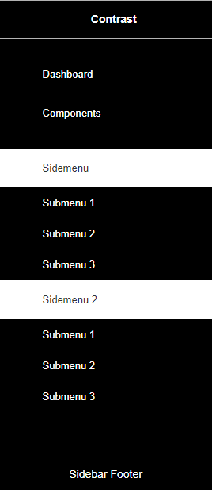

---

title: 'Sidebar'
metaTitle: 'Bootstrap 5 Sidebar'
metaDescription: 'The Bootstrap 5 Sidebar is a vertical navigation component that can include icons, dropdowns, avatars, and search forms in addition to typical text links.'
githubUrl: "https://github.com/Devwares-Team/DOCS-Contrast/blob/master/content/contrast/javascript/navigation/sidebar.md"
---import React from 'react';
import { Link } from 'gatsby';

# Bootstrap 5 Sidebar

The Bootstrap 5 Sidebar is a vertical navigation component that is fully customized to contain icons, dropdown, avatars and call to action buttons in addition to typical text links.

It significantly improves user experience due to its clarity and simplicity. It allows you to quickly move through little apps as well as large platforms. The ability to incorporate multiple links allows you to perform more extensive content classification, which is almost necessary in larger applications.

Thanks to CDB, you can quickly implement Sidebar in your projects using different, alluring Side Menus.

You can quickly add Sidebar in your own projects with Contrast Design Bootstrap by utilizing one of the many attractive Side Menus.

Let's go through the various examples and implementation of the sidebar.

## Default Sidebar

<bootstrapSidebarExample1 />

<!--  -->

```html link=github.com/Devwares-Team/Contrast-Docs/blob/master/content/contrast/javascript/navigation/sidebar.md
<div class="sidebar" role="cdb-sidebar">
  <div class="sidebar-container">
    <div class="sidebar-header">
      <a class="sidebar-brand">Contrast</a>
      <a class="sidebar-toggler"><i class="fa fa-bars"></i></a>
    </div>
    <div class="sidebar-nav">
      <div class="sidenav">
        <a class="sidebar-item">
          <div class="sidebar-item-content">
            <i class="fa fa-th-large sidebar-icon sidebar-icon-lg"></i>
            <span>Dashboard</span>
            <div class="suffix">
              <div class="badge rounded-pill bg-danger">new</div>
            </div>
          </div>
        </a>
        <a class="sidebar-item">
          <div class="sidebar-item-content">
            <i class="fa fa-sticky-note sidebar-icon"></i>
            <span>Components</span>
          </div>
        </a>
        <a class="sidebar-item">
          <div class="sidebar-item-content">
            <i class="fa fa-sticky-note sidebar-icon"></i>
            <span>Bootstrap</span>
          </div>
        </a>
      </div>
      <div class="sidebar-footer">Sidebar Footer</div>
    </div>
  </div>
</div>
```

## Light Sidebar

With the `color` html attribute we can customize the theme of our sidebar. Currently we have support for only gray and dark themes.

<bootstrapSidebarExample2 />

<!--  -->

```html link=github.com/Devwares-Team/Contrast-Docs/blob/master/content/contrast/javascript/navigation/sidebar.md
<div class="sidebar" role="cdb-sidebar" color="white">
  <div class="sidebar-container">
    <div class="sidebar-header">
      <a class="sidebar-brand">Contrast Light</a>
      <a class="sidebar-toggler"><i class="fa fa-bars"></i></a>
    </div>
    <div class="sidebar-nav">
      <div class="sidenav">
        <a class="sidebar-item">
          <div class="sidebar-item-content">
            <i class="fa fa-th-large sidebar-icon sidebar-icon-lg"></i>
            <span>Dashboard</span>
            <div class="suffix">
              <div class="badge rounded-pill bg-danger">new</div>
            </div>
          </div>
        </a>
        <a class="sidebar-item">
          <div class="sidebar-item-content">
            <i class="fa fa-sticky-note sidebar-icon"></i>
            <span>Components</span>
          </div>
        </a>
        <a class="sidebar-item">
          <div class="sidebar-item-content">
            <i class="fa fa-sticky-note sidebar-icon"></i>
            <span>Bootstrap</span>
          </div>
        </a>
      </div>
      <div class="sidebar-footer">Sidebar Footer</div>
    </div>
  </div>
</div>
```

## Submenu Sidebar



You can customize sub-levels for you sidebar with contrast bootstrap sidebar. We currently only support one level deep customization.

<bootstrapSidebarExample3 />

```html link=github.com/Devwares-Team/Contrast-Docs/blob/master/content/contrast/javascript/navigation/sidebar.md
<div class="sidebar" role="cdb-sidebar" color="white">
  <div class="sidebar-container">
    <div class="sidebar-header">
      <a class="sidebar-brand">Multi Level</a>
      <a class="sidebar-toggler"><i class="fa fa-bars"></i></a>
    </div>
    <div class="sidebar-nav">
      <div class="sidenav">
        <a class="sidebar-item">
          <div class="sidebar-item-content">
            <i class="fa fa-th-large sidebar-icon sidebar-icon-lg"></i>
            <span>Dashboard</span>
          </div>
        </a>
        <a class="sidebar-item">
          <div class="sidebar-item-content">
            <i class="fa fa-sticky-note sidebar-icon"></i>
            <span>Components</span>
          </div>
        </a>
      </div>
      <div class="sidebar-footer">
        Sidebar Footer
      </div>
    </div>
  </div>
</div>
```

## Sidebar With CTA

You can add a CTA component to your sidebar

<bootstrapSidebarExample4 />

```html link=github.com/Devwares-Team/Contrast-Docs/blob/master/content/contrast/javascript/navigation/sidebar.md

<div class="sidebar" role="cdb-sidebar" color="white">
  <div class="sidebar-container">
    <div class="sidebar-header">
      <a class="sidebar-brand">With CTA</a>
      <a class="sidebar-toggler"><i class="fa fa-bars"></i></a>
    </div>
    <div class="sidebar-nav">
      <div class="sidenav">
        <a class="sidebar-item">
          <div class="sidebar-item-content">
            <i class="fa fa-th-large sidebar-icon sidebar-icon-lg"></i>
            <span>Dashboard</span>
          </div>
        </a>
        <a class="sidebar-item">
          <div class="sidebar-item-content">
            <i class="fa fa-sticky-note sidebar-icon"></i>
            <span>Components</span>
          </div>
        </a>
        <a class="sidebar-item">
          <div class="sidebar-item-content">
            <i class="fa fa-bold sidebar-icon"></i>
            <span>Bootstrap</span>
          </div>
        </a>
      </div>
      <div class="sidebar-cta sidebar-cta-dark">
        <div class="cta-text">
          This sidebar contains a CTA component. You can add anything you
          want here.
        </div>
      </div>
      <div class="sidebar-footer">
        Sidebar Footer
      </div>
    </div>
  </div>
</div>

```

### Script

We add dynamicity and interactivity to our sidebar with JavaScript, we use `querySelector` to select an element. We then create a new sidebar object using the `new` keyword from CDB, passing it the element we just targeted as an argument.


Each sidebar instance can be created with the following javascript code snippet. This gives you access to the event handlers and listeners available for the sidebar.

```html
<script src="/build/constrast-bootstrap-pro/js/cdb.js"></script>
<script>
  const sidebar = document.querySelector('.sidebar');
  new CDB.Sidebar(sidebar);
</script>
```


## Classes and Events Reference: Contrast Bootstrap Sidebar

This section will build on your information about the classes and events that makes Contrast Bootstrap sidebar tick. You will find out what they do, their default values, and how you would use them in your code.

The table below lists css classes options for `Contrast Bootstrap Sidebar`

| Name                |                                             Description                                              |
| :------------------ | :--------------------------------------------------------------------------------------------------: |
| `sidebar`           |                                    Defines styles for the sidebar                                    |
| `sidebar-container` |                       Defines styles for the container of the sidebar content                        |
| `sidebar-header`    |                                Defines styles for the sidebar header                                 |
| `sidebar-toggler`   |                                Defines styles for the sidebar toggler                                |
| `sidebar-brand`     |                             Defines styles for the sideba brand or text                              |
| `sidebar-nav`       | Defines styles for the sidebar navigation. The sidebar navigation is the container for all the links |
| `sidebar-item`      |                           Defines styles for all the links in the sidebar                            |
| `sidebar-dropdown`  |                               Defines styles for the sidebar dropdown                                |
| `sidebar-icon`      |                                 Defines styles for the sidebar icons                                 |
| `sidebar-submenu`   |                          Defines sidebar for the sidebar submenu container                           |
