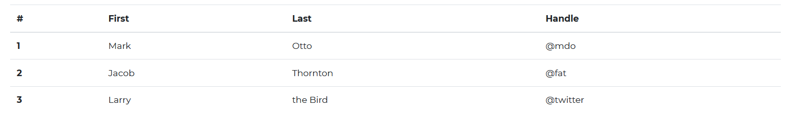
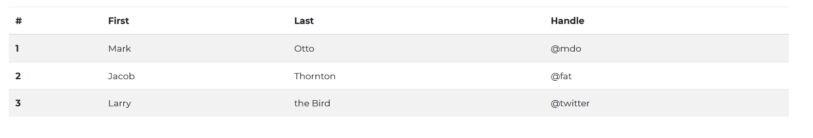
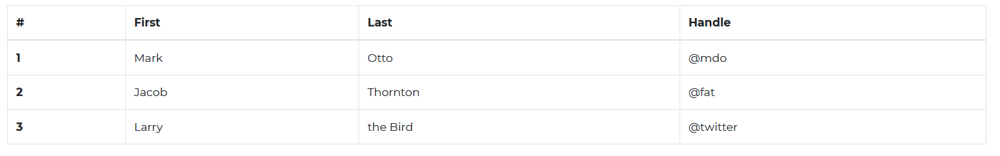
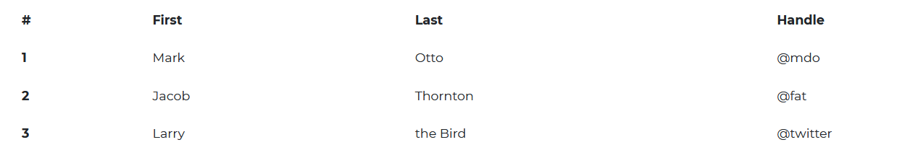
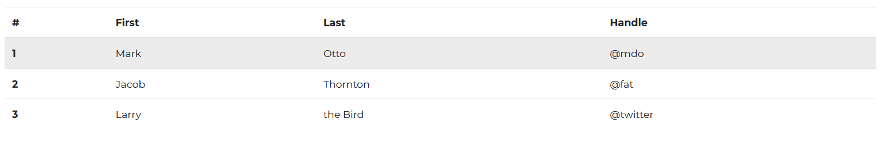
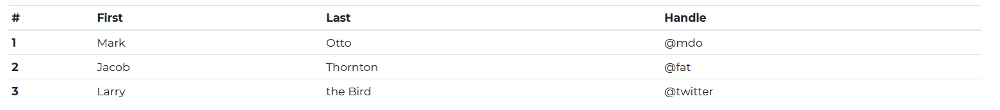
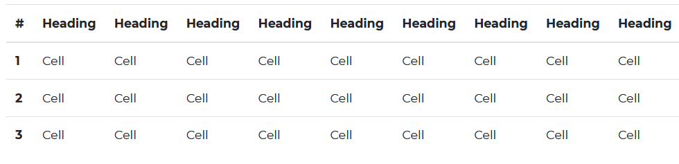

---
title: 'Table'
metaTitle: 'Bootstrap 5 Fixed DataTables - Bootstrap CSS tutorial'
metaDescription: 'Bootstrap 5 Tables are component with basic tables features.'
---# Bootstrap 5 Table

Bootstrap 5 Tables are a component that includes basic table functionality. They enable you to compile large amounts of data and show it in a logical and ordered manner.

Additional advantages of Bootstrap tables include responsiveness and the ability to customize table styles. Add buttons, checkboxes, panels, and a variety of other items to your tables to make them more appealing. You can also use advanced data table features such as sorting, searching, and pagination.

## Default Table



###### Html

```html
<div class="container">
  <table class="table">
    <thead>
      <tr>
        <th scope="col">#</th>
        <th scope="col">First</th>
        <th scope="col">Last</th>
        <th scope="col">Handle</th>
      </tr>
    </thead>
    <tbody>
      <tr>
        <th scope="row">1</th>
        <td>Mark</td>
        <td>Otto</td>
        <td>@mdo</td>
      </tr>
      <tr>
        <th scope="row">2</th>
        <td>Jacob</td>
        <td>Thornton</td>
        <td>@fat</td>
      </tr>
      <tr>
        <th scope="row">3</th>
        <td>Larry</td>
        <td>the Bird</td>
        <td>@twitter</td>
      </tr>
    </tbody>
  </table>
</div>
```

## Table Head Options


###### Html

```html
<div class="container">
  <table class="table">
    <thead class="thead-dark">
      <tr>
        <th scope="col">#</th>
        <th scope="col">First</th>
        <th scope="col">Last</th>
        <th scope="col">Handle</th>
      </tr>
    </thead>
    <tbody>
      <tr>
        <th scope="row">1</th>
        <td>Mark</td>
        <td>Otto</td>
        <td>@mdo</td>
      </tr>
      <tr>
        <th scope="row">2</th>
        <td>Jacob</td>
        <td>Thornton</td>
        <td>@fat</td>
      </tr>
      <tr>
        <th scope="row">3</th>
        <td>Larry</td>
        <td>the Bird</td>
        <td>@twitter</td>
      </tr>
    </tbody>
  </table>
  <table class="table">
    <thead class="thead-light">
      <tr>
        <th scope="col">#</th>
        <th scope="col">First</th>
        <th scope="col">Last</th>
        <th scope="col">Handle</th>
      </tr>
    </thead>
    <tbody>
      <tr>
        <th scope="row">1</th>
        <td>Mark</td>
        <td>Otto</td>
        <td>@mdo</td>
      </tr>
      <tr>
        <th scope="row">2</th>
        <td>Jacob</td>
        <td>Thornton</td>
        <td>@fat</td>
      </tr>
      <tr>
        <th scope="row">3</th>
        <td>Larry</td>
        <td>the Bird</td>
        <td>@twitter</td>
      </tr>
    </tbody>
  </table>
</div>
```

## Striped Table



###### Html

```html
<div class="container">
  <table class="table table-striped">
    <thead>
      <tr>
        <th scope="col">#</th>
        <th scope="col">First</th>
        <th scope="col">Last</th>
        <th scope="col">Handle</th>
      </tr>
    </thead>
    <tbody>
      <tr>
        <th scope="row">1</th>
        <td>Mark</td>
        <td>Otto</td>
        <td>@mdo</td>
      </tr>
      <tr>
        <th scope="row">2</th>
        <td>Jacob</td>
        <td>Thornton</td>
        <td>@fat</td>
      </tr>
      <tr>
        <th scope="row">3</th>
        <td>Larry</td>
        <td>the Bird</td>
        <td>@twitter</td>
      </tr>
    </tbody>
  </table>
</div>
```

## Bordered Table



###### Html

```html
<div class="container">
  <table class="table">
    <thead>
      <tr>
        <th scope="col">#</th>
        <th scope="col">First</th>
        <th scope="col">Last</th>
        <th scope="col">Handle</th>
      </tr>
    </thead>
    <tbody>
      <tr>
        <th scope="row">1</th>
        <td>Mark</td>
        <td>Otto</td>
        <td>@mdo</td>
      </tr>
      <tr>
        <th scope="row">2</th>
        <td>Jacob</td>
        <td>Thornton</td>
        <td>@fat</td>
      </tr>
      <tr>
        <th scope="row">3</th>
        <td>Larry</td>
        <td>the Bird</td>
        <td>@twitter</td>
      </tr>
    </tbody>
  </table>
</div>
```

## Borderless Table



###### Html

```html
<div class="container">
  <table class="table table-borderless">
    <thead>
      <tr>
        <th scope="col">#</th>
        <th scope="col">First</th>
        <th scope="col">Last</th>
        <th scope="col">Handle</th>
      </tr>
    </thead>
    <tbody>
      <tr>
        <th scope="row">1</th>
        <td>Mark</td>
        <td>Otto</td>
        <td>@mdo</td>
      </tr>
      <tr>
        <th scope="row">2</th>
        <td>Jacob</td>
        <td>Thornton</td>
        <td>@fat</td>
      </tr>
      <tr>
        <th scope="row">3</th>
        <td>Larry</td>
        <td>the Bird</td>
        <td>@twitter</td>
      </tr>
    </tbody>
  </table>
</div>
```

## Hoverable Rows



###### Html

```html
<div class="container">
  <table class="table table-hover">
    <thead>
      <tr>
        <th scope="col">#</th>
        <th scope="col">First</th>
        <th scope="col">Last</th>
        <th scope="col">Handle</th>
      </tr>
    </thead>
    <tbody>
      <tr>
        <th scope="row">1</th>
        <td>Mark</td>
        <td>Otto</td>
        <td>@mdo</td>
      </tr>
      <tr>
        <th scope="row">2</th>
        <td>Jacob</td>
        <td>Thornton</td>
        <td>@fat</td>
      </tr>
      <tr>
        <th scope="row">3</th>
        <td>Larry</td>
        <td>the Bird</td>
        <td>@twitter</td>
      </tr>
    </tbody>
  </table>
</div>
```

## Small Table



###### Html

```html
<div class="container">
  <table class="table table-sm">
    <thead>
      <tr>
        <th scope="col">#</th>
        <th scope="col">First</th>
        <th scope="col">Last</th>
        <th scope="col">Handle</th>
      </tr>
    </thead>
    <tbody>
      <tr>
        <th scope="row">1</th>
        <td>Mark</td>
        <td>Otto</td>
        <td>@mdo</td>
      </tr>
      <tr>
        <th scope="row">2</th>
        <td>Jacob</td>
        <td>Thornton</td>
        <td>@fat</td>
      </tr>
      <tr>
        <th scope="row">3</th>
        <td>Larry</td>
        <td>the Bird</td>
        <td>@twitter</td>
      </tr>
    </tbody>
  </table>
</div>
```

## Captions


###### Html

```html
<div class="container">
  <table class="table">
    <caption>
      List of users
    </caption>
    <thead>
      <tr>
        <th scope="col">#</th>
        <th scope="col">First</th>
        <th scope="col">Last</th>
        <th scope="col">Handle</th>
      </tr>
    </thead>
    <tbody>
      <tr>
        <th scope="row">1</th>
        <td>Mark</td>
        <td>Otto</td>
        <td>@mdo</td>
      </tr>
      <tr>
        <th scope="row">2</th>
        <td>Jacob</td>
        <td>Thornton</td>
        <td>@fat</td>
      </tr>
      <tr>
        <th scope="row">3</th>
        <td>Larry</td>
        <td>the Bird</td>
        <td>@twitter</td>
      </tr>
    </tbody>
  </table>
</div>
```

## Responsive Tables



###### Html

```html
<div class="container">
  <div style="width:500px;" class="table-responsive">
    <table class="table">
      <thead>
        <tr>
          <th scope="col">#</th>
          <th scope="col">First</th>
          <th scope="col">Second</th>
          <th scope="col">Third</th>
          <th scope="col">Fourth</th>
          <th scope="col">Fifth</th>
          <th scope="col">Sixth</th>
          <th scope="col">Seventh</th>
          <th scope="col">Last</th>
          <th scope="col">Handle</th>
        </tr>
      </thead>
      <tbody>
        <tr>
          <th scope="row">1</th>
          <td>Name</td>
          <td>Name</td>
          <td>Name</td>
          <td>Name</td>
          <td>Name</td>
          <td>Name</td>
          <td>Name</td>
          <td>Name</td>
          <td>@email</td>
        </tr>
        <tr>
          <th scope="row">2</th>
          <td>Name</td>
          <td>Name</td>
          <td>Name</td>
          <td>Name</td>
          <td>Name</td>
          <td>Name</td>
          <td>Name</td>
          <td>Name</td>
          <td>@email</td>
        </tr>
        <tr>
          <th scope="row">3</th>
          <td>Name</td>
          <td>Name</td>
          <td>Name</td>
          <td>Name</td>
          <td>Name</td>
          <td>Name</td>
          <td>Name</td>
          <td>Name</td>
          <td>@email</td>
        </tr>
      </tbody>
    </table>
  </div>
</div>
```
