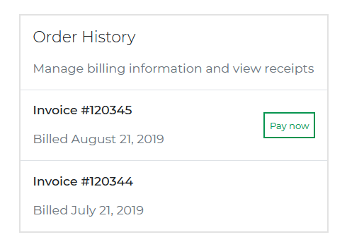
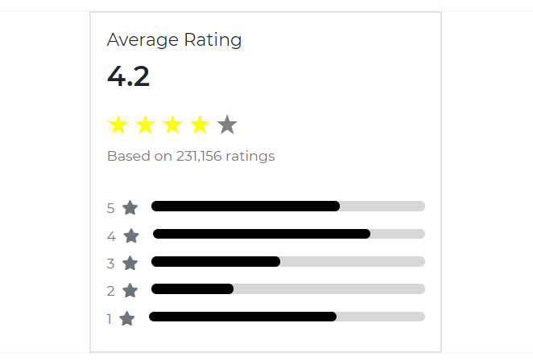

Bootstrap 5 Widgets are stand-alone third-party components that can be used within a webpage's body tag.

The direct contact widget, like the one on our website, is an example of a widget that allows users to contact you easily.

To make our widgets, we use the CDBootstrap Card component. Check out our [documentation](https://www.devwares.com/docs/contrast/javascript/components/card) to learn more about the contrast design bootstrap card and how to utilize it in your project.
<br/><br/>
<i/>

## Blog Card


###### Html

```html
<div class="card" style="width: 25rem">
  <div class="card-body p-1">
    <div class="pane border-bottom p-3">
      
      <p class="card-text m-0 ml-3">techlead</p>
      <div class="dropdown ml-auto">
        <button
          class="btn btn-white btn-flat mr-0"
          type="button"
          id="dropdownMenuButton"
          data-toggle="dropdown"
          aria-expanded="false"
        >
          <i class="text-dark fa fa-ellipsis-h"></i>
        </button>
        <ul class="dropdown-menu" aria-labelledby="dropdownMenuButton">
          <li>
            <span class="dropdown-item disabled" href="#">Edit Profile</span>
          </li>
          <li><span class="dropdown-item divider" href="#"></span></li>
          <li><span class="dropdown-item" href="#">Action 1</span></li>
          <li><span class="dropdown-item" href="#">Action 2</span></li>
        </ul>
      </div>
    </div>
    
    <div class="mx-2 mb-4">
      <h2 class="card-title">A Dummy blog title sample</h2>
      <p class="card-text text-muted mb-5">
        Lorem ipsum dolor sit amet, consectetur adipisicing elit, sed do eiusmod tempor incididunt
        ut labore et dolore magna aliqua. Ut enim ad minim veniam, quis nostrud exercitation ullamco
        laboris nisi ut aliquip ex ea commodo
      </p>
      <div>
        <button class="btn btn-dark py-1 px-2"><i class="fa fa-arrow-up pl-0"></i> 11</button>
        <button class="btn btn-dark py-1 px-2">
          <i class="fa fa-arrow-down pl-0"></i>
          2
        </button>
      </div>
      <div class="my-2">
        <button flat class="p-0 btn btn-flat">
          <i class="fa fa-comments"></i>
          21.4k
        </button>
        <button class="p-0 btn btn-flat">
          <i class="fa fa-share"></i>
          Share
        </button>
        <button class="btn btn-warning text-dark py-1">
          <i class="fa fa-save"></i>
          Save
        </button>
      </div>
    </div>
  </div>
</div>
```
<br/><br/>
<i/>

## Widget Card


###### Html

```html
<div class="card" style="width: 25rem">
  <div class="card-body">
    <div class="lead">Total Downloads</div>
    <h2 class="card-title">1,057,891</h2>
    <p class="small text-muted">Oct 1 - Dec 31,<i class="fa fa-globe"></i> Worldwide</p>
  </div>
</div>
```
<br/><br/>
<i/>

## Counter Card


###### Html

```html
<div class="card" style="width: 25rem">
  <div class="card-body">
    <i class="fas fa-line-chart fa-2x p-4 bg-primary"></i>
    <div class="mt-2 lead">Customers</div>
    <h2 class="card-title" style="font-size:1.8em;">852k</h2>
    <p class="small text-muted">Oct 1 - Dec 31,<i class="fa fa-globe"></i> Worldwide</p>
    <p class="text-success">
      <i class="fa fa-angle-up"></i> 27.4%
      <span style="font-size: 0.9em" class="ml-2 text-muted">Since last quarter</span>
    </p>
  </div>
</div>
```
<br/><br/>
<i/>

## Invoices



###### Html

```html
<div class="card" style="width: 25rem">
  <div class="card-body p-0">
    <div class="pane py-2 px-3 border-bottom">
      <div>
        <h2 class="card-title mb-3 mt-0 lead">Order History</h2>
        <p class="text-muted">
          Manage billing information and view receipts
        </p>
      </div>
    </div>
    <div class="pane py-2 px-3 border-bottom">
      <div>
        <h2 class="card-title mb-3 mt-0 h6">Invoice #120345</h2>
        <p class="text-muted">Billed August 21, 2019</p>
      </div>
      <button class="btn btn-flat btn-sm btn-outline-success ml-auto">
        Pay now
      </button>
    </div>
    <div class="pane py-2 px-3">
      <div>
        <h2 class="card-title mb-3 mt-0 h6">Invoice #120344</h2>
        <p class="text-muted">Billed July 21, 2019</p>
      </div>
    </div>
  </div>
</div>
```
<br/><br/>
<i/>

## Ratings

Use the Contrast Bootstrap Progress to put progress bar in your widgets, check out our docs [here](https://www.devwares.com/docs/contrast/javascript/components/progress).



###### Html

```html
<div class="card" style="width: 25rem">
  <div class="card-body">
    <h2 class="lead">Average Rating</h2>
    <h3 class="card-title" style="font-size:2em;">4.2</h3>
    <div>
      <div id="rating1" class="star-rating mt-0" role="rating" data-rating="4">
        <span class="star" data-value="1"
          >&#9733;<span class="star-notification">Abysmal</span></span
        >
        <span class="star" data-value="2">&#9733;<span class="star-notification">Bad</span></span>
        <span class="star" data-value="3">&#9733;<span class="star-notification">Ok</span></span>
        <span class="star" data-value="4">&#9733;<span class="star-notification">Good</span></span>
        <span class="star" data-value="5"
          >&#9733;<span class="star-notification">Excellent</span></span
        >
      </div>
    </div>
    <p class="card-text text-muted">Based on 231,156 ratings</p>
    <div class="text-muted pt-4">
      <div class="d-flex align-items-between">
        <div class="d-flex">
          <span style="line-height: 100%">5</span>
          <i class="fa fa-star ml-2"></i>
        </div>

        <div class="progress-container ml-3">
          <div class="progress progress-dark" role="progress" min="0" max="100" value="69">
            <div class="progress-bar"></div>
          </div>
        </div>
      </div>

      <div class="d-flex align-items-between pt-1">
        <div class="d-flex">
          <span style="line-height: 100%">4</span>
          <i class="fa fa-star ml-2"></i>
        </div>

        <div class="progress-container ml-3">
          <div class="progress progress-dark" role="progress" min="0" max="100" value="80">
            <div class="progress-bar"></div>
          </div>
        </div>
      </div>
      <div class="d-flex align-items-between pt-1">
        <div class="d-flex">
          <span style="line-height: 100%">3</span>
          <i class="fa fa-star ml-2"></i>
        </div>

        <div class="progress-container ml-3">
          <div class="progress progress-dark" role="progress" min="0" max="100" value="47">
            <div class="progress-bar"></div>
          </div>
        </div>
      </div>
      <div class="d-flex align-items-between pt-1">
        <div class="d-flex">
          <span style="line-height: 100%">2</span>
          <i class="fa fa-star ml-2"></i>
        </div>

        <div class="progress-container ml-3">
          <div class="progress progress-dark" role="progress" min="0" max="100" value="30">
            <div class="progress-bar"></div>
          </div>
        </div>
      </div>
      <div class="d-flex align-items-between pt-1">
        <div class="d-flex">
          <span style="line-height: 100%">1</span>
          <i class="fa fa-star ml-2"></i>
        </div>

        <div class="progress-container ml-3">
          <div class="progress progress-dark" role="progress" min="0" max="100" value="68">
            <div class="progress-bar"></div>
          </div>
        </div>
      </div>
    </div>
  </div>
</div>
```
<br/><br/>
<i/>

## Events


###### Html

```html
<div class="card" style="width: 25rem">
  <h2 class="card-title lead p-4 border-bottom" style="font-weight: 600">
    Events
  </h2>
  <div class="pane border-bottom p-3">
    <i class="far fa-3x fa-calendar-alt text-danger ml-2" aria-hidden="true"></i>
    <div class="ml-3">
      <h2 class="card-title mb-1 lead" style="font-weight: 600">
        Newmarket Nights
      </h2>
      <p class="card-text mb-2">Organized by University of Oxford</p>
      <p class="card-text mb-0 small text-muted">Time: 6:00AM</p>
      <p class="card-text mb-0 small text-muted">
        Place: Cambridge Boat Club, Cambridge
      </p>
    </div>
  </div>
  <div class="pane border-bottom p-3">
    <i class="far fa-3x fa-calendar-alt text-danger" aria-hidden="true"></i>
    <div class="ml-3">
      <h2 class="card-title mb-1 lead" style="font-weight: 600">
        Noco Hemp Expo
      </h2>
      <p class="card-text mb-2">Organized by University of Oxford</p>
      <p class="card-text mb-0 small text-muted">
        Thu, 12 Sep - Sat, 18 Sep 2020
      </p>
      <p class="card-text mb-0 small text-muted">
        Place: Denver Expo Club, USA
      </p>
    </div>
  </div>
  <div class="pane border-bottom p-3">
    <i class="far fa-3x fa-calendar-alt text-danger ml-2" aria-hidden="true"></i>
    <div class="ml-3">
      <h2 class="card-title mb-1 lead" style="font-weight: 600">
        Canadian National Exhibition (CNE)
      </h2>
      <p class="card-text mb-2">Organized by University of Oxford</p>
      <p class="card-text mb-0 small text-muted">
        Fri, 20 Sep - Mon, 07 Oct 2020
      </p>
      <p class="card-text mb-0 small text-muted">
        Place: Toronto , Canada
      </p>
    </div>
  </div>
  <p class="card-text p-4 text-center pointer border-top">See All</p>
</div>
```
<br/><br/>
<i/>

## Alerts and Notifications


###### Html

```html
<div class="card" style="width: 25rem">
  <div class="card-body py-0">
    <h2 class="card-title lead m-0 py-3 border-bottom">
      Alerts & Notifications
    </h2>
    <div class="pane py-3 border-bottom">
      <div>
        <div class="card-title my-0 mb-2 h6">Company News</div>
        <p class="small m-0">
          Get Rocket news, announcements, and product updates
        </p>
      </div>
      <div class="custom-check ml-auto">
        <input class="custom-check-input" type="checkbox" value="" id="defaultCheck1" />
        <label class="custom-check-label" for="defaultCheck1"> </label>
      </div>
    </div>
    <div class="pane py-3 border-bottom">
      <div>
        <div class="card-title my-0 mb-2 h6">Account Activity</div>
        <p class="small m-0">
          Get important notifications about you or activity you've missed
        </p>
      </div>
      <div class="custom-check ml-auto">
        <input class="custom-check-input" type="checkbox" value="" id="defaultCheck2" checked />
        <label class="custom-check-label" for="defaultCheck2"> </label>
      </div>
    </div>
    <div class="pane py-3">
      <div>
        <h2 class="card-title my-0 mb-2 h6">Meetups Near You</h2>
        <p class="small m-0">
          Get an email when a Dribbble Meetup is posted close to my location
        </p>
      </div>
      <div class="custom-check ml-auto">
        <input class="custom-check-input" type="checkbox" value="" id="defaultCheck3" />
        <label class="custom-check-label" for="defaultCheck3"> </label>
      </div>
    </div>
  </div>
</div>
```
