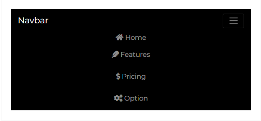

---
title: 'Navbar'
metaTitle: 'Navbar Component for React Bootstrap 5'
metaDescription: 'Building a Navbar Component using React Bootstrap 5'
githubUrl: "https://github.com/Devwares-Team/DOCS-Contrast/blob/master/content/contrast/react/navigation/navbar.mdx"
---import React from 'react';

# React Bootstrap 5 Navbar

A React Bootstrap 5 Navbar is a user interface element that links a user to other sections of the website.

The Contrast React Bootstrap 5 Navbar has predefined styles you can access via passing values into a prop on the component.

## Importing the Contrast Navbar Component

To use the Contrast React Bootstrap 5 Navbar component, you import `CDBNavbar` into your project.

```js
import { CDBNavbar } from 'cdbreact';
```

## Default Navbar

In this section of the tutorial we use the [CDBDropDown](https://www.devwares.com/docs/contrast/react/components/dropdown) component for our dropdowns, the [CDBBtn](https://www.devwares.com/docs/contrast/react/components/dropdown) component for our button , the [CDBIcon](https://www.devwares.com/docs/contrast/react/components/icon) component for our icons, the [CDBCollapse](https://www.devwares.com/docs/contrast/react/components/collapse) component alongside the `CDBNavbar` component. Check out the docs to have more information.

<div class="container">
  <header>
    <nav class="navbar navbar-expand-md navbar-dark bg-dark">
      <span class="navbar-brand font-weight-bold" style="font-size:1em;">
        Navbar
      </span>
      <button
        class="navbar-toggler"
        type="button"
        data-toggle="collapse"
        data-target="#navbarSupportedContent"
        aria-controls="navbarSupportedContent"
        aria-expanded="false"
        aria-label="Toggle navigation"
      >
        <span class="navbar-toggler-icon"></span>
      </button>
      <div class="collapse navbar-collapse " id="navbarSupportedContent">
        <ul class="navbar-nav mr-auto">
          <li class="nav-item">
            <span class="nav-link text-white">
              <i class="fab fa-facebook-f"></i>
            </span>
          </li>
          <li class="nav-item">
            <span class="nav-link text-white">
              <i class="fab fa-twitter"></i>
            </span>
          </li>
          <li class="nav-item">
            <span class="nav-link text-white">
              <i class="fab fa-instagram"></i>
            </span>
          </li>
        </ul>
        <ul class="navbar-nav">
          <li class="nav-item">
            <span class="nav-link text-white">
              <i class="fa fa-home mr-2"></i>
              Home
            </span>
          </li>
          <li class="nav-item dropdown">
            <span class="nav-link text-white">
              <i class="fa fa-feather mr-2"></i>
              Features
            </span>
          </li>
          <li class="nav-item dropdown">
            <span class="nav-link text-white">
              <i class="fa fa-dollar-sign mr-2"></i>
              Pricing
            </span>
          </li>
          <li class="nav-item dropdown">
            <span class="nav-link text-white">
              <i class="fa fa-cogs mr-2"></i>
              Options
            </span>
          </li>
        </ul>
      </div>
    </nav>
  </header>
</div>

```js
import React from 'react';

const Navbar = () => {
  const [collapse, setCollapse] = useState(false);

  const bgBlack = { backgroundColor: '#000000', color: '#f4f4f4' };

  return (
    <CDBContainer>
      <Router style={{ width: '100%' }}>
        <CDBNavbar style={bgBlack} dark expand="md" scrolling>
          <CDBNavBrand href="/">
            <strong>Navbar</strong>
          </CDBNavBrand>
          <CDBNavToggle
            onClick={() => {
              setCollapse(!collapse);
            }}
          />
          <CDBCollapse id="navbarCollapse1" isOpen={collapse} navbar>
            <CDBNavbarNav left>
              <CDBNavItem>
                <CDBNavLink to="#">
                  <CDBIcon fab icon="facebook-f" />
                </CDBNavLink>
              </CDBNavItem>
              <CDBNavItem>
                <CDBNavLink to="#">
                  <CDBIcon fab icon="twitter" />
                </CDBNavLink>
              </CDBNavItem>
              <CDBNavItem>
                <CDBNavLink to="#">
                  <CDBIcon fab icon="instagram" />
                </CDBNavLink>
              </CDBNavItem>
            </CDBNavbarNav>
            <CDBNavbarNav right className="align-items-center">
              <CDBNavItem active>
                <CDBBtn circle color="dark" style={{ padding: 0 }}>
                  <CDBNavLink to="#">
                    <CDBIcon className="mr-2" icon="home" /> Home
                  </CDBNavLink>
                </CDBBtn>
              </CDBNavItem>
              <CDBNavItem>
                <CDBBtn circle color="dark" style={{ padding: 0 }}>
                  <CDBNavLink to="#">
                    <CDBIcon className="mr-2" icon="feather" /> Features
                  </CDBNavLink>
                </CDBBtn>
              </CDBNavItem>
              <CDBNavItem>
                <CDBBtn circle color="dark" style={{ padding: 0 }}>
                  <CDBNavLink to="#">
                    <CDBIcon className="mr-2" icon="dollar-sign" /> Pricing
                  </CDBNavLink>
                </CDBBtn>
              </CDBNavItem>

              <CDBNavItem>
                <CDBDropDown>
                  <CDBDropDownToggle caret style={{ padding: 0 }} color="dark" circle>
                    <CDBIcon className="mr-2" icon="cogs" /> Options
                  </CDBDropDownToggle>
                  <CDBDropDownMenu>Coming soon #pleaseStayUpdated.</CDBDropDownMenu>
                </CDBDropDown>
              </CDBNavItem>
            </CDBNavbarNav>
          </CDBCollapse>
        </CDBNavbar>
      </Router>
    </CDBContainer>
  );
};
export default Navbar;
```

## Example 2

<div class="container">
  <header>
    <nav class="navbar navbar-expand-md navbar-dark bg-dark">
      <span class="navbar-brand font-weight-bold" style="font-size:1em;">
        Navbar
      </span>
      <button
        class="navbar-toggler"
        type="button"
        data-toggle="collapse"
        data-target="#navbarSupportedContent"
        aria-controls="navbarSupportedContent"
        aria-expanded="false"
        aria-label="Toggle navigation"
      >
        <span class="navbar-toggler-icon"></span>
      </button>
      <div class="collapse navbar-collapse " id="navbarSupportedContent">
        <ul class="navbar-nav mr-auto">
          <li class="nav-item">
            <span class="nav-link text-white">Categories</span>
          </li>
          <li class="nav-item">
            <span class="nav-link text-white">Help</span>
          </li>
          <li class="nav-item">
            <span class="nav-link text-white">About</span>
          </li>
        </ul>
        <ul class="navbar-nav">
          <li class="nav-item">
            <span class="nav-link text-white">
              <i class="fa fa-globe mr-2"></i>
              EN
            </span>
          </li>
          <li class="nav-item dropdown">
            <span class="nav-link text-white">
              <i class="fa fa-user mr-2"></i>
              Login
            </span>
          </li>
          <li class="nav-item">
            <button class="btn bg-light nav-link text-dark px-2" style="font-size:0.9em;">
              Sign Up
            </button>
          </li>
        </ul>
      </div>
    </nav>
  </header>
</div>

```js
import React from 'react';
import { BrowserRouter as Router } from 'react-router-dom';
import {
  CDBNavbar,
  CDBNavBrand,
  CDBNavItem,
  CDBNavLink,
  CDBDropDown,
  CDBDropDownMenu,
  CDBDropDownToggle,
  CDBBtn,
  CDBNavToggle,
  CDBIcon,
  CDBCollapse,
  CDBNavbarNav,
  CDBContainer,
} from 'cdbreact';

const Navbar = () => {
  const [collapse2, setCollapse2] = useState(false);

  const bgBlack = { backgroundColor: '#000000', color: '#f4f4f4' };

  return (
    <CDBContainer>
      <Router style={{ width: '100%' }}>
        <CDBNavbar style={bgBlack} dark expand="md" scrolling>
          <CDBNavBrand href="/">
            <strong>Navbar</strong>
          </CDBNavBrand>
          <CDBNavToggle
            onClick={() => {
              setCollapse2(!collapse2);
            }}
          />
          <CDBCollapse id="navbarCollapse1" isOpen={collapse2} navbar>
            <CDBNavbarNav left className="align-items-center">
              <CDBNavItem>
                <CDBDropDown>
                  <CDBDropDownToggle caret style={{ padding: 0 }} color="dark" circle>
                    Categories
                  </CDBDropDownToggle>
                  <CDBDropDownMenu>Coming soon #pleaseStayUpdated.</CDBDropDownMenu>
                </CDBDropDown>
              </CDBNavItem>
              <CDBNavItem>
                <CDBBtn circle color="dark" style={{ padding: 0 }}>
                  <CDBNavLink to="#">Help</CDBNavLink>
                </CDBBtn>
              </CDBNavItem>
              <CDBNavItem>
                <CDBBtn circle color="dark" style={{ padding: 0 }}>
                  <CDBNavLink to="#">About</CDBNavLink>
                </CDBBtn>
              </CDBNavItem>
            </CDBNavbarNav>
            <CDBNavbarNav right>
              <CDBNavItem>
                <CDBBtn circle color="dark" style={{ padding: 0 }}>
                  <CDBNavLink to="#">
                    <CDBIcon className="mr-2" icon="globe" />
                    EN
                  </CDBNavLink>
                </CDBBtn>
              </CDBNavItem>

              <CDBNavItem>
                <CDBBtn circle color="dark" style={{ padding: 0 }}>
                  <CDBNavLink to="#">
                    <CDBIcon className="mr-2" icon="user" />
                    Login
                  </CDBNavLink>
                </CDBBtn>
              </CDBNavItem>
              <CDBNavItem>
                <CDBBtn color="white" style={{ padding: '0px 10px' }}>
                  <CDBNavLink to="#" style={{ color: '#000' }}>
                    Sign Up
                  </CDBNavLink>
                </CDBBtn>
              </CDBNavItem>
            </CDBNavbarNav>
          </CDBCollapse>
        </CDBNavbar>
      </Router>
    </CDBContainer>
  );
};
export default Navbar;
```

## Mobile View
The React Bootstrap 5 Navbar is a responsive component, it shows and hide navbar contents by its parent breakpoint. It uses a toggle element to set the display of its content.


#### Mobile View - Collapsed



## API Reference: Contrast React Bootstrap 5 Navbar Props

This section will build on your information about the props you get to use with the Contrast React Bootstrap 5 Navbar component. You will find out what these props do, their default values, and how you would use them in your code.

The table below lists other prop options of the `CDBNavbar` component.

| Name                  |       Type        | Default |                                                              Description                                                              |                                      Example |
| :-------------------- | :---------------: | ------: | :-----------------------------------------------------------------------------------------------------------------------------------: | -------------------------------------------: |
| className             |      String       |         |                                                          Adds custom classes                                                          |        <CDBNavbar className="myClass" ... /> |
| tag                   |      String       |     nav |                                                          Changes default tag                                                          |                  <CDBNavbar tag="div" ... /> |
| color                 |      String       |   false |                                          Sets navbar background color. Use mdb color palette                                          |              <CDBNavbar color="indigo" .../> |
| dark                  |      Boolean      |   false |                                       Change navbar's theme to dark (text color will be white)                                        |                        <CDBNavbar dark .../> |
| light                 |      Boolean      |   false |                                       Change navbar's theme to light (text color will be black)                                       |                       <CDBNavbar light .../> |
| double                |      Boolean      |   false |                                              Allows navbar to be used along with Sidebar                                              |                      <CDBNavbar double .../> |
| expand                | Boolean or String |   false | Determines on which viewport navbar should be expanded. Accepts: `xs`, `sm`, `md`, `lg`, `xl`. If empty - navbar won't ever collapse. |                 <CDBNavbar expand="xs" .../> |
| fixed                 |      String       |         |                                      Sets Navbar position to fixed. Use `top` or `bottom` values                                      |                 <CDBNavbar fixed="top" .../> |
| scrolling             |      Boolean      |   false |                    Changes Navbar's size on scroll. Combine with prop transparent to archive color changing effect                    |                   <CDBNavbar scrolling .../> |
| scrollingNavbarOffset |      Number       |      50 |                                   Number of pixels after which the Navbar changes 'scrolling' state                                   | <CDBNavbar scrollingNavbarOffset={100} .../> |
| transparent           |      Boolean      |   false |           Sets Navbar background to transparent. Combine with prop `scrolling` and `color` to archive color changing effect           |                 <CDBNavbar transparent .../> |
| sticky                |      String       |         |                                  enables navbar to stick to the when you reach its scroll position.                                   |               <CDBNavbar sticky="100%" .../> |

## API Reference: Contrast React Bootstrap Navbar Brand Properties

The table below lists other prop options of the `CDBNavBrand` component.

| Name      |  Type  | Default |                   Description                    |                                        Example |
| :-------- | :----: | ------: | :----------------------------------------------: | ---------------------------------------------: |
| className | String |         |               Adds custom classes                |        <CDBNavBrand className="myClass" ... /> |
| href      | String |         | Sets passed URL (component use react-router-dom) | <CDBNavBrand href="./components/custom" ... /> |

## API Reference: Contrast React Bootstrap 5 Navbar Item Properties

The table below lists other prop options of the `CDBNavItem` component.

| Name      |  Type   | Default |           Description            |                                Example |
| :-------- | :-----: | ------: | :------------------------------: | -------------------------------------: |
| className | String  |         |       Adds custom classes        | <CDBNavItem className="myClass" ... /> |
| active    | Boolean |         | Sets active state of the NavItem |              <CDBNavItem active ... /> |
| tag       | String  |      li |       Changes default tag        |           <CDBNavItem tag="div" ... /> |

## API Reference: Contrast React Bootstrap Navbar Link Properties

The table below lists other prop options of the `CDBNavLink` component.

| Name      |  Type   | Default |                       Description                        |                                      Example |
| :-------- | :-----: | ------: | :------------------------------------------------------: | -------------------------------------------: |
| className | String  |         |                   Adds custom classes                    |       <CDBNavLink className="myClass" ... /> |
| active    | Boolean |         |             Sets active state of the NavLink             |                    <CDBNavLink active ... /> |
| tag       | String  |      li |                   Changes default tag                    |                 <CDBNavLink tag="div" ... /> |
| disabled  | Boolean |         |      Disables element, element could not be clicked      |                  <CDBNavLink disabled ... /> |
| to        | String  |         |     Sets passed URL (component use react-router-dom)     | <CDBNavBrand to="./components/custom" ... /> |
| link      | Boolean |         | Change NavLink to Link Component from 'react-router-dom' |                      <CDBNavLink link ... /> |

## API Reference: Contrast React Bootstrap Navbar Toggle Properties

The table below lists other prop options of the `CDBNavToggle` component.

| Name      |        Type        | Default |                  Description                  |                                    Example |
| :-------- | :----------------: | ------: | :-------------------------------------------: | -----------------------------------------: |
| className |       String       |         |              Adds custom classes              |     <CDBNavLink className="myClass" ... /> |
| tag       | function or String |  button |              Changes default tag              |            <CDBNavLink tag="button" ... /> |
| type      |       String       |  button |        Changes elements type attribute        |           <CDBNavLink type="button" ... /> |
| image     |       String       |         |     Sets background-image of the toggler      | <CDBNavBrand image="../asset/image" ... /> |
| left      |      Boolean       |         | Pulls element to the left side of the Navbar  |                    <CDBNavLink left ... /> |
| right     |      Boolean       |         | Pulls element to the right side of the Navbar |                   <CDBNavLink right ... /> |

## API Reference: Contrast React Bootstrap 5 Navbar Nav Properties

The table below lists other prop options of the `CDBNavbarNav` component.

| Name      |        Type        | Default |                  Description                  |                                  Example |
| :-------- | :----------------: | ------: | :-------------------------------------------: | ---------------------------------------: |
| className |       String       |         |              Adds custom classes              | <CDBNavbarNav className="myClass" ... /> |
| tag       | function or String |      ul |              Changes default tag              |           <CDBNavbarNav tag="div" ... /> |
| left      |      Boolean       |         | Pulls element to the left side of the Navbar  |                <CDBNavbarNav left ... /> |
| right     |      Boolean       |         | Pulls element to the right side of the Navbar |               <CDBNavbarNav right ... /> |
